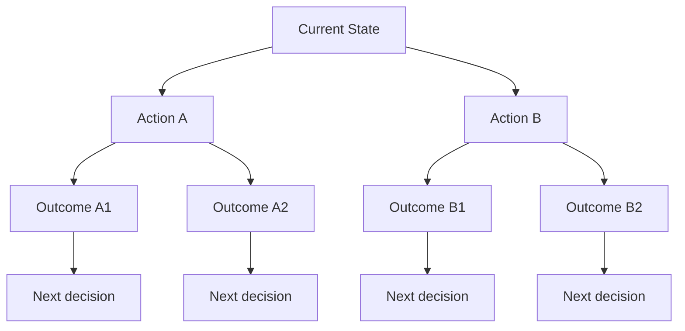
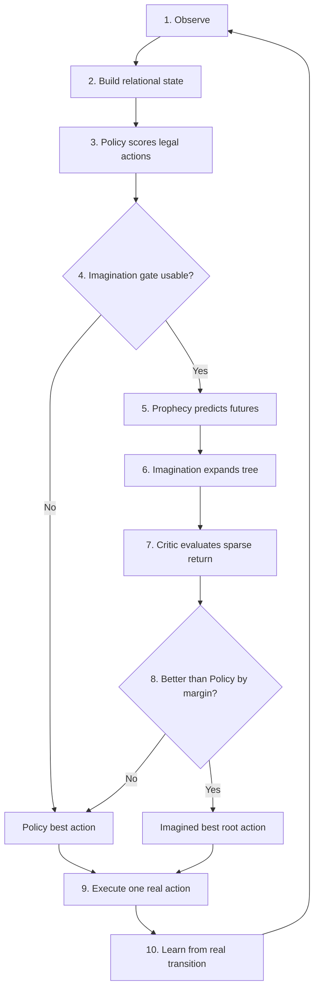

# AASSR in 5 Minutes

이 페이지의 목표는 코드를 보지 않고도 **AASSR이 왜 필요하고, 무엇을 추가했으며, 각각이 어떤 역할을 하는지** 이해하는 것이다.

## 1. 문제: 보상이 너무 늦게 온다

강화학습에서 에이전트는 행동을 하고 보상을 받는다.

간단한 환경에서는 다음처럼 행동 하나의 결과가 바로 보일 수 있다.

```text
벽에 충돌 -> -1
목표 지점 도착 -> +1
```

하지만 AASSR이 다루는 환경은 더 가깝게 보면 다음과 같다.

```text
정보 확인 -> 0
경로 선택 -> 0
인증 시도 -> 0
대상 확인 -> 0
작업 시작 -> 0
작업 완료 -> 0
proof 획득 -> +1
```

실패도 마찬가지다.

```text
위험한 행동 -> 0
또 다른 위험한 행동 -> 0
lockout -> -1
```

즉 대부분의 transition에서 reward가 `0`이다. 이런 문제를 **sparse reward**라고 한다.

핵심 어려움은 단순히 보상이 적다는 데 있지 않다. 에이전트는 다음 질문에 답해야 한다.

- 몇 단계 전에 얻은 정보가 지금 왜 중요한가?
- 방금 한 행동은 실제로 상태를 바꿨는가?
- 현재 가장 좋아 보이는 행동이 장기적으로도 좋은가?
- 지금 처음 보는 이름과 ID를 가진 환경이 과거 경험과 구조적으로 같은가?

AASSR은 이 질문을 각각 하나의 모듈로 분해한다.

---

## 2. ASEQ: 실제로 무엇이 일어났는가?

AASSR의 가장 기본적인 경험 단위는 다음과 같다.

```text
현재 상태 S
   |
   | 행동 A
   v
다음 상태 S'
```

이를 간단히

```text
(S, A, S')
```

라고 쓰며 이 위키에서는 **ASEQ**라고 부른다.

예를 들어 어떤 `browse` 행동을 했는데 정보도, 가능한 행동도, 진행 상황도 전혀 바뀌지 않았다면:

```text
S -> browse -> S
```

이다.

이것이 실제로 반복해서 관측되면 AASSR은 같은 self-loop를 계속 고집하지 않도록 해당 후보를 억제할 수 있다.

중요한 점은 **같은 행동 자체를 금지하지 않는다는 것**이다.

```text
S1 -> browse -> S2
S2 -> browse -> S3
```

처럼 상태가 실제로 변한다면 같은 `browse`를 여러 번 하는 것은 허용된다.

따라서 ASEQ는 “반복 금지 장치”라기보다 **경험한 상태 변화의 구조를 기억하는 장치**에 가깝다.

자세한 내용: **[ASEQ](ASEQ)**

---

## 3. Relational Representation: 이름 대신 관계를 본다

AASSR의 실험 환경에서는 seed가 바뀌면 route, profile, object 같은 구체 ID가 바뀐다.

예를 들어 두 환경이 다음처럼 생겼다고 하자.

```text
Scenario A
route-17 -> profile-03 -> object-28

Scenario B
route-04 -> profile-19 -> object-06
```

ID만 보면 완전히 다르다. 하지만 역할이

```text
catalog route -> authenticated profile -> target-like object
```

으로 같다면 문제 구조는 같다.

현재 AASSR은 transfer가 필요한 Policy, Prophecy, Critic, Skill에서 **rename-invariant relational representation**을 사용한다.

반대로 ASEQ는 한 episode 안에서 실제 concrete entity를 구분해야 하기 때문에 더 구체적인 semantic identity를 사용한다.

즉 AASSR에는 의도적으로 두 종류의 동일성 개념이 존재한다.

| 용도 | 동일성 |
|---|---|
| 같은 episode에서 정확히 무엇을 반복했는가? | concrete semantic identity |
| 새로운 seed로 일반화할 때 구조가 같은가? | relational identity |

---

## 4. Policy: 지금 당장 무엇을 할 것인가?

Policy는 현재 가능한 행동 각각에 점수를 준다.

현재 generation에서는 핵심 Policy가 **relational DQN**이다.

```text
Relational State + Relational Action
                |
                v
              Q-value
```

AASSR은 여기에 별도의 **information-value residual**을 더한다. 어떤 행동이 즉시 성공을 만들지 않더라도 이후 의사결정에 필요한 정보를 열어 줄 가능성을 따로 학습하기 위한 구조다.

Policy만 사용하면 현재 Q값이 가장 큰 행동을 실행한다.

하지만 AASSR Full에서는 여기서 한 단계 더 간다.

---

## 5. Prophecy: 이 행동을 하면 다음에 어떻게 될까?

Prophecy는 AASSR의 learned world model이다.

현재 모델은 하나의 확정된 미래만 예측하지 않는다. 같은 공개 상태와 행동에서도 숨겨진 조건 때문에 여러 결과가 가능할 수 있기 때문이다.

그래서 개념적으로 다음처럼 동작한다.

```text
State + Action
      |
      v
+-----------------------------+
| 60% -> next state A         |
| 25% -> next state B         |
| 15% -> truncation/failure   |
+-----------------------------+
```

현재 Prophecy가 다루는 출력에는 다음이 포함된다.

- 다음 relational state descriptor
- 다음 legal-action mask
- public latest HTTP status
- terminal class
  - active
  - success
  - true failure
  - truncation

그리고 두 종류의 확률을 구분한다.

- **outcome probability**: 환경적으로 그 결과가 나올 확률
- **reliability / confidence**: 이 예측을 world model이 얼마나 믿을 수 있는가

이 둘을 섞지 않는 것이 중요하다. 드문 결과라고 해서 모델이 틀린 것은 아니고, 모델이 자신 있다고 해서 그 결과 자체가 자주 일어나는 것도 아니다.

---

## 6. Imagination: 실제로 하기 전에 여러 미래를 펼친다

Prophecy를 한 번만 쓰면 one-step prediction이다.

AASSR의 Imagination은 이를 여러 단계 이어 붙인다.



여기에는 서로 다른 두 종류의 노드가 있다.

### Chance node

환경이 여러 결과 중 무엇을 만들지 에이전트가 선택할 수 없다.

따라서 가능한 결과의 가치는 **outcome probability로 평균**한다.

```text
Expected value = sum(probability * future value)
```

### Decision node

다음 상태에서 어떤 행동을 할지는 에이전트가 고를 수 있다.

따라서 가능한 행동 중 **가장 좋은 것(max)**을 선택한다.

이 구분이 없으면 “환경의 랜덤 결과”와 “에이전트가 선택할 수 있는 행동”을 같은 평균으로 섞는 문제가 생긴다.

---

## 7. Critic: 상상한 미래가 실제 목표에 좋은가?

Imagination이 미래를 만들어도 무엇이 좋은 미래인지 평가할 모델이 필요하다.

현재 Critic은 실제 task reward와 맞춘 return을 학습한다.

```text
success       -> +1
truncation    ->  0
true failure  -> -1
```

중요한 것은 true failure와 단순 truncation을 같은 `0`으로 취급하지 않는 것이다.

Critic은 실제 trajectory의 여러 suffix에서 학습해, 현재 decision state에서 zero recurrent memory로 시작하는 planning과 학습 조건을 맞추도록 설계되어 있다.

하지만 Critic이 전체적으로 학습됐다는 것만으로 어떤 새로운 상태에서도 신뢰할 수 있는 것은 아니다.

그래서 현재 generation에는 **local Critic support gate**가 있다.

```text
Critic has been trained globally
          !=
This state/action is supported by training data
```

현재 상태/행동이 실제 Critic training distribution에서 충분히 지원되지 않으면 Imagination이 Policy를 강제로 override하지 못하도록 fail-closed한다.

---

## 8. 실제 행동 선택

전체 흐름을 다시 연결하면 다음과 같다.



AASSR은 상상 속에서 여러 행동을 실행하지만 **현실에서는 첫 행동 하나만 실행**한다. 이후에는 실제 관측을 받아 다시 계획한다.

---

## 9. 현재 결과를 어떻게 읽어야 하나?

현재 연구는 다음 세 문장을 구분한다.

### ① AASSR의 각 구성요소가 코드에서 작동하는가?

대부분 **예**다. Current-generation runtime, relational representation, ASEQ, Policy, learned world model, Critic, Imagination tree가 연결되어 있다.

### ② Imagination이 실제 Policy 행동을 바꿀 수 있는가?

2026-08-11 2k validation에서 **예**였다. 86회 실제 action override가 발생했다.

### ③ 그 Imagination이 현재 성능을 높이는가?

아직 **아니다 / 미확정**이다. 같은 2k validation에서 no-Imagination과 Full은 둘 다 `4/20` 성공이었고, Full의 개입 상당수가 잘못된 HTTP action으로 이어졌다.

따라서 현재 연구의 중심은 단순히 “Imagination을 켜기”가 아니라 **언제 상상을 믿어도 되는가**를 검증하는 것이다.

다음 페이지: **[Core Architecture](Core-Architecture)**
