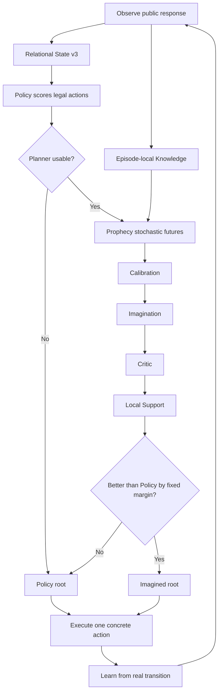

# AASSR in 5 Minutes

이 페이지의 목표는 코드를 읽지 않고도 **AASSR이 어떤 문제를 풀려고 하고, 왜 여러 모듈이 필요하며, 현재 구조가 어떻게 한 번의 행동을 선택하는지** 이해하는 것이다.

> [!IMPORTANT]
> 이 페이지는 `main`의 **current-generation**을 설명한다. 과거 2026-08-11 실패 diagnostic의 숫자는 현재 성능처럼 사용하지 않는다. 과거 실패가 궁금하면 [Historical Imagination Diagnostic — 2026-08-11](Historical-Imagination-Diagnostic-2026-08-11)을 본다.

---

# 1. 문제: 정답은 마지막에만 알려준다

[강화학습](Reinforcement-Learning)에서 agent는 행동하고 reward를 받는다.

Dense reward 문제라면:

```text
좋은 방향으로 이동   +0.1
목표에 가까워짐      +0.2
목표 도달            +1
```

처럼 중간 힌트가 많다.

AASSR이 겨냥하는 [sparse reward](Sparse-Reward-and-Credit-Assignment)는 훨씬 불친절하다.

```text
정보 확인      0
경로 발견      0
로그인         0
대상 확인      0
workflow 진행  0
proof 획득     +1
```

실제 task failure라면 `-1`, 단순 rate-limit/truncation 등은 `0`으로 구분한다.

즉 agent는 **“방금 reward가 0이었으니 이 행동은 쓸모없다”**라고 단순 판단할 수 없다.

몇 단계 전의 정보 획득이 마지막 성공을 가능하게 했을 수도 있기 때문이다.

---

# 2. 더 어려운 점: 환경을 전부 볼 수도 없다

AASSR benchmark는 [부분 관측(POMDP)](MDP-and-POMDP)에 가깝다.

```text
Environment hidden state
         ↓ 일부만 공개
Public response
         ↓
Agent observation
```

Agent는 simulator가 내부적으로 알고 있는 정답 target, exact hidden audit pressure, future outcome을 직접 볼 수 없다.

대신 실제 response로 관측한 정보만 사용한다.

```text
공개된 403 status        O
response에서 얻은 token  O
hidden target identity    X
future success 여부       X
```

이 원칙을 [response-causal boundary](Causality-Leakage-and-Evaluation)라고 생각하면 된다.

---

# 3. State Representation: 이름보다 구조를 본다

Training scenario:

```text
route-12
profile-4
object-7
```

Unseen scenario:

```text
route-31
profile-9
object-2
```

이름만 보면 전부 다르다.

하지만 역할이 같을 수 있다.

```text
catalog-like route
→ authenticated profile
→ candidate object
```

그래서 current AASSR은 transfer가 필요한 [Policy](Policy), [Prophecy](Prophecy), [Critic](Critic), [Skill](Skills)에서 [relational representation](Relational-Representation-and-Generalization)을 사용한다.

현재 [Relational State v3](State-Representation)는 구조뿐 아니라 최근 public HTTP-like status도 보존한다.

```text
base relational descriptor  35D
latest status categorical    8D
-------------------------------
current v3                   43D
```

하지만 실제 실행에서는 서로 다른 concrete object를 구분해야 한다.

그래서:

```text
transfer / learning identity  = relational
execution / exact repetition  = concrete
```

두 identity를 분리한다.

---

# 4. ASEQ: “아무 일도 안 일어난 반복”을 기억한다

[AASSR의 ASEQ](ASEQ)는 실제 transition:

```text
(S, A, S')
```

이다.

특히 같은 semantic state에서 같은 행동을 했는데 다시 같은 상태라면:

```text
S → A → S
```

실제로 진전이 없는 self-loop일 수 있다.

이 패턴이 experience로 확인되면 같은 self-loop를 계속 반복하지 않도록 후보를 억제할 수 있다.

하지만:

```text
S1 → browse → S2
S2 → browse → S3
```

처럼 상태가 진행하면 같은 action type의 반복을 막지 않는다.

즉 ASEQ는 **“반복 행동 금지”가 아니라 “관측된 무진전 반복 억제”**다.

---

# 5. Policy: 지금 상태만 보고 기본 행동을 고른다

현재 [Policy](Policy)의 중심은 relational DQN이다.

```text
Relational State
+
Relational Action
      ↓
Q_task(S,A)
```

[Q-value](Value-Functions-and-Bellman-Equation)는 현재 행동 이후의 장기 external return을 근사한다.

AASSR은 별도의 information residual도 관리한다.

```text
Q_task
+
I_information
```

중요한 점:

```text
Information residual
!= external task reward
```

이다.

Task reward 자체를 정보 bonus로 바꾸지 않고, 행동 ranking에서 정보를 얻는 가치와 task value를 구분하려는 설계다.

Policy만 사용한다면 여기서 기본 행동이 정해진다.

---

# 6. Knowledge: “그때 이미 알고 있었나?”를 보존한다

부분 관측에서는 과거 response에서 얻은 정보가 현재 화면에는 다시 나오지 않을 수 있다.

예:

```text
t-2: token 발견
t-1: 다른 response
t:   현재 response에는 token 없음
```

[Knowledge](Knowledge)는 **현재 episode에서 real response로 이미 획득한 사실**을 저장한다.

시간 순서가 중요하다.

```text
K_t
 ↓
predict / decide
 ↓
action 실행
 ↓
new response
 ↓
K_{t+1}
```

미래 response에서 얻은 `K_{t+1}`을 과거 prediction에 넣으면 [hindsight leakage](Causality-Leakage-and-Evaluation)다.

---

# 7. Prophecy: “이 행동 뒤에는 어떤 결과들이 가능한가?”

현재 [Prophecy](Prophecy)는 AASSR의 stochastic [world model](Model-Based-RL-and-World-Models)이다.

Current contract:

```text
relational-conditional-mixture-ensemble-v5-status-balanced
```

같은 public `(state, action)`에서도 여러 결과가 가능할 수 있다.

```text
action A
  |-- 0.70 → next state 1 / 200
  |-- 0.20 → next state 2 / 403
  `-- 0.10 → truncation / 429
```

그래서 하나의 평균 future로 뭉개지 않고 [mixture](Mixture-Ensemble-and-Calibration) outcome을 표현한다.

Prophecy가 다루는 중요한 출력:

- next relational descriptor
- latest public HTTP status
- legal action mask
- active / success / failure / truncation
- outcome probability mass

여기서:

```text
Outcome probability
!=
Prediction reliability
```

이다.

`403`이 10% 확률이라는 말과, “그 10%라는 예측을 모델이 얼마나 믿을 수 있나”는 다른 질문이다.

---

# 8. Calibration: “그 예측을 믿어도 되는가?”

[Calibration](Calibration)은 holdout real transition을 사용해 Prophecy prediction의 reliability를 평가한다.

Current contract:

```text
semantic-probability-holdout-calibration-v3-status-aware
```

왜 status-aware인가?

과거에는 전체 relational state가 비슷하게 맞아도 `403/404/429` 같은 **decision-critical public status를 틀리는 문제**가 있었다.

따라서 단순 global similarity만으로 “world model이 믿을 만하다”고 판단하지 않는다.

---

# 9. Imagination: 실제로 하기 전에 미래를 펼친다

[Imagination](Imagination)은 Prophecy를 여러 단계 이어 붙이는 [counterfactual planner](Counterfactual-Planning-and-Search)다.

```text
현재 state
  ├─ action A
  │    ├─ outcome A1
  │    └─ outcome A2
  ├─ action B
  │    ├─ outcome B1
  │    └─ outcome B2
  └─ action C
       └─ ...
```

하지만 tree 안에는 서로 다른 두 종류의 선택이 있다.

## Chance node

환경이 어떤 결과를 만들지는 agent가 고를 수 없다.

```math
V_{chance}=\sum_i p_iV_i
```

확률로 평균해야 한다.

## Decision node

다음 state에서 어떤 행동을 할지는 agent가 고를 수 있다.

```math
V_{decision}=\max_aV(S',a)
```

가장 좋은 action continuation을 선택할 수 있다.

이 둘을 섞으면 “10% jackpot outcome을 agent가 마음대로 선택할 수 있다”는 잘못된 planning이 된다.

관련: [Chance Nodes & Decision Nodes](Chance-and-Decision-Nodes)

---

# 10. Critic: 상상한 미래가 실제 목표에 좋은가?

[Critic](Critic)은 imagined state가 external sparse-return 관점에서 얼마나 좋은지 추정한다.

현재는 relational GRU 기반 discounted sparse-return estimator다.

```text
Prophecy
→ 어떤 future인가?

Critic
→ 그 future의 task return은 얼마나 좋은가?
```

하지만 큰 문제가 하나 있다.

Neural network는 본 적 없는 상태에서도 숫자를 낸다.

```text
Critic output = 0.92
```

라고 해서 그 값이 real data로 뒷받침된다는 뜻은 아니다.

---

# 11. Local Critic Support: “그 값을 여기서 믿을 근거가 있나?”

현재 AASSR은 [local Critic support](Critic-Support-and-OOD)를 별도로 본다.

```text
Critic ready globally
!=
this state/action locally supported
```

Current contract:

```text
local-real-training-support-fail-closed-v1
```

현재 imagined state/action 주변에 실제 Critic training evidence가 부족하면:

```text
높은 predicted value가 나와도
        ↓
override 금지
        ↓
Policy로 fallback
```

한다.

Support는 reward도 아니고 value bonus도 아니다.

---

# 12. 실제 행동은 어떻게 결정되는가?

전체 흐름:



AASSR이 상상 속에서 100개의 future를 계산해도 **현실에서 실행하는 것은 첫 concrete action 하나**다.

그리고 real response를 받은 뒤 다시 처음부터 관측하고 계획한다.

이 점은 [Model Predictive Control / receding horizon](Counterfactual-Planning-and-Search) 직관과 닮아 있다.

---

# 13. Skill: 성공한 구조를 다음 문제에서 재사용한다

[Skill](Skills)은 반복 성공한 real ASeq 구조를 relational template로 승격하는 메커니즘이다.

```text
real successful sequence
        ↓
relational pattern
        ↓
Skill template
        ↓
new scenario concrete action에 rebind
```

사람이 정답 macro를 미리 넣는 기능은 아니다.

Skill은 이미 발견한 성공 구조의 재사용에 가깝고, **새로운 해결 경로를 만드는 creativity 자체와는 별개**다.

---

# 14. AASSR에서 가장 헷갈리기 쉬운 값

다음은 전부 다른 값이다.

```text
External reward
Return
Q-value
Information residual
Outcome probability
Prediction reliability
Critic value
Local Critic support
Planner advantage
```

이들을 하나의 “좋음 점수”로 섞지 않는 것이 current-generation 설계의 중요한 특징 중 하나다.

짧은 정의: [Glossary](Glossary)  
깊은 설명: [Concept Index](Concept-Index)

---

# 15. 그래서 현재 성능은?

현재 위키는 성능을 한 줄 숫자로 고정하지 않는다.

왜냐하면:

- historical mechanism evidence
- 과거 failure diagnostic
- current architecture contract
- reduced validation
- multi-seed benchmark
- final blind

가 서로 다른 수준의 evidence이기 때문이다.

현재 무엇까지 검증되었는지는 **[Current Status](Current-Status)** 를 보고, 각 연구 질문별 증거는 **[Evidence Matrix](Evidence-Matrix)** 를 본다.

> [!CAUTION]
> 2026-08-11의 `4/20 vs 4/20`, `86 interventions`, `58/86 bad-status`는 현재 성능 수치가 아니라 repair를 유도한 historical diagnostic이다.

---

# 16. 한 문장 요약

> **AASSR은 sparse reward 환경에서 실제 경험을 relational/semantic 구조로 기억하고, stochastic world model로 여러 future를 예측하며, calibration과 local value support가 충분할 때만 counterfactual planning으로 Policy의 첫 행동을 바꾸려는 강화학습 시스템이다.**

---

## 다음으로 읽기

### 연구가 궁금하면
[Research Questions](Research-Questions) → [Evidence Matrix](Evidence-Matrix) → [Experiments](Experiments)

### 구조가 궁금하면
[Research Architecture](Research-Architecture) → [State Representation](State-Representation) → [Policy](Policy) → [Prophecy](Prophecy) → [Imagination](Imagination)

### 현재 검증 상태가 궁금하면
[Current Status](Current-Status)
