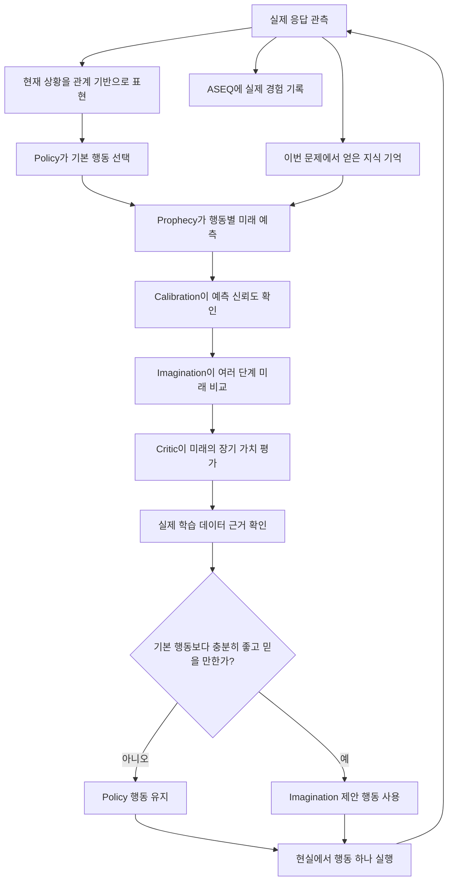

# AASSR 5분 설명

이 페이지는 **강화학습 용어를 거의 모르는 사람도 AASSR의 전체 작동 원리를 한 번에 이해할 수 있게** 설명하는 문서다.

수식이나 정확한 구현 이름은 필요할 때만 보여준다. 먼저 “왜 이런 장치가 필요한가?”를 이해하는 것이 목표다.

강화학습 자체가 처음이라면 **[처음 읽는 사람을 위한 안내서](Beginner-Guide)**를 먼저 읽어도 좋다.

---

# 1. AASSR은 무슨 문제를 풀려고 하나?

AASSR의 출발점은 다음 질문이다.

> **중간 힌트가 거의 없는 문제에서 인공지능이 스스로 성공까지의 여러 단계 행동을 찾아낼 수 있을까?**

보통 학습 문제에서는 중간중간 점수를 줄 수 있다.

```text
좋은 방향으로 이동  +0.1
목표에 가까워짐     +0.2
목표 도달           +1
```

이런 식이라면 무엇을 잘하고 있는지 비교적 쉽게 알 수 있다.

하지만 AASSR이 연구하는 **[희소 보상(sparse reward)](Sparse-Reward-and-Credit-Assignment)** 환경에서는 중간 점수가 거의 없다.

```text
정보 확인       0
새 경로 발견    0
로그인          0
대상 조사       0
필요한 정보 획득 0
최종 목표 달성  +1
실제 실패       -1
```

따라서 어떤 행동이 지금 `0점`을 받았다고 해서 쓸모없다고 말할 수 없다.

그 행동으로 얻은 정보가 다섯 단계 뒤의 성공을 가능하게 할 수도 있기 때문이다.

---

# 2. 게다가 에이전트는 정답을 직접 볼 수 없다

AASSR은 환경 내부의 모든 정보를 학습 모델에게 보여주지 않는다.

에이전트가 실제 상호작용을 통해 얻을 수 있는 정보만 사용하려고 한다.

```text
볼 수 있음
- 실제 응답
- 공개된 상태 코드
- 응답에서 실제로 발견한 정보

볼 수 없음
- 환경 내부의 정답 대상
- 미래에 성공할 행동
- 숨겨진 실패 임계치
- 아직 일어나지 않은 미래 결과
```

이런 문제를 **[부분 관측(partial observability)](MDP-and-POMDP)** 문제라고 한다.

왜 이렇게 하느냐면, 정답을 내부에서 몰래 보여주면 성능이 높아도 “스스로 배웠다”고 말하기 어렵기 때문이다.

---

# 3. AASSR은 하나의 신경망이 아니다

AASSR은 서로 다른 역할을 여러 구성요소로 나눈다.

사람이 낯선 문제를 푸는 과정을 떠올리면 이해하기 쉽다.

```text
현재 상황을 정리한다
        ↓
기본적으로 할 행동을 생각한다
        ↓
과거에 얻은 정보를 기억한다
        ↓
각 행동 뒤에 어떤 일이 생길지 예상한다
        ↓
그 예상을 믿어도 되는지 확인한다
        ↓
여러 미래를 머릿속으로 비교한다
        ↓
그 미래가 최종 목표에 좋은지 평가한다
        ↓
실제 경험이 부족한 상상이라면 과신하지 않는다
        ↓
행동 하나를 실제로 실행한다
```

이 과정을 AASSR에서는 다음 모듈들이 나누어 맡는다.

| 구성요소 | 쉬운 역할 |
|---|---|
| [상태 표현](State-Representation) | 현재 상황을 학습에 쓸 수 있게 정리 |
| [ASEQ](ASEQ) | 실제 행동과 결과를 기억하고 제자리 반복을 확인 |
| [Policy](Policy) | 현재 상황만 보고 기본 행동을 고름 |
| [Knowledge](Knowledge) | 이번 문제에서 실제로 알아낸 사실을 기억 |
| [Prophecy](Prophecy) | 행동 뒤에 가능한 미래를 예측 |
| [Calibration](Calibration) | 그 미래 예측을 믿을 만한지 확인 |
| [Imagination](Imagination) | 여러 행동의 미래를 가상으로 펼쳐 비교 |
| [Critic](Critic) | 상상한 미래가 최종 목표에 좋은지 평가 |
| [가치 평가 데이터 근거](Critic-Support-and-OOD) | 그 가치 평가를 뒷받침할 실제 경험이 있는지 확인 |
| [Skills](Skills) | 성공했던 행동 구조를 다른 문제에서 재사용 |

---

# 4. 상태 표현: 이름을 외우기보다 구조를 본다

훈련 중 이런 이름을 봤다고 하자.

```text
route-12
profile-4
object-7
```

새 문제에서는 이름이 이렇게 바뀔 수 있다.

```text
route-31
profile-9
object-2
```

이름만 외우는 모델은 완전히 다른 문제라고 생각할 수 있다.

하지만 실제 역할은 비슷할 수 있다.

```text
목록을 보여주는 경로
→ 인증된 사용자
→ 후보 객체
```

그래서 AASSR은 일부 핵심 학습 모듈에서 **[관계 기반 표현(relational representation)](Relational-Representation-and-Generalization)**을 사용한다.

쉽게 말하면:

> **“이름이 무엇인가?”보다 “서로 어떤 역할과 관계를 가지는가?”를 더 중요하게 본다.**

하지만 현실에서 행동을 실행할 때는 실제 객체를 구분해야 한다.

따라서 AASSR은:

```text
학습과 일반화에는 관계 구조를 사용
실제 실행과 정확한 반복 판정에는 구체적인 객체를 구분
```

하는 두 관점을 함께 사용한다.

자세히: [상태 표현](State-Representation)

---

# 5. ASEQ: “방금 이 행동, 아무 변화도 없었지?”

[ASEQ(실제 상태-행동-다음 상태 기록)](ASEQ)는 실제로 경험한 한 번의 상태 변화를 기록한다.

```text
현재 상태 S
+ 행동 A
+ 다음 상태 S'
= ASEQ (S, A, S')
```

특히 중요한 경우가 있다.

```text
S → A → S
```

행동했는데 의미 있는 상황 변화가 없다.

이런 것을 **[제자리 반복(self-loop)](ASEQ)**이라고 볼 수 있다.

AASSR은 이런 무진전 패턴을 실제 경험으로 반복 확인하면 같은 행동을 계속 고르는 것을 줄인다.

하지만 단순히 “같은 행동을 두 번 했다”는 이유만으로 막지 않는다.

```text
S1 → 탐색 → S2
S2 → 탐색 → S3
```

처럼 실제 상황이 변했다면 같은 종류의 행동을 다시 해도 된다.

즉 [ASEQ](ASEQ)는 **반복 행동 금지 장치가 아니라, 실제로 확인된 무진전 반복을 줄이는 기억 장치**다.

자세히: [ASEQ](ASEQ)

---

# 6. Policy: 지금 당장 무엇을 할까?

[Policy](Policy)는 현재 상황을 보고 기본 행동을 선택한다.

현재 AASSR의 [Policy(정책 모델)](Policy)는 [DQN(딥 Q-네트워크)](Q-Learning-DQN-and-TD) 계열을 중심으로 한다.

[DQN(딥 Q-네트워크)](Q-Learning-DQN-and-TD)의 직관은 간단하다.

```text
현재 상태에서
이 행동을 하면
장기적으로 얼마나 좋을까?
```

예를 들어 행동별 추정값이 다음과 같다고 하자.

```text
탐색        0.22
로그인      0.48
객체 요청   0.31
```

[Policy](Policy)는 기본적으로 더 좋은 장기 가치가 예상되는 행동을 선호한다.

여기서 사용하는 **[Q값(Q-value)](Value-Functions-and-Bellman-Equation)**은 “방금 받은 점수”와 같은 것이 아니다.

앞으로의 성공까지 고려한 장기 가치의 추정치다.

AASSR은 정보 획득에 관한 내부 가치도 별도로 관리하지만, 이것을 환경이 주는 실제 목표 보상과 섞지 않으려고 한다.

자세히: [Policy](Policy)

---

# 7. Knowledge: 이번 문제에서 이미 무엇을 알아냈나?

현재 화면만 보면 과거에 발견한 정보가 사라질 수 있다.

```text
1단계: 응답에서 토큰 발견
2단계: 다른 페이지로 이동
3단계: 현재 응답에는 토큰이 다시 나오지 않음
```

사람은 “아까 토큰을 봤다”고 기억한다.

[Knowledge](Knowledge)는 같은 역할을 한다.

단, 매우 중요한 규칙이 있다.

```text
현재까지 실제로 알아낸 정보
        ↓
예측과 행동 결정
        ↓
실제 행동 실행
        ↓
새로운 응답
        ↓
새 지식 추가
```

미래 응답에서 나중에 알게 된 정보를 과거 판단에 넣으면 부정행위와 비슷한 **사후 정보 누출**이 된다.

AASSR은 이 시간 순서를 지키려고 한다.

자세히: [Knowledge](Knowledge), [인과성·정보 누출·공정 평가](Causality-Leakage-and-Evaluation)

---

# 8. Prophecy: 이 행동 뒤에 어떤 일들이 가능할까?

[Prophecy](Prophecy)는 AASSR의 **미래 예측 모델**이다.

강화학습에서는 이런 종류의 환경 예측기를 **[세계 모델(world model)](Model-Based-RL-and-World-Models)**이라고 부른다.

예를 들어 어떤 행동 뒤에 결과가 하나만 생기는 것이 아니라 다음처럼 여러 결과가 가능할 수 있다.

```text
행동 A
├─ 70% → 정상 응답
├─ 20% → 접근 거부
└─ 10% → 요청 제한
```

여기서 세 결과를 그냥 평균 하나로 만들어 버리면 실제로 존재하지 않는 애매한 미래가 생길 수 있다.

그래서 현재 [Prophecy(미래 예측 모델)](Prophecy)는 **가능한 여러 결과를 따로 유지하고 각각의 확률을 표현**한다.

이것을 **혼합 분포([여러 결과의 혼합 분포(mixture)](Mixture-Ensemble-and-Calibration))**라고 한다.

또 하나의 학습 모델만 사용하는 것이 아니라 여러 모델의 예측을 함께 보기도 한다.

이것은 **앙상블([여러 모델을 함께 쓰는 앙상블(ensemble)](Mixture-Ensemble-and-Calibration))**이라고 한다.

둘은 전혀 다른 개념이다.

```text
혼합 분포
= 환경 자체에서 여러 결과가 가능함

앙상블
= 여러 학습 모델의 예측을 함께 사용함
```

현재 [Prophecy](Prophecy)는 다음과 같은 공개 미래 정보를 예측한다.

- 다음 관계 기반 상태
- 최근 공개 상태 코드
- 다음 상태에서 가능한 행동 구조
- 계속 진행 중인지
- 성공인지
- 실제 실패인지
- 외부 제한 때문에 끊긴 것인지
- 각 결과가 나타날 확률

자세히: [Prophecy](Prophecy)

---

# 9. Calibration: 그 예측을 믿어도 되나?

미래 예측 모델이 숫자를 냈다고 해서 그 숫자가 항상 믿을 만한 것은 아니다.

예를 들어 모델이 비슷한 상황마다 “80% 확률”이라고 말했는데 실제로는 절반 정도만 맞는다면 모델은 자신감이 지나치게 높다.

[Calibration](Calibration)은 **예측이 실제 검증 데이터에서 얼마나 믿을 만한지 확인하는 장치**다.

여기서 특히 중요한 구분이 있다.

```text
어떤 결과가 발생할 확률
≠
그 확률 예측 자체를 믿을 수 있는 정도
```

예를 들어:

```text
접근 거부 발생 확률 = 20%
```

이라는 예측과

```text
이 20%라는 예측이 얼마나 정확한가?
```

는 다른 질문이다.

자세히: [Calibration](Calibration)

---

# 10. Imagination: 실제로 하기 전에 미래를 펼쳐 본다

[Imagination](Imagination)은 [Prophecy](Prophecy)가 만든 미래 예측을 여러 단계 이어 붙인다.

```text
현재
├─ 행동 A
│  ├─ 결과 A1
│  │  ├─ 다음 행동 ...
│  │  └─ 다음 행동 ...
│  └─ 결과 A2
└─ 행동 B
   ├─ 결과 B1
   └─ 결과 B2
```

이것은 “실제로 아직 하지 않았지만, 만약 이 행동을 했다면?”을 계산하는 **[반사실적 계획(counterfactual planning)](Counterfactual-Planning-and-Search)**이다.

하지만 여기에는 반드시 구분해야 할 두 종류의 갈림길이 있다.

## 환경이 정하는 결과

행동 A 뒤에:

```text
10% 성공
90% 실패
```

가 가능하다고 해서 에이전트가 10% 성공만 선택할 수는 없다.

환경 결과는 에이전트의 선택이 아니기 때문에 **확률에 따라 평균**해야 한다.

이를 [환경 결과 노드(chance node)](Chance-and-Decision-Nodes)라고 한다.

## 에이전트가 정하는 다음 행동

어떤 미래 상태에서 세 행동 중 하나를 선택할 수 있다면, 에이전트는 더 좋은 행동을 고를 수 있다.

이를 [행동 선택 노드(decision node)](Chance-and-Decision-Nodes)라고 한다.

이 둘을 섞으면 “운이 좋을 때만 생기는 미래를 항상 선택할 수 있다”고 착각하는 잘못된 계획기가 된다.

---

# 11. Critic: 그 미래가 최종 목표에 좋은가?

[Prophecy](Prophecy)는 **무슨 일이 생길지** 예측한다.

하지만 미래가 최종 목표에 좋은지는 별도의 질문이다.

[Critic](Critic)은 이 역할을 맡는다.

```text
Prophecy
→ 어떤 미래가 가능한가?

Critic
→ 그 미래가 장기적으로 성공에 얼마나 좋은가?
```

현재 [Critic(미래 가치 평가기)](Critic)은 실제 희소 보상 경험을 이용해 장기 가치를 학습한다.

따라서 미래 예측 모델과 가치 평가 모델을 하나의 점수처럼 섞지 않는다.

자세히: [Critic](Critic)

---

# 12. 가치 평가 데이터 근거: 높은 숫자를 냈다고 믿어도 되나?

신경망에는 곤란한 성질이 하나 있다.

처음 보는 입력에도 일단 숫자를 낸다.

```text
미래 가치 추정 = 0.94
```

라고 나왔다고 해서 그 상태를 실제 학습에서 충분히 본 것은 아니다.

특히 **[학습 분포 밖(OOD)](Critic-Support-and-OOD)** 상태에서는 높은 숫자가 근거 없는 과신일 수 있다.

그래서 AASSR은 [Critic](Critic)의 값과 별도로 **주변에 실제 학습 경험이 충분한지** 확인한다.

```text
Critic이 높은 가치 예측
        ↓
비슷한 실제 학습 경험이 충분한가?
        ↓ 아니오
Imagination이 기본 행동을 덮어쓰지 못하게 함
```

이런 설계를 **근거가 부족하면 보수적으로 기본 경로로 돌아간다**는 의미에서 `fail closed`라고 부른다.

자세히: [가치 평가 데이터 근거와 OOD](Critic-Support-and-OOD)

---

# 13. 결국 실제 행동은 어떻게 정해지나?

전체 흐름을 다시 합치면 다음과 같다.



핵심은 **AASSR이 상상 속에서 수백 개의 미래를 계산하더라도 현실에서는 첫 행동 하나만 실행한다**는 점이다.

실제 결과를 받은 뒤에는 다시 처음부터 관측하고 판단한다.

---

# 14. Skill: 성공했던 구조를 새 문제에 재사용한다

[Skills](Skills)는 반복해서 성공한 실제 행동 구조를 관계 패턴으로 바꾸어 재사용하려는 기능이다.

예를 들어 과거에:

```text
목록 경로 A
→ 인증 사용자 B
→ 대상 객체 C
```

라는 구조가 성공했다고 하자.

새 문제에서는 실제 이름이 모두 달라질 수 있다.

```text
목록 경로 X
→ 인증 사용자 Y
→ 대상 객체 Z
```

[Skill(성공 절차 재사용)](Skills)의 목표는 A·B·C라는 이름을 외우는 것이 아니라 **성공한 관계 구조를 X·Y·Z에 다시 연결할 수 있는가**를 보는 것이다.

이 기능은 아직 “인간과 다른 창의적 해결법” 자체와는 구분해야 한다.

자세히: [Skills](Skills)

---

# 15. AASSR에서 절대 섞으면 안 되는 값들

다음은 모두 서로 다른 개념이다.

| 값 | 쉬운 뜻 |
|---|---|
| 보상 | 환경이 지금 주는 점수 |
| 누적 보상 | 앞으로 받을 여러 보상의 장기 합 |
| Q값 | 특정 행동의 장기 가치를 [Policy](Policy)가 추정한 값 |
| 정보 가치 잔차 | 정보 획득 행동의 내부 가치를 별도로 본 값 |
| 결과 확률 | 특정 환경 결과가 실제로 발생할 확률 |
| 예측 신뢰도 | 그 결과 확률 예측 자체가 믿을 만한 정도 |
| [Critic](Critic) 값 | 상상한 미래의 장기 목표 가치를 추정한 값 |
| 실제 데이터 근거 | 그 [Critic](Critic) 값을 뒷받침하는 실제 학습 경험이 주변에 있는 정도 |

짧은 정의: [한국어 중심 용어 안내서](Terminology-Guide)

깊은 설명: [개념 지도](Concept-Index)

---

# 16. 그럼 현재 AASSR은 잘 작동하나?

여기서 연구 문서를 읽을 때 가장 중요한 태도가 있다.

**구조가 구현됐다는 것과 성능이 증명됐다는 것은 다르다.**

AASSR에서는 증거를 다음 단계로 구분한다.

```text
1. 코드에 구조가 존재
2. 회귀 테스트에서 의도한 계약을 지킴
3. 좁은 진단 실험에서 메커니즘 효과 확인
4. 작은 규모의 현재 버전 실제 실험
5. 여러 난수 시드를 사용한 비교 실험
6. 모든 설정을 고정한 뒤 최종 비공개 평가
```

현재 연구는 핵심 구조와 많은 메커니즘 검증이 진행됐지만, **[Imagination(가상 미래 탐색)](Imagination)의 최종 성능 기여와 전체 비교군에 대한 대규모 검증은 아직 완료되지 않았다.**

정확한 최신 상태: **[현재 연구 상태](Current-Status)**

연구 질문별 증거: **[연구 질문-증거 연결표](Evidence-Matrix)**

---

# 17. 과거 실패 결과와 현재 버전을 섞으면 안 된다

2026년 8월 11일에는 이전 [Imagination](Imagination) 구조가 좋지 않은 행동을 자주 선택하는 문제가 발견됐다.

이 결과는 중요한 연구 기록이지만 현재 모델의 성능 숫자로 사용하면 안 된다.

그 실험은 **왜 실패했는지를 찾은 과거 진단 실험**이고, 이후 상태 표현·미래 예측·신뢰도 판단·[Critic](Critic) 데이터 근거 구조가 수정됐다.

자세히: [2026-08-11 Imagination 실패 진단](Historical-Imagination-Diagnostic-2026-08-11)

---

# 18. 다음에 무엇을 읽으면 좋나?

## 구조가 궁금하다

[전체 구조](Core-Architecture) → [상태 표현](State-Representation) → [Policy](Policy) → [Prophecy](Prophecy) → [Imagination](Imagination)

## 연구가 얼마나 증명됐는지 궁금하다

[연구 질문](Research-Questions) → [연구 질문-증거 연결표](Evidence-Matrix) → [현재 연구 상태](Current-Status)

## 강화학습 이론도 같이 배우고 싶다

[강화학습](Reinforcement-Learning) → [MDP와 POMDP](MDP-and-POMDP) → [희소 보상](Sparse-Reward-and-Credit-Assignment) → [Q-learning·DQN·TD](Q-Learning-DQN-and-TD) → [세계 모델](Model-Based-RL-and-World-Models)

## 영어 용어가 계속 막힌다

**[한국어 중심 용어 안내서](Terminology-Guide)**
