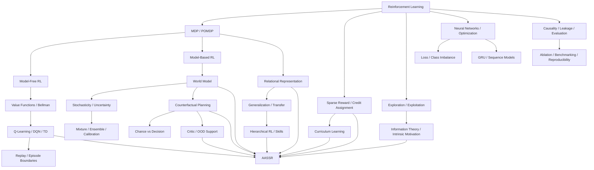

# Concept Index

이 페이지는 AASSR 위키의 **개념 사전이자 지식 지도**다.

AASSR을 읽다가 모르는 용어가 나오면 해당 단어를 눌러 더 기초적인 개념으로 내려갈 수 있도록 구성한다. 반대로 강화학습의 기초 개념을 읽다가 **그 개념이 AASSR에서 실제로 어디에 쓰이는지** 다시 핵심 메커니즘으로 올라갈 수도 있다.

> [!TIP]
> 이 위키의 링크 규칙은 가능한 한 **첫 등장하는 중요한 전문용어에 내부 링크를 건다**는 것이다. 같은 문단에서 지나치게 반복해서 링크하지는 않지만, 독자가 어느 페이지에서 시작해도 관련 개념을 타고 이동할 수 있게 한다.

> [!NOTE]
> 짧은 정의가 필요하면 [Glossary](Glossary), 개념을 처음부터 이해하려면 이 페이지에서 연결되는 foundation 문서, AASSR의 실제 구현을 보고 싶으면 각 Core Mechanism 페이지로 이동한다.

---

# 1. 전체 지식 그래프



---

# 2. 강화학습을 처음부터

## [Reinforcement Learning](Reinforcement-Learning)

가장 먼저 읽을 페이지다.

다음 개념을 한꺼번에 연결한다.

- agent / environment
- state / observation
- action
- reward / return
- discount factor
- policy
- value function
- trajectory / episode
- model-free / model-based
- on-policy / off-policy

AASSR의 `Policy`, `Prophecy`, `Critic`, `Imagination`이 일반 강화학습에서 어디에 위치하는지도 여기서 연결한다.

---

## [MDP and POMDP](MDP-and-POMDP)

- Markov property
- MDP의 `(S, A, P, R, γ)`
- hidden state와 observation
- POMDP
- belief state
- state aliasing
- memory

AASSR의 partial observation contract와 stochastic Prophecy를 이해하는 기반이다.

---

## [Sparse Reward and Credit Assignment](Sparse-Reward-and-Credit-Assignment)

- dense / sparse reward
- delayed reward
- long horizon
- temporal credit assignment
- reward shaping
- potential-based shaping
- intrinsic reward
- Monte Carlo vs TD

AASSR 자체의 구체적인 문제 설정은 **[Sparse Reward Problem](Sparse-Reward-Problem)** 에서 이어진다.

---

## [Exploration and Exploitation](Exploration-and-Exploitation)

- exploitation / exploration
- epsilon-greedy
- epsilon decay
- random exploration의 한계
- novelty
- curiosity
- information gain
- risky exploration

AASSR Policy의 information residual과 ASEQ를 이해하는 데 중요하다.

---

## [Information Theory and Intrinsic Motivation](Information-Theory-and-Intrinsic-Motivation)

- self-information
- entropy
- conditional entropy
- mutual information
- KL divergence
- information gain
- curiosity
- noisy-TV problem
- intrinsic vs extrinsic objective

AASSR의 information-value residual을 일반 이론과 구분하면서 이해하는 페이지다.

---

## [Curriculum Learning](Curriculum-Learning)

- fixed / adaptive curriculum
- promotion / demotion
- easy-to-hard learning
- transfer bottleneck
- catastrophic forgetting
- curriculum과 reward shaping의 차이
- guided trajectory와의 차이

AASSR에서 최초 성공 discovery와 higher-level transfer가 왜 별개의 문제인지 연결한다.

---

# 3. 가치 기반 강화학습

## [Value Functions and Bellman Equation](Value-Functions-and-Bellman-Equation)

- return `G_t`
- discount factor `γ`
- state value `V(s)`
- action value `Q(s,a)`
- advantage
- Bellman expectation equation
- Bellman optimality equation
- backup
- bootstrapping

AASSR의 DQN Policy와 sparse-return Critic의 수학적 기반이다.

---

## [Q-Learning, DQN and Temporal Difference](Q-Learning-DQN-and-TD)

- Q-learning update
- TD error
- target network
- experience replay
- DQN
- epsilon-greedy
- terminal mask
- overestimation
- distribution shift

`dqn_raw`, `dqn_relational`, `CurrentRelationalPolicy`를 읽기 전에 보면 좋다.

---

## [Replay Buffer and Episode Boundaries](Replay-Buffer-and-Episode-Boundaries)

- experience replay
- terminal
- truncation
- stalled reset
- rate-limit reset
- transition cap
- reward boundary vs bootstrap boundary
- replay vs Knowledge
- real transition vs imagined transition

AASSR에서 **reward가 0이어도 TD bootstrap은 끊어야 할 수 있다**는 수정의 이론적 배경이다.

---

# 4. 신경망과 최적화

## [Neural Networks and Optimization](Neural-Networks-and-Optimization)

- function approximation
- linear layer / activation
- forward / backward
- gradient / backpropagation
- optimizer
- learning rate
- minibatch
- overfitting / underfitting
- normalization
- one-hot encoding
- GPU batching / synchronization

AASSR 코드에서 신경망 구현을 읽기 위한 기초다.

---

## [Loss Functions and Class Imbalance](Loss-Functions-and-Class-Imbalance)

- MSE / MAE
- Huber / Smooth L1
- softmax / cross entropy
- BCE
- categorical vs multi-label
- class imbalance
- class weighting / oversampling
- NLL / mixture likelihood
- multi-task loss
- training loss vs validation metric

특히 status-aware Prophecy에서 **rare class를 더 잘 학습하는 것과 reward shaping은 다른 문제**라는 점을 설명한다.

---

# 5. Model-Based RL과 World Model

## [Model-Based RL and World Models](Model-Based-RL-and-World-Models)

- model-free vs model-based
- transition model
- reward model
- world model
- learned dynamics
- one-step vs multi-step prediction
- compounding error
- model bias
- model exploitation
- latent world model
- Dreamer 계열과의 개념적 비교

AASSR의 Prophecy와 Imagination을 일반 model-based RL 안에서 위치시킨다.

---

## [Stochasticity, Uncertainty and Probability](Stochasticity-Uncertainty-and-Probability)

- probability
- random variable
- expected value
- variance
- stochasticity
- aleatoric uncertainty
- epistemic uncertainty
- reliability
- value
- support
- risk

AASSR에서 반드시 구분해야 하는 관계:

```text
outcome probability
!= prediction reliability
!= Critic value
!= local support
```

---

## [Mixture Models, Ensembles and Calibration](Mixture-Ensemble-and-Calibration)

- multimodal distribution
- mixture model / component / weight
- mixture collapse
- ensemble / disagreement
- aleatoric vs epistemic 관점
- holdout calibration
- probability-weighted semantic score
- frozen holdout
- reliability diagram / ECE 개념

AASSR stochastic Prophecy와 Calibration의 직접 배경이다.

---

# 6. Planning과 Imagination

## [Counterfactual Planning and Search](Counterfactual-Planning-and-Search)

- planning vs learning
- counterfactual
- rollout
- lookahead
- horizon
- search tree
- branching factor
- beam search
- pruning
- root preservation
- structural deduplication
- MPC / receding horizon과의 개념적 연결
- intervention margin

AASSR의 Imagination을 단순 `n × k`보다 깊게 이해하는 페이지다.

---

## [Chance Nodes and Decision Nodes](Chance-and-Decision-Nodes)

```math
V_{chance}=\sum_i p_iV_i
```

```math
V_{decision}=\max_aV(a)
```

- 왜 environment randomness에는 expectation을 쓰는가?
- 왜 agent choice에는 max를 쓸 수 있는가?
- optimistic stochastic backup은 왜 틀리는가?
- probability와 reliability는 왜 다른가?

AASSR Imagination의 핵심 수학적 semantics다.

---

# 7. 표현, 일반화, OOD

## [Relational Representation and Generalization](Relational-Representation-and-Generalization)

- representation
- memorization vs generalization
- permutation
- invariance / equivariance
- relational inductive bias
- abstraction
- state aliasing
- concrete vs relational identity
- transfer learning
- structural root dedup
- representation leakage

AASSR `Relational State v3`, action key, Skill transfer의 기반이다.

---

## [Critic, Support and OOD](Critic-Support-and-OOD)

- function approximation
- interpolation / extrapolation
- in-distribution / OOD
- global readiness vs local support
- nearest-neighbor evidence
- density/support intuition
- fail-open / fail-closed
- conservative RL과의 문제의식 연결

AASSR에서 Critic이 숫자를 출력한다는 사실만으로 override를 허용하지 않는 이유를 설명한다.

---

# 8. Sequence와 계층적 행동

## [GRU and Sequence Models](GRU-and-Sequence-Models)

- RNN
- hidden state
- GRU update/reset gate
- sequence encoding
- recurrent-state mismatch
- zero-memory inference
- decision suffix training
- sequence batching

AASSR Critic의 recurrent contract를 이해하는 페이지다.

---

## [Hierarchical Reinforcement Learning and Skills](Hierarchical-RL-and-Skills)

- temporal abstraction
- macro action
- option framework
- primitive action
- skill discovery
- promotion
- relational Skill
- initiation / availability
- stochastic skill rollout

AASSR의 Skill이 사람이 넣은 정답 macro와 어떻게 다른지 설명한다.

---

# 9. 연구 방법론

## [Causality, Leakage and Fair Evaluation](Causality-Leakage-and-Evaluation)

- causality
- data leakage
- target leakage
- hindsight leakage
- privileged information
- public observation contract
- cross-episode leakage
- imagined fact vs real fact
- train/test contamination
- same-checkpoint comparison
- Oracle / guided trajectory

AASSR의 anti-hindsight, hidden-state 금지, same-checkpoint protocol과 연결된다.

---

## [Ablation, Benchmarking and Reproducibility](Ablation-Benchmarking-and-Reproducibility)

- benchmark
- baseline / control
- ablation
- confounder
- independent / dependent variable
- seed
- training budget
- hyperparameter tuning
- metric / proxy metric
- mean / standard deviation / confidence interval
- paired comparison
- diagnostic vs final benchmark
- reproducibility
- artifact provenance
- source of truth

AASSR의 핵심 비교:

```text
dqn_raw
→ dqn_relational
→ aassr_current_no_imagination
→ aassr_current_full
```

가 왜 필요한지 연구 방법론 수준에서 설명한다.

---

# 10. AASSR 자체 문서

## 연구

- [Sparse Reward Problem](Sparse-Reward-Problem)
- [Research Questions](Research-Questions)
- [Research Architecture](Research-Architecture)
- [Design Rationale](Design-Rationale)

## 메커니즘

- [State Representation](State-Representation)
- [ASEQ](ASEQ)
- [Policy](Policy)
- [Knowledge](Knowledge)
- [Prophecy](Prophecy)
- [Calibration](Calibration)
- [Critic](Critic)
- [Imagination](Imagination)
- [Skills](Skills)
- [Core Architecture](Core-Architecture)

## 검증

- [Experiments](Experiments)
- [Current Status](Current-Status)
- [Reproduction](Reproduction)

## 역사 / 용어

- [Development History](Development-History)
- [Glossary](Glossary)

---

# 11. 단어를 발견했을 때 어디로 가야 하나?

| 단어 | 먼저 읽을 페이지 |
|---|---|
| 강화학습, agent, environment | [Reinforcement Learning](Reinforcement-Learning) |
| state, observation, Markov, POMDP | [MDP and POMDP](MDP-and-POMDP) |
| sparse reward, delayed reward, credit assignment | [Sparse Reward and Credit Assignment](Sparse-Reward-and-Credit-Assignment) |
| exploration, epsilon, curiosity | [Exploration and Exploitation](Exploration-and-Exploitation) |
| entropy, mutual information, information gain | [Information Theory and Intrinsic Motivation](Information-Theory-and-Intrinsic-Motivation) |
| curriculum, promotion, demotion | [Curriculum Learning](Curriculum-Learning) |
| value, return, Bellman, bootstrapping | [Value Functions and Bellman Equation](Value-Functions-and-Bellman-Equation) |
| Q-learning, DQN, TD, target network | [Q-Learning, DQN and TD](Q-Learning-DQN-and-TD) |
| replay, terminal, truncation | [Replay Buffer and Episode Boundaries](Replay-Buffer-and-Episode-Boundaries) |
| neural network, gradient, optimizer, GPU batch | [Neural Networks and Optimization](Neural-Networks-and-Optimization) |
| MSE, cross entropy, Smooth L1, class imbalance | [Loss Functions and Class Imbalance](Loss-Functions-and-Class-Imbalance) |
| world model, model bias, model exploitation | [Model-Based RL and World Models](Model-Based-RL-and-World-Models) |
| probability, uncertainty, aleatoric, epistemic | [Stochasticity, Uncertainty and Probability](Stochasticity-Uncertainty-and-Probability) |
| mixture, ensemble, calibration | [Mixture, Ensemble and Calibration](Mixture-Ensemble-and-Calibration) |
| rollout, lookahead, beam, pruning | [Counterfactual Planning and Search](Counterfactual-Planning-and-Search) |
| chance node, decision node, expectation | [Chance and Decision Nodes](Chance-and-Decision-Nodes) |
| relational, permutation, invariance, transfer | [Relational Representation and Generalization](Relational-Representation-and-Generalization) |
| OOD, extrapolation, support, fail-closed | [Critic, Support and OOD](Critic-Support-and-OOD) |
| GRU, recurrent, hidden state | [GRU and Sequence Models](GRU-and-Sequence-Models) |
| skill, macro, option, temporal abstraction | [Hierarchical RL and Skills](Hierarchical-RL-and-Skills) |
| leakage, hindsight, privileged information | [Causality, Leakage and Evaluation](Causality-Leakage-and-Evaluation) |
| ablation, baseline, seed, confidence interval | [Ablation, Benchmarking and Reproducibility](Ablation-Benchmarking-and-Reproducibility) |

---

# 12. 추천 순서

**완전 처음부터:**  
[Reinforcement Learning](Reinforcement-Learning) → [MDP and POMDP](MDP-and-POMDP) → [Sparse Reward & Credit Assignment](Sparse-Reward-and-Credit-Assignment) → [AASSR in 5 Minutes](AASSR-in-5-Minutes)

**Policy를 이해하고 싶다면:**  
[Value & Bellman](Value-Functions-and-Bellman-Equation) → [DQN & TD](Q-Learning-DQN-and-TD) → [Exploration](Exploration-and-Exploitation) → [Information Theory](Information-Theory-and-Intrinsic-Motivation) → [Policy](Policy)

**Prophecy를 이해하고 싶다면:**  
[MDP/POMDP](MDP-and-POMDP) → [World Models](Model-Based-RL-and-World-Models) → [Uncertainty](Stochasticity-Uncertainty-and-Probability) → [Mixture/Ensemble](Mixture-Ensemble-and-Calibration) → [Loss/Class Imbalance](Loss-Functions-and-Class-Imbalance) → [Prophecy](Prophecy)

**Imagination을 이해하고 싶다면:**  
[World Models](Model-Based-RL-and-World-Models) → [Planning](Counterfactual-Planning-and-Search) → [Chance/Decision](Chance-and-Decision-Nodes) → [Critic/OOD](Critic-Support-and-OOD) → [Imagination](Imagination)

**실험을 검증하고 싶다면:**  
[Causality & Leakage](Causality-Leakage-and-Evaluation) → [Ablation & Benchmarking](Ablation-Benchmarking-and-Reproducibility) → [Experiments](Experiments) → [Current Status](Current-Status)

---

다음으로 읽기:

- **[Home](Home)**
- **[Reinforcement Learning](Reinforcement-Learning)**
- **[Research Architecture](Research-Architecture)**
- **[Glossary](Glossary)**