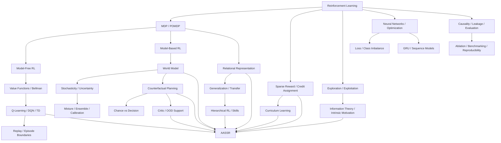

# Concept Index

이 페이지는 AASSR 위키의 **개념 사전이자 지식 지도**다.

AASSR을 읽다가 모르는 용어가 나오면 해당 단어를 눌러 더 기초적인 개념으로 내려갈 수 있도록 구성한다. 반대로 강화학습의 기초 개념을 읽다가 **그 개념이 AASSR에서 실제로 어디에 쓰이는지** 다시 핵심 메커니즘으로 올라갈 수도 있다.

> [!TIP]
> 이 위키의 링크 규칙은 가능한 한 **첫 등장하는 중요한 전문용어에 내부 링크를 건다**는 것이다. 같은 문단에서 지나치게 반복해서 링크하지는 않지만, 독자가 어느 페이지에서 시작해도 관련 개념을 타고 이동할 수 있게 한다.

> [!NOTE]
> 짧은 정의가 필요하면 [Glossary](Glossary), 개념을 처음부터 이해하려면 이 페이지에서 연결되는 foundation 문서, AASSR의 실제 구현을 보고 싶으면 각 Core Mechanism 페이지로 이동한다.

---

# 1. 전체 지식 그래프



---

# 2. 강화학습을 처음부터

## [Reinforcement Learning](Reinforcement-Learning)

가장 먼저 읽을 페이지다.

다음 개념을 한꺼번에 연결한다.

- [에이전트(agent)](Reinforcement-Learning) / [환경(environment)](Reinforcement-Learning)
- [상태(state)](State-Representation) / [관측(observation)](MDP-and-POMDP)
- [행동(action)](Reinforcement-Learning)
- [보상(reward)](Sparse-Reward-and-Credit-Assignment) / [누적 보상(return)](Value-Functions-and-Bellman-Equation)
- discount factor
- policy
- [가치(value)](Value-Functions-and-Bellman-Equation) function
- trajectory / [한 번의 문제 풀이 구간(episode)](Terminology-Guide)
- model-free / model-based
- on-policy / off-policy

AASSR의 `Policy`, `Prophecy`, `Critic`, `Imagination`이 일반 강화학습에서 어디에 위치하는지도 여기서 연결한다.

---

## [MDP and POMDP](MDP-and-POMDP)

- Markov property
- MDP의 `(S, A, P, R, γ)`
- [숨은 환경 상태(hidden state)](MDP-and-POMDP)와 관측
- POMDP
- belief 상태
- 상태 aliasing
- memory

AASSR의 partial 관측 [명세(contract)](Current-Status)와 [확률적(stochastic)](Stochasticity-Uncertainty-and-Probability) [Prophecy(미래 예측 모델)](Prophecy)를 이해하는 기반이다.

---

## [Sparse Reward and Credit Assignment](Sparse-Reward-and-Credit-Assignment)

- dense / [희소 보상(sparse reward)](Sparse-Reward-and-Credit-Assignment)
- delayed 보상
- long horizon
- temporal [보상 책임 배분(credit assignment)](Sparse-Reward-and-Credit-Assignment)
- 보상 shaping
- potential-based shaping
- intrinsic 보상
- Monte Carlo vs TD

AASSR 자체의 구체적인 문제 설정은 **[Sparse Reward Problem](Sparse-Reward-Problem)** 에서 이어진다.

---

## [Exploration and Exploitation](Exploration-and-Exploitation)

- [활용(exploitation)](Exploration-and-Exploitation) / [탐색(exploration)](Exploration-and-Exploitation)
- epsilon-greedy
- epsilon decay
- random 탐색의 한계
- novelty
- curiosity
- information gain
- risky 탐색

AASSR [Policy(정책 모델)](Policy)의 [정보 가치 잔차(information residual)](Policy)과 [ASEQ(실제 상태-행동-다음 상태 기록)](ASEQ)를 이해하는 데 중요하다.

---

## [Information Theory and Intrinsic Motivation](Information-Theory-and-Intrinsic-Motivation)

- self-information
- entropy
- conditional entropy
- mutual information
- KL divergence
- information gain
- curiosity
- noisy-TV problem
- intrinsic vs extrinsic [학습 목표(objective)](Terminology-Guide)

AASSR의 [정보 가치 잔차(information-value residual)](Policy)을 일반 이론과 구분하면서 이해하는 페이지다.

---

## [Curriculum Learning](Curriculum-Learning)

- fixed / adaptive [난이도 조절 학습(curriculum)](Curriculum-Learning)
- promotion / demotion
- easy-to-hard learning
- [전이(transfer)](Relational-Representation-and-Generalization) bottleneck
- catastrophic forgetting
- 난이도 조절 학습과 보상 shaping의 차이
- guided trajectory와의 차이

AASSR에서 최초 성공 discovery와 higher-level 전이가 왜 별개의 문제인지 연결한다.

---

# 3. 가치 기반 강화학습

## [Value Functions and Bellman Equation](Value-Functions-and-Bellman-Equation)

- 누적 보상 `G_t`
- discount factor `γ`
- 상태 가치 `V(s)`
- 행동 가치 `Q(s,a)`
- advantage
- Bellman expectation equation
- Bellman optimality equation
- backup
- [다음 상태 가치 이어받기(bootstrap)](Replay-Buffer-and-Episode-Boundaries)ping

AASSR의 [DQN(딥 Q-네트워크)](Q-Learning-DQN-and-TD) [Policy](Policy)와 sparse-누적 보상 [Critic(미래 가치 평가기)](Critic)의 수학적 기반이다.

---

## [Q-Learning, DQN and Temporal Difference](Q-Learning-DQN-and-TD)

- Q-learning update
- TD error
- target [신경망(network)](Neural-Networks-and-Optimization)
- experience replay
- [DQN](Q-Learning-DQN-and-TD)
- epsilon-greedy
- [에피소드 종료(terminal)](Replay-Buffer-and-Episode-Boundaries) mask
- overestimation
- [데이터 분포 변화(distribution shift)](Critic-Support-and-OOD)

`dqn_raw`, `dqn_relational`, `CurrentRelationalPolicy`를 읽기 전에 보면 좋다.

---

## [Replay Buffer and Episode Boundaries](Replay-Buffer-and-Episode-Boundaries)

- experience replay
- 에피소드 종료
- [외부 제한 종료(truncation)](Replay-Buffer-and-Episode-Boundaries)
- stalled reset
- rate-limit reset
- [상태 전이(transition)](MDP-and-POMDP) cap
- 보상 boundary vs 다음 상태 가치 이어받기 boundary
- replay vs [Knowledge(에피소드 지식)](Knowledge)
- real 상태 전이 vs imagined 상태 전이

AASSR에서 **보상가 0이어도 TD 다음 상태 가치 이어받기은 끊어야 할 수 있다**는 수정의 이론적 배경이다.

---

# 4. 신경망과 최적화

## [Neural Networks and Optimization](Neural-Networks-and-Optimization)

- function approximation
- linear [처리 계층(layer)](Research-Architecture) / activation
- forward / backward
- gradient / backpropagation
- optimizer
- learning rate
- minibatch
- overfitting / underfitting
- normalization
- one-hot encoding
- GPU [묶음 처리(batching)](Reproduction) / synchronization

AASSR 코드에서 신경망 구현을 읽기 위한 기초다.

---

## [Loss Functions and Class Imbalance](Loss-Functions-and-Class-Imbalance)

- MSE / MAE
- Huber / Smooth L1
- softmax / cross entropy
- BCE
- [범주형(categorical)](Loss-Functions-and-Class-Imbalance) vs multi-label
- class imbalance
- class weighting / oversampling
- NLL / mixture likelihood
- multi-task [학습 손실(loss)](Loss-Functions-and-Class-Imbalance)
- [학습(training)](Terminology-Guide) 학습 손실 vs [검증(validation)](Ablation-Benchmarking-and-Reproducibility) [평가지표(metric)](Ablation-Benchmarking-and-Reproducibility)

특히 [상태 코드까지 고려하는(status-aware)](Calibration) [Prophecy](Prophecy)에서 **[드문(rare)](Loss-Functions-and-Class-Imbalance) class를 더 잘 학습하는 것과 보상 shaping은 다른 문제**라는 점을 설명한다.

---

# 5. Model-Based RL과 World Model

## [Model-Based RL and World Models](Model-Based-RL-and-World-Models)

- model-free vs model-based
- 상태 전이 [학습 모델(model)](Terminology-Guide)
- 보상 학습 모델
- [세계 모델(world model)](Model-Based-RL-and-World-Models)
- learned [환경의 상태 변화 규칙(dynamics)](Model-Based-RL-and-World-Models)
- one-step vs multi-step [예측(prediction)](Terminology-Guide)
- compounding error
- 학습 모델 bias
- [모델 오류 악용(model exploitation)](Model-Based-RL-and-World-Models)
- latent 세계 모델
- Dreamer 계열과의 개념적 비교

AASSR의 [Prophecy](Prophecy)와 [Imagination(가상 미래 탐색)](Imagination)을 일반 [모델 기반 강화학습(model-based RL)](Model-Based-RL-and-World-Models) 안에서 위치시킨다.

---

## [Stochasticity, Uncertainty and Probability](Stochasticity-Uncertainty-and-Probability)

- probability
- random variable
- expected 가치
- variance
- stochasticity
- aleatoric uncertainty
- [지식 부족에서 오는 불확실성(epistemic uncertainty)](Stochasticity-Uncertainty-and-Probability)
- [신뢰도(reliability)](Calibration)
- 가치
- [데이터 근거(support)](Critic-Support-and-OOD)
- risk

AASSR에서 반드시 구분해야 하는 관계:

```text
outcome probability
!= prediction reliability
!= Critic value
!= local support
```

---

## [Mixture Models, Ensembles and Calibration](Mixture-Ensemble-and-Calibration)

- [여러 결과 형태를 가진(multimodal)](Mixture-Ensemble-and-Calibration) distribution
- mixture 학습 모델 / [구성요소(component)](Research-Architecture) / weight
- mixture collapse
- ensemble / disagreement
- aleatoric vs epistemic 관점
- [검증용 분리 데이터(holdout)](Calibration) calibration
- probability-weighted semantic score
- [학습을 멈춘(frozen)](Ablation-Benchmarking-and-Reproducibility) 검증용 분리 데이터
- 신뢰도 diagram / ECE 개념

AASSR 확률적 [Prophecy](Prophecy)와 [Calibration(예측 신뢰도 보정)](Calibration)의 직접 배경이다.

---

# 6. Planning과 Imagination

## [Counterfactual Planning and Search](Counterfactual-Planning-and-Search)

- [계획(planning)](Counterfactual-Planning-and-Search) vs learning
- counterfactual
- rollout
- lookahead
- horizon
- search tree
- branching factor
- beam search
- pruning
- [탐색의 첫 행동(root)](Imagination) preservation
- structural deduplication
- MPC / receding horizon과의 개념적 연결
- [실제 행동 개입(intervention)](Imagination) [최소 차이 기준(margin)](Imagination)

AASSR의 [Imagination](Imagination)을 단순 `n × k`보다 깊게 이해하는 페이지다.

---

## [Chance Nodes and Decision Nodes](Chance-and-Decision-Nodes)

```math
V_{chance}=\sum_i p_iV_i
```

```math
V_{decision}=\max_aV(a)
```

- 왜 환경 randomness에는 expectation을 쓰는가?
- 왜 에이전트 choice에는 max를 쓸 수 있는가?
- optimistic 확률적 backup은 왜 틀리는가?
- probability와 신뢰도는 왜 다른가?

AASSR [Imagination](Imagination)의 핵심 수학적 semantics다.

---

# 7. 표현, 일반화, OOD

## [Relational Representation and Generalization](Relational-Representation-and-Generalization)

- [표현(representation)](Relational-Representation-and-Generalization)
- memorization vs [일반화(generalization)](Relational-Representation-and-Generalization)
- permutation
- invariance / equivariance
- [관계 기반(relational)](Relational-Representation-and-Generalization) inductive bias
- abstr행동
- 상태 aliasing
- concrete vs 관계 기반 [식별 방식(identity)](State-Representation)
- 전이 learning
- structural 탐색의 첫 행동 dedup
- 표현 leakage

AASSR `Relational State v3`, 행동 key, [Skill(성공 절차 재사용)](Skills) 전이의 기반이다.

---

## [Critic, Support and OOD](Critic-Support-and-OOD)

- function approximation
- interpolation / extrapolation
- in-distribution / [학습 분포 밖(OOD)](Critic-Support-and-OOD)
- global readiness vs [국소 데이터 근거(local support)](Critic-Support-and-OOD)
- nearest-neighbor [증거(evidence)](Evidence-Matrix)
- density/데이터 근거 intuition
- fail-open / [근거가 부족하면 보수적으로 거부하는(fail-closed)](Critic-Support-and-OOD)
- conservative RL과의 문제의식 연결

AASSR에서 [Critic](Critic)이 숫자를 출력한다는 사실만으로 [기본 행동 덮어쓰기(override)](Imagination)를 허용하지 않는 이유를 설명한다.

---

# 8. Sequence와 계층적 행동

## [GRU and Sequence Models](GRU-and-Sequence-Models)

- RNN
- 숨은 환경 상태
- [GRU(게이트 순환 유닛)](GRU-and-Sequence-Models) update/reset [판정 관문(gate)](Terminology-Guide)
- sequence encoding
- recurrent-state mismatch
- zero-memory inference
- decision suffix 학습
- sequence 묶음 처리

AASSR [Critic](Critic)의 recurrent 명세를 이해하는 페이지다.

---

## [Hierarchical Reinforcement Learning and Skills](Hierarchical-RL-and-Skills)

- temporal abstr행동
- macro 행동
- option [문제 표현 틀(framework)](Terminology-Guide)
- primitive 행동
- skill discovery
- promotion
- 관계 기반 [Skill](Skills)
- initiation / availability
- 확률적 skill rollout

AASSR의 [Skill](Skills)이 사람이 넣은 정답 macro와 어떻게 다른지 설명한다.

---

# 9. 연구 방법론

## [Causality, Leakage and Fair Evaluation](Causality-Leakage-and-Evaluation)

- causality
- data leakage
- target leakage
- hindsight leakage
- privileged information
- [공개된(public)](State-Representation) 관측 명세
- cross-episode leakage
- imagined fact vs real fact
- train/test contamination
- [같은 체크포인트(same-checkpoint)](Experiments) comparison
- Oracle / guided trajectory

AASSR의 anti-hindsight, hidden-state 금지, 같은 체크포인트 [실험 규칙(protocol)](Ablation-Benchmarking-and-Reproducibility)과 연결된다.

---

## [Ablation, Benchmarking and Reproducibility](Ablation-Benchmarking-and-Reproducibility)

- [표준 비교 실험(benchmark)](Ablation-Benchmarking-and-Reproducibility)
- [비교 기준(baseline)](Ablation-Benchmarking-and-Reproducibility) / control
- [구성요소 제거 비교(ablation)](Ablation-Benchmarking-and-Reproducibility)
- confounder
- independent / dependent variable
- [난수 시드(seed)](Ablation-Benchmarking-and-Reproducibility)
- 학습 budget
- hyperparameter tuning
- 평가지표 / [대리 지표(proxy)](Ablation-Benchmarking-and-Reproducibility) 평가지표
- mean / standard deviation / confidence interval
- paired comparison
- [진단 실험(diagnostic)](Evidence-Matrix) vs final 표준 비교 실험
- reproducibility
- artifact [정보의 출처 기록(provenance)](Knowledge)
- [최종 기준(source of truth)](Current-Status)

AASSR의 핵심 비교:

```text
dqn_raw
→ dqn_relational
→ aassr_current_no_imagination
→ aassr_current_full
```

가 왜 필요한지 연구 방법론 수준에서 설명한다.

---

# 10. AASSR 자체 문서

## 연구

- [Sparse Reward Problem](Sparse-Reward-Problem)
- [Research Questions](Research-Questions)
- [Research Architecture](Research-Architecture)
- [Design Rationale](Design-Rationale)

## 메커니즘

- [State Representation](State-Representation)
- [ASEQ](ASEQ)
- [Policy](Policy)
- [Knowledge](Knowledge)
- [Prophecy](Prophecy)
- [Calibration](Calibration)
- [Critic](Critic)
- [Imagination](Imagination)
- [Skills](Skills)
- [Core Architecture](Core-Architecture)

## 검증

- [Experiments](Experiments)
- [Current Status](Current-Status)
- [Reproduction](Reproduction)

## 역사 / 용어

- [Development History](Development-History)
- [Glossary](Glossary)

---

# 11. 단어를 발견했을 때 어디로 가야 하나?

| 단어 | 먼저 읽을 페이지 |
|---|---|
| 강화학습, 에이전트, 환경 | [Reinforcement Learning](Reinforcement-Learning) |
| 상태, 관측, Markov, POMDP | [MDP and POMDP](MDP-and-POMDP) |
| 희소 보상, delayed 보상, 보상 책임 배분 | [Sparse Reward and Credit Assignment](Sparse-Reward-and-Credit-Assignment) |
| 탐색, epsilon, curiosity | [Exploration and Exploitation](Exploration-and-Exploitation) |
| entropy, mutual information, information gain | [Information Theory and Intrinsic Motivation](Information-Theory-and-Intrinsic-Motivation) |
| 난이도 조절 학습, promotion, demotion | [Curriculum Learning](Curriculum-Learning) |
| 가치, 누적 보상, Bellman, 다음 상태 가치 이어받기ping | [Value Functions and Bellman Equation](Value-Functions-and-Bellman-Equation) |
| Q-learning, [DQN](Q-Learning-DQN-and-TD), TD, target 신경망 | [Q-Learning, DQN and TD](Q-Learning-DQN-and-TD) |
| replay, 에피소드 종료, 외부 제한 종료 | [Replay Buffer and Episode Boundaries](Replay-Buffer-and-Episode-Boundaries) |
| neural 신경망, gradient, optimizer, GPU batch | [Neural Networks and Optimization](Neural-Networks-and-Optimization) |
| MSE, cross entropy, Smooth L1, class imbalance | [Loss Functions and Class Imbalance](Loss-Functions-and-Class-Imbalance) |
| 세계 모델, 학습 모델 bias, 모델 오류 악용 | [Model-Based RL and World Models](Model-Based-RL-and-World-Models) |
| probability, uncertainty, aleatoric, epistemic | [Stochasticity, Uncertainty and Probability](Stochasticity-Uncertainty-and-Probability) |
| mixture, ensemble, calibration | [Mixture, Ensemble and Calibration](Mixture-Ensemble-and-Calibration) |
| rollout, lookahead, beam, pruning | [Counterfactual Planning and Search](Counterfactual-Planning-and-Search) |
| [환경 결과 노드(chance node)](Chance-and-Decision-Nodes), [행동 선택 노드(decision node)](Chance-and-Decision-Nodes), expectation | [Chance and Decision Nodes](Chance-and-Decision-Nodes) |
| 관계 기반, permutation, invariance, 전이 | [Relational Representation and Generalization](Relational-Representation-and-Generalization) |
| [OOD](Critic-Support-and-OOD), extrapolation, 데이터 근거, 근거가 부족하면 보수적으로 거부하는 | [Critic, Support and OOD](Critic-Support-and-OOD) |
| [GRU](GRU-and-Sequence-Models), recurrent, 숨은 환경 상태 | [GRU and Sequence Models](GRU-and-Sequence-Models) |
| skill, macro, option, temporal abstr행동 | [Hierarchical RL and Skills](Hierarchical-RL-and-Skills) |
| leakage, hindsight, privileged information | [Causality, Leakage and Evaluation](Causality-Leakage-and-Evaluation) |
| 구성요소 제거 비교, 비교 기준, 난수 시드, confidence interval | [Ablation, Benchmarking and Reproducibility](Ablation-Benchmarking-and-Reproducibility) |

---

# 12. 추천 순서

**완전 처음부터:**  
[Reinforcement Learning](Reinforcement-Learning) → [MDP and POMDP](MDP-and-POMDP) → [Sparse Reward & Credit Assignment](Sparse-Reward-and-Credit-Assignment) → [AASSR in 5 Minutes](AASSR-in-5-Minutes)

**[Policy](Policy)를 이해하고 싶다면:**  
[Value & Bellman](Value-Functions-and-Bellman-Equation) → [DQN & TD](Q-Learning-DQN-and-TD) → [Exploration](Exploration-and-Exploitation) → [Information Theory](Information-Theory-and-Intrinsic-Motivation) → [Policy](Policy)

**[Prophecy](Prophecy)를 이해하고 싶다면:**  
[MDP/POMDP](MDP-and-POMDP) → [World Models](Model-Based-RL-and-World-Models) → [Uncertainty](Stochasticity-Uncertainty-and-Probability) → [Mixture/Ensemble](Mixture-Ensemble-and-Calibration) → [Loss/Class Imbalance](Loss-Functions-and-Class-Imbalance) → [Prophecy](Prophecy)

**[Imagination](Imagination)을 이해하고 싶다면:**  
[World Models](Model-Based-RL-and-World-Models) → [Planning](Counterfactual-Planning-and-Search) → [Chance/Decision](Chance-and-Decision-Nodes) → [Critic/OOD](Critic-Support-and-OOD) → [Imagination](Imagination)

**실험을 검증하고 싶다면:**  
[Causality & Leakage](Causality-Leakage-and-Evaluation) → [Ablation & Benchmarking](Ablation-Benchmarking-and-Reproducibility) → [Experiments](Experiments) → [Current Status](Current-Status)

---

다음으로 읽기:

- **[Home](Home)**
- **[Reinforcement Learning](Reinforcement-Learning)**
- **[Research Architecture](Research-Architecture)**
- **[Glossary](Glossary)**