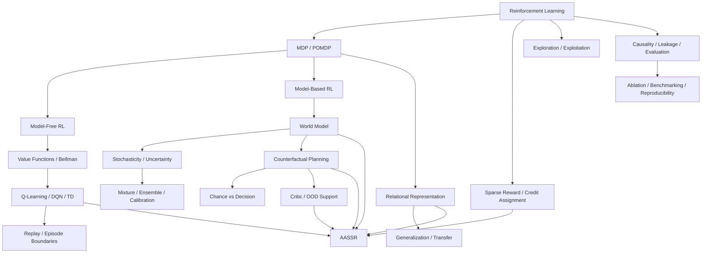

# Concept Index

이 페이지는 AASSR 위키의 **개념 사전이자 지식 지도**다.

AASSR을 읽다가 모르는 용어가 나오면 해당 단어를 눌러 더 기초적인 개념으로 내려갈 수 있도록 구성한다. 반대로 강화학습의 기초 개념을 읽다가 **그 개념이 AASSR에서 실제로 어디에 쓰이는지** 다시 핵심 메커니즘으로 올라갈 수도 있다.

> [!TIP]
> 이 위키의 링크 규칙은 가능한 한 **첫 등장하는 중요한 전문용어에 내부 링크를 건다**는 것이다. 같은 문단에서 지나치게 반복해서 링크하지는 않지만, 독자가 어느 페이지에서 시작해도 관련 개념을 타고 이동할 수 있게 한다.

---

# 1. 가장 큰 지도



---

# 2. 강화학습 기초

## [Reinforcement Learning](Reinforcement-Learning)

가장 먼저 읽을 페이지다.

다음 개념을 한꺼번에 연결한다.

- agent / environment
- state / observation
- action
- reward
- return
- policy
- trajectory / episode
- value function
- model-free / model-based
- on-policy / off-policy

AASSR의 `Policy`, `Prophecy`, `Critic`, `Imagination`이 각각 일반 강화학습의 어디에 위치하는지도 여기서 연결한다.

---

## [MDP and POMDP](MDP-and-POMDP)

다음 질문을 다룬다.

- Markov property란 무엇인가?
- MDP의 `(S, A, P, R, γ)`는 무엇인가?
- state와 observation은 왜 다른가?
- POMDP에서는 왜 같은 관측에서 여러 미래가 가능할 수 있는가?
- belief state와 memory는 어떤 역할을 하는가?

AASSR의 stochastic Prophecy가 필요한 가장 깊은 배경 중 하나다.

---

## [Sparse Reward and Credit Assignment](Sparse-Reward-and-Credit-Assignment)

다음을 설명한다.

- dense reward / sparse reward
- delayed reward
- temporal credit assignment
- exploration difficulty
- long horizon
- reward shaping
- subgoal leakage

AASSR의 연구 질문 자체와 직접 연결된다.

AASSR 특화 문제 정의는 **[Sparse Reward Problem](Sparse-Reward-Problem)** 에서 본다.

---

## [Exploration and Exploitation](Exploration-and-Exploitation)

다음을 설명한다.

- exploitation
- exploration
- epsilon-greedy
- random exploration의 한계
- information gain
- intrinsic motivation
- curiosity와 reward shaping의 차이

AASSR `Policy`의 information residual을 이해할 때 중요하다.

---

# 3. 가치 기반 강화학습

## [Value Functions and Bellman Equation](Value-Functions-and-Bellman-Equation)

다음을 다룬다.

- return `G_t`
- discount factor `γ`
- state value `V(s)`
- action value `Q(s,a)`
- Bellman expectation equation
- Bellman optimality equation
- bootstrapping

AASSR의 DQN Policy와 sparse-return Critic의 수학적 바탕이다.

---

## [Q-Learning, DQN and Temporal Difference](Q-Learning-DQN-and-TD)

다음을 연결한다.

- Q-learning
- TD target
- bootstrapping
- target network
- experience replay
- DQN
- epsilon-greedy
- terminal transition

AASSR의 `dqn_raw`, `dqn_relational`, `CurrentRelationalPolicy`를 읽기 전 기초 페이지다.

---

## [Replay Buffer and Episode Boundaries](Replay-Buffer-and-Episode-Boundaries)

다음을 구분한다.

- replay buffer
- off-policy reuse
- terminal
- truncation
- stalled reset
- rate-limit reset
- transition cap
- TD bootstrap boundary

AASSR에서 **reward가 0이어도 bootstrap은 끊어야 할 수 있다**는 설계를 이해하는 데 중요하다.

---

# 4. Model-Based RL과 World Model

## [Model-Based RL and World Models](Model-Based-RL-and-World-Models)

다음을 다룬다.

- model-free RL과 model-based RL의 차이
- transition model
- reward model
- world model
- learned dynamics
- planning with a learned model
- model bias
- compounding error
- model exploitation

AASSR에서 Prophecy가 왜 단순 보조 예측기가 아니라 planning model인지 설명한다.

---

## [Stochasticity, Uncertainty and Probability](Stochasticity-Uncertainty-and-Probability)

헷갈리기 쉬운 개념을 분리한다.

- stochasticity
- probability
- expected value
- variance
- aleatoric uncertainty
- epistemic uncertainty
- confidence
- reliability

특히 AASSR의 다음 구분으로 연결된다.

```text
outcome probability != prediction reliability != Critic value != support
```

---

## [Mixture Models, Ensembles and Calibration](Mixture-Ensemble-and-Calibration)

다음을 설명한다.

- multimodal distribution
- mixture model
- mixture weight
- ensemble
- disagreement
- calibration
- holdout calibration
- class imbalance
- reliability gating

AASSR의 stochastic Prophecy와 Calibration 페이지의 직접 배경이다.

---

# 5. Planning과 Imagination

## [Counterfactual Planning and Search](Counterfactual-Planning-and-Search)

다음을 연결한다.

- planning
- rollout
- lookahead
- search tree
- counterfactual
- planning horizon
- branching factor
- beam search
- pruning
- model predictive control과의 개념적 유사점

AASSR의 Imagination을 `n × k`라는 단순 표현보다 더 정확히 이해하기 위한 페이지다.

---

## [Chance Nodes and Decision Nodes](Chance-and-Decision-Nodes)

AASSR에서 특히 중요한 구분을 깊게 다룬다.

```math
V_{chance} = \sum_i p_iV_i
```

```math
V_{decision} = \max_a V(a)
```

환경의 랜덤 결과를 agent가 선택할 수 있는 행동처럼 `max`하면 왜 optimistic planning 오류가 생기는지 설명한다.

---

# 6. 표현과 일반화

## [Relational Representation and Generalization](Relational-Representation-and-Generalization)

다음을 다룬다.

- representation
- feature
- invariance
- permutation invariance
- identifier renaming
- relational inductive bias
- generalization
- transfer learning
- memorization

AASSR의 `Relational State v3`, relational action key, structural root dedup, relational Skill을 이해하는 데 중요하다.

---

# 7. Critic, OOD와 support

## [Critic, Support and OOD](Critic-Support-and-OOD)

다음을 설명한다.

- critic
- value approximation
- interpolation / extrapolation
- in-distribution / out-of-distribution
- support
- nearest-neighbor evidence
- epistemic risk
- fail-closed gate

AASSR의 **global critic-ready와 local critic support는 다르다**는 설계의 배경이다.

---

## [GRU and Sequence Models](GRU-and-Sequence-Models)

다음을 다룬다.

- recurrent neural network
- hidden state
- GRU update/reset gate
- sequence encoding
- zero-memory inference
- recurrent-state mismatch

AASSR Critic의 `decision suffix training`이 왜 필요한지 연결한다.

---

# 8. Skill과 계층적 행동

## [Hierarchical Reinforcement Learning and Skills](Hierarchical-RL-and-Skills)

다음을 설명한다.

- temporal abstraction
- macro action
- option
- skill
- primitive action
- reusable subpolicy
- skill discovery
- transfer

AASSR Skill은 정답 macro를 사람이 주입하는 방식이 아니라 **실제 성공 ASeq를 relational template로 승격**한다는 점을 여기서 비교한다.

---

# 9. 연구 방법론

## [Causality, Leakage and Fair Evaluation](Causality-Leakage-and-Evaluation)

다음을 다룬다.

- data leakage
- hindsight leakage
- target leakage
- privileged information
- causal observation
- train/eval contamination
- same-checkpoint comparison

AASSR의 다음 경계와 직접 연결된다.

- hidden simulator state 금지
- 행동 후 Knowledge를 행동 전 prediction에 사용하지 않음
- imagined fact를 real fact처럼 학습하지 않음
- OFF/ON 평가 사이에 재학습하지 않음

---

## [Ablation, Benchmarking and Reproducibility](Ablation-Benchmarking-and-Reproducibility)

다음을 설명한다.

- baseline
- control
- ablation
- confounder
- seed
- train/test split
- unseen evaluation
- same checkpoint
- metric
- statistical uncertainty
- reproducibility
- source of truth

AASSR의

```text
dqn_raw
→ dqn_relational
→ aassr_current_no_imagination
→ aassr_current_full
```

구조가 왜 필요한지 연구 방법론 수준에서 설명한다.

---

# 10. AASSR 자체 페이지

## 연구

- **[Sparse Reward Problem](Sparse-Reward-Problem)**
- **[Research Questions](Research-Questions)**
- **[Research Architecture](Research-Architecture)**
- **[Design Rationale](Design-Rationale)**

## 메커니즘

- **[State Representation](State-Representation)**
- **[ASEQ](ASEQ)**
- **[Policy](Policy)**
- **[Knowledge](Knowledge)**
- **[Prophecy](Prophecy)**
- **[Calibration](Calibration)**
- **[Critic](Critic)**
- **[Imagination](Imagination)**
- **[Skills](Skills)**

## 검증

- **[Experiments](Experiments)**
- **[Current Status](Current-Status)**
- **[Reproduction](Reproduction)**

---

# 11. 단어를 발견했을 때 어디로 가야 하나?

| 단어 | 먼저 읽을 페이지 |
|---|---|
| 강화학습, agent, environment | [Reinforcement Learning](Reinforcement-Learning) |
| state, observation, Markov | [MDP and POMDP](MDP-and-POMDP) |
| sparse reward, delayed reward | [Sparse Reward and Credit Assignment](Sparse-Reward-and-Credit-Assignment) |
| exploration, epsilon | [Exploration and Exploitation](Exploration-and-Exploitation) |
| value, return, Bellman | [Value Functions and Bellman Equation](Value-Functions-and-Bellman-Equation) |
| Q-learning, DQN, TD | [Q-Learning, DQN and TD](Q-Learning-DQN-and-TD) |
| replay, terminal, truncation | [Replay Buffer and Episode Boundaries](Replay-Buffer-and-Episode-Boundaries) |
| world model | [Model-Based RL and World Models](Model-Based-RL-and-World-Models) |
| probability, uncertainty | [Stochasticity, Uncertainty and Probability](Stochasticity-Uncertainty-and-Probability) |
| mixture, ensemble, calibration | [Mixture, Ensemble and Calibration](Mixture-Ensemble-and-Calibration) |
| rollout, lookahead | [Counterfactual Planning and Search](Counterfactual-Planning-and-Search) |
| chance node, expectation | [Chance and Decision Nodes](Chance-and-Decision-Nodes) |
| relational, permutation | [Relational Representation and Generalization](Relational-Representation-and-Generalization) |
| OOD, support | [Critic, Support and OOD](Critic-Support-and-OOD) |
| GRU, recurrent | [GRU and Sequence Models](GRU-and-Sequence-Models) |
| skill, macro, option | [Hierarchical RL and Skills](Hierarchical-RL-and-Skills) |
| leakage, hindsight | [Causality, Leakage and Evaluation](Causality-Leakage-and-Evaluation) |
| ablation, baseline, seed | [Ablation, Benchmarking and Reproducibility](Ablation-Benchmarking-and-Reproducibility) |

---

다음으로 읽기:

- **[Home](Home)**
- **[Reinforcement Learning](Reinforcement-Learning)**
- **[Research Architecture](Research-Architecture)**
- **[Glossary](Glossary)**