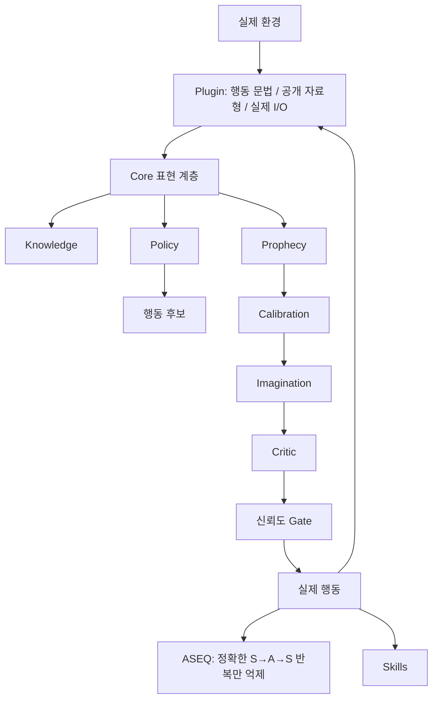

# AASSR Core Architecture

이 페이지는 2026-08-14에 고정한 **최소 Plugin 경계 이후의 새 Core 구조**를 설명한다.

> **Plugin은 세계의 문법만 알려주고, 세계의 의미는 AASSR Core가 스스로 배운다.**

기존 10k pentest runtime(`current_*`, `plugins/current_pentest.py`)은 체크포인트와 과거 실험 재현을 위해 남아 있지만 새 Core 설계의 기준은 아니다.

## 전체 구조

## Plugin 경계

Plugin은 `PluginSchema`로 행동 형식과 관찰 자료형만 선언한다. Plugin이 상태 벡터, 행동 구조, 의미 역할, world model, 행동 우선순위를 정의할 수 없다.

Core는 공개 관찰에서 자료형에 맞는 값을 모아 후보 명령을 구성한다. 따라서 Plugin이 정답 후보만 골라주는 경로가 없다.

자세한 내용: [[플러그인 제작법|Plugin-Development]]

## Core의 책임

### Knowledge
실제 transition에서 관찰한 공개 정보와 출처를 저장한다.

### Policy
외부 sparse reward를 학습하는 DQN과 별도의 내부 정보 가치 신호를 사용한다. Plugin은 내부 보상을 만들 수 없다.

### Prophecy
Core가 만든 일반 표현으로 다음 상태를 학습한다. 환경 전용 Prophecy head를 Plugin이 주입하지 않는다.

### Calibration
실제 transition 기반 holdout으로 예측 신뢰도를 확인한다.

### Critic
실제 episode sparse return을 학습한다. 새 Core의 Critic은 부호가 있는 return을 그대로 다룬다.

### Imagination
Prophecy의 미래를 실제 행동 전에 비교한다. Critic 지원과 예측 coverage가 부족하면 fail-closed한다. 실제 planner run이 0이면 ON/OFF 실험을 유효한 Imagination 성능 비교로 표시하지 않는다.

### ASEQ
`S → A → S`가 같은 semantic state에서 반복된 경우만 억제한다. `S → A → S'`에서 `S' != S`이면 합법이다. 모든 행동이 guard되면 원래 행동 집합으로 되돌아간다.

### Skills
성공한 행동열을 Core 표현의 구조적 template으로 저장하고 현재 상태의 행동과 다시 대응시킨다.

## 현재 증거 수준

새 구조에서 현재 주장 가능한 것은 **코드 경계와 계약의 분리**다. 기존 10k 성능 수치는 이전 pentest runtime의 historical evidence이며 새 Core의 성능으로 이전하지 않는다. localhost 실제 I/O와 새 학습 성능은 별도로 검증한다.
