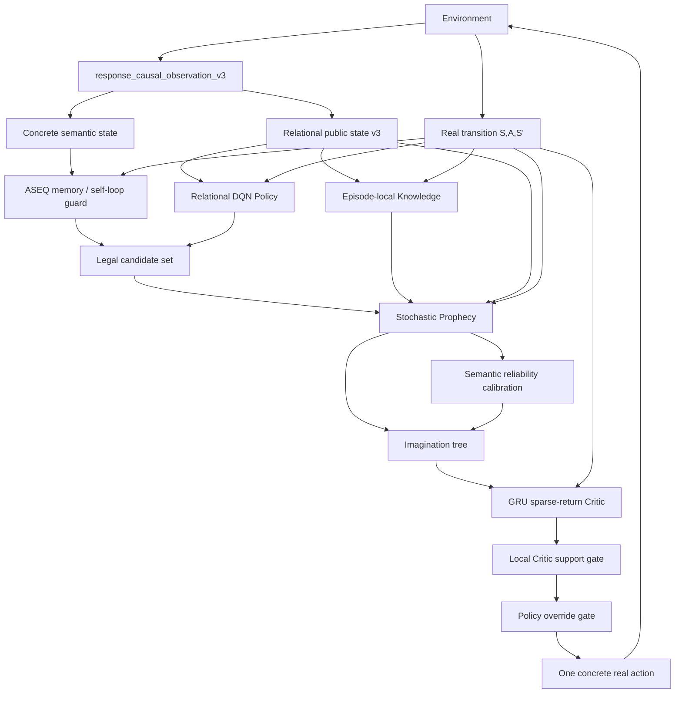

# Core Architecture

이 페이지는 **현재 AASSR [현재 세대(current-generation)](Current-Status) [실행 구조(runtime)](Current-Status)의 실제 구조**를 설명한다.

> [!WARNING]
> 저장소에는 과거 실험 재현을 위한 `OnlineGRUProphecy`, `SemanticContextualPolicy`, old effect-composition, AASSR v0.4 경로가 남아 있다. 현재 실행 구조의 [최종 기준(source of truth)](Current-Status)는 `src/aassr_v2/current_manifest.py`이며, `LEGACY_COMPONENTS_ACTIVE`는 비어 있어야 한다.

## 1. Current-generation component map

현재 manifest 기준 세대 이름:

```text
aassr-current-generation-v2
```

주요 구성요소는 다음과 같다.

| Layer | Current [명세(contract)](Current-Status) | 역할 |
|---|---|---|
| [관측(Observation)](MDP-and-POMDP) | `response_causal_observation_v3` | [에이전트(agent)](Reinforcement-Learning)가 실제로 볼 수 있는 정보만 노출 |
| [ASEQ(실제 상태-행동-다음 상태 기록)](ASEQ) | `semantic-self-loop-empirical-v3` | 경험적으로 확인된 [제자리 반복(self-loop)](ASEQ) 억제 |
| [Policy(정책 모델)](Policy) | `relational-invariant-dqn+information-residual-v1` | 현재 행동 가치 + 정보 가치 |
| [Policy](Policy) [상태(state)](State-Representation) | `relational-public-structural-v3+latest-http-status` | rename-invariant [공개 관측 상태(public state)](State-Representation) |
| [Policy](Policy) [행동(action)](Reinforcement-Learning) | `relational-role-features-v1` | [실제 개체를 구분하는(concrete)](State-Representation) ID 대신 역할 관계 |
| [Prophecy(미래 예측 모델)](Prophecy) | `relational-stochastic-world-model-v3-status-supervised` | 확률적 다음 상태 예측 |
| [Calibration(예측 신뢰도 보정)](Calibration) | `semantic-probability-holdout-calibration-v3-status-aware` | 예측 신뢰도 측정 |
| [Knowledge(에피소드 지식)](Knowledge) | `episode-local-response-knowledge-context-v1` | 현재 [한 번의 문제 풀이 구간(episode)](Terminology-Guide)에서 얻은 응답 지식 |
| [Critic(미래 가치 평가기)](Critic) | `relational-gru-discounted-sparse-return` 계열 | 미래 sparse [누적 보상(return)](Value-Functions-and-Bellman-Equation) 평가 |
| [가치 평가 데이터 근거(Critic support)](Critic-Support-and-OOD) | `local-real-training-support-fail-closed-v1` | [학습 분포 밖(OOD)](Critic-Support-and-OOD) [기본 행동 덮어쓰기(override)](Imagination) 방지 |
| [Imagination(가상 미래 탐색)](Imagination) | `root-preserving-parallel-universe-tree-v6` 계열 | chance/decision 분리 미래 탐색 |
| [Skills(성공 절차 재사용)](Skills) | `relational-aseq-template-v1` | 반복 성공 ASeq의 재사용 |
| Training [Imagination](Imagination) | `disabled-same-checkpoint` | 학습 중 개입 없음, 평가에서만 OFF/ON 비교 |

---

## 2. 전체 데이터 흐름



핵심 원칙은 **상상은 계획에만 쓰이고, 학습의 사실 근거는 [실제 환경에서 관측된(real)](Research-Jargon-Guide) [상태 전이(transition)](MDP-and-POMDP)**이라는 것이다.

---

# 3. Observation contract

현재 pentest 실행 구조은 `response_causal_observation_v3`를 사용한다.

목표는 simulator 내부 정답을 모델에게 흘리지 않는 것이다.

## 노출되는 정보의 예

- 실제 응답에서 관측 가능한 [공개된(public)](State-Representation) facts
- discovered route/profile/object 관계
- 현재 available 행동 surface
- session/CSRF의 존재 여부처럼 에이전트가 직접 확인한 상태
- self-counted request usage
- self-observed workflow progress
- **latest 공개된 HTTP [상태 코드(status)](Terminology-Guide)**

현재 [관계 기반(relational)](Relational-Representation-and-Generalization) 상태 v3는 HTTP 상태 코드를 다음 공개된 channel로 보존한다.

```text
200 / 302 / 400 / 401 / 403 / 404 / 409 / 429
```

## 의도적으로 숨기는 정보

- 정확한 [숨겨진(hidden)](MDP-and-POMDP) audit pressure
- 정확한 숨겨진 session countdown
- 숨겨진 workflow depth
- scenario 내부 정답 행동
- target 정답 label
- future 상태
- 숨겨진 [난이도 조절 학습(curriculum)](Curriculum-Learning) metadata를 통한 shortcut

즉 [세계 모델(world model)](Model-Based-RL-and-World-Models)이 예측해야 할 것을 [관측(observation)](MDP-and-POMDP)에서 몰래 제공하지 않는다.

---

# 4. 두 종류의 state identity

현재 AASSR을 이해할 때 가장 중요한 설계 중 하나다.

## 4.1 Concrete semantic identity

사용처:

- [ASEQ](ASEQ)
- [현재 에피소드 안에서만 유지되는(episode-local)](Knowledge) exact repetition 판단
- 실제 개체를 구분하는 cycle detection

예를 들어 같은 역할을 가진 두 route라도 실제 한 번의 문제 풀이 구간에서 서로 다른 route라면 구분한다.

```text
route-12 != route-31
```

이 구분이 없으면 서로 다른 대상을 같은 제자리 반복로 잘못 막을 수 있다.

## 4.2 Relational transfer identity

사용처:

- [Policy](Policy)
- [Prophecy](Prophecy)
- [Critic](Critic)
- [Skill(성공 절차 재사용)](Skills)
- 관계 기반 [DQN(딥 Q-네트워크)](Q-Learning-DQN-and-TD) [비교 기준(baseline)](Ablation-Benchmarking-and-Reproducibility)
- [DreamerV3(외부 세계 모델 강화학습 비교군)](Experiments) adapter

여기서는 실제 개체를 구분하는 이름보다 관측된 관계를 본다.

```text
Scenario A: route-12 = catalog-like route
Scenario B: route-31 = catalog-like route

=> same relational role
```

이 덕분에 [난수 시드(seed)](Ablation-Benchmarking-and-Reproducibility)가 바뀌어 ID가 전부 rename되어도 구조가 같으면 [전이(transfer)](Relational-Representation-and-Generalization)할 수 있다.

---

# 5. Policy

현재 [Policy](Policy)는 **관계 기반 [DQN](Q-Learning-DQN-and-TD) + separate [정보 가치 잔차(information-value residual)](Policy)**이다.

개념적으로:

```text
Q_total(S,A)
 = Q_task(S,A)
 + information_residual(S,A)
```

단, [정보 가치 잔차(information residual)](Policy)은 외부 [보상(reward)](Sparse-Reward-and-Credit-Assignment)를 바꾸는 보상 shaping이 아니다. 외부 task 보상는 끝까지 다음 그대로 유지한다.

```text
success       +1
true failure  -1
otherwise      0
```

[Policy](Policy) 상태/행동 [입력(input)](Terminology-Guide) 모두 [관계 기반 표현(relational representation)](Relational-Representation-and-Generalization)을 사용한다.

## 왜 raw DQN baseline도 따로 두는가?

최종 비교에서 [표현(representation)](Relational-Representation-and-Generalization) 자체의 효과와 AASSR 구조의 효과를 분리하기 위해서다.

```text
dqn_raw
   |
   | representation effect
   v
dqn_relational
   |
   | AASSR non-Imagination stack
   v
aassr_current_no_imagination
   |
   | Imagination marginal effect
   v
aassr_current_full
```

---

# 6. Knowledge

[Knowledge](Knowledge)는 **현재 에피소드 안에서만 유지되는 [응답(response)](State-Representation) knowledge**다.

중요한 방법론 경계:

```text
행동 전 알고 있던 Knowledge
        |
        v
(S, A) prediction
        |
        v
real response
        |
        v
새 Knowledge 획득
```

방금 상태 전이 결과에서 얻은 정보를 다시 그 상태 전이의 행동 전 예측에 넣으면 hindsight leak이 된다. 현재 구조는 이를 허용하지 않는다.

Evaluation 중 응답에서 얻는 현재 에피소드 안에서만 유지되는 [Knowledge](Knowledge)는 사용할 수 있지만 persistent learning 상태를 바꾸면 안 된다.

---

# 7. Prophecy: stochastic relational world model

현재 [Prophecy](Prophecy)는 과거 deterministic 실제 개체를 구분하는 delta [학습 모델(model)](Terminology-Guide)이 아니다.

입력:

```text
relational public state
+
relational action
+
allowed pre-existing Knowledge context
```

출력:

```text
possible next relational state(s)
+
legal-action mask
+
latest HTTP status
+
terminal class
```

[에피소드 종료(terminal)](Replay-Buffer-and-Episode-Boundaries) class는 네 종류로 분리한다.

1. `active`
2. `success`
3. `true failure`
4. `truncation`

## 왜 mixture가 필요한가?

같은 공개 관측 상태/행동에서도 숨겨진 난수 시드 condition 때문에 여러 결과가 나올 수 있다.

결정론적 평균 하나만 예측하면:

```text
실제 가능한 상태 A
실제 가능한 상태 B
        |
        v
존재하지 않는 평균 상태 C
```

가 될 수 있다.

그래서 [현재(current)](Current-Status) 학습 모델은 conditional mixture를 사용해 [여러 결과 형태를 가진(multimodal)](Mixture-Ensemble-and-Calibration) future를 표현한다.

## Probability와 reliability 분리

각 예측 [갈라진 결과 경로(branch)](Chance-and-Decision-Nodes)에는 최소 두 의미가 있다.

```text
outcome_probability
    = 이 환경 결과가 나올 확률 질량

prediction reliability
    = world model 예측을 얼마나 신뢰하는가
```

Planner의 chance [미래 가치를 앞 단계로 되돌려 계산하는 과정(backup)](Value-Functions-and-Bellman-Equation)은 전자를 사용하고, [판정 관문(gate)](Terminology-Guide)는 후자를 신뢰도 조건으로 사용한다.

신뢰도를 미래 가치에 보너스로 더하지 않는다.

---

# 8. Semantic calibration

[Calibration](Calibration)은 [검증용 분리 데이터(holdout)](Calibration) 실제 상태 전이에서 [Prophecy](Prophecy)가 얼마나 맞는지 측정한다.

현재 [상태 코드까지 고려하는(status-aware)](Calibration) calibration은 단순 vector distance만 보지 않는다.

평가 대상에는 다음이 포함된다.

- 관계 기반 [의미 기준(semantic)](State-Representation) next-state quality
- [가능 행동 마스크(legal-action mask)](Prophecy) accuracy
- 에피소드 종료 class accuracy
- 공개된 HTTP 상태 코드 correctness
- probability-weighted 의미 기준 quality

이 설계가 들어간 이유는 2026-08-11 2k run에서 의미 기준 quality가 높게 보였는데도 `403/404` 같은 [의사결정에 중요한(decision-critical)](Calibration) error를 제대로 반영하지 못한 문제가 발견됐기 때문이다.

---

# 9. Critic

현재 [Critic](Critic)은 관계 기반 [GRU(게이트 순환 유닛)](GRU-and-Sequence-Models) 기반이며 **실제 sparse task 누적 보상**을 학습한다.

```text
success       +1
truncation     0
true failure  -1
```

예전처럼 non-success를 전부 `0`으로 두면 실제 실패와 단순 budget [외부 제한 종료(truncation)](Replay-Buffer-and-Episode-Boundaries)을 구분할 수 없다.

## Zero-memory decision suffix training

[Imagination](Imagination)은 임의의 현재 실제 decision point에서 [계획(planning)](Counterfactual-Planning-and-Search)을 시작할 수 있다.

따라서 [Critic](Critic)도 trajectory 시작점에서만 학습하면 계약이 맞지 않는다.

현재 학습은 trajectory의 여러 suffix를 학습해 다음 형태를 맞춘다.

```text
real trajectory
S0 -> S1 -> S2 -> S3 -> terminal

training roots:
S0
S1
S2
S3
```

각 [탐색의 첫 행동(root)](Imagination)에서 계획은 zero recurrent memory로 시작할 수 있다.

## Local Critic support gate

`critic_ready=True`는 “[Critic](Critic)이 학습을 한 적 있다”는 뜻이지, 모든 상태를 잘 안다는 뜻은 아니다.

그래서 현재 판정 관문는 다음을 추가로 묻는다.

```text
현재 relational state/action region이
실제 Critic training data에서 지원되는가?
```

지원되지 않으면 **[근거가 부족하면 보수적으로 거부하는(fail closed)](Critic-Support-and-OOD)**하고 [Policy](Policy) 기본 행동 덮어쓰기를 허용하지 않는다.

이 [데이터 근거(support)](Critic-Support-and-OOD)는 [가치(value)](Value-Functions-and-Bellman-Equation) bonus가 아니다.

---

# 10. Imagination planner

현재 [계획기(planner)](Counterfactual-Planning-and-Search) 명세는 두 연산을 명확히 분리한다.

## Chance node

환경 [환경 결과(outcome)](Stochasticity-Uncertainty-and-Probability)은 선택할 수 없다.

```text
V_chance = sum_i p_i * V_i
```

## Decision node

다음 행동은 에이전트가 선택할 수 있다.

```text
V_decision = max_a V(a)
```

## Root preservation

실제로 실행 가능한 탐색의 첫 행동 행동은 평가 중 사라지면 안 된다.

깊은 결과 경로가 pruning되더라도 탐색의 첫 행동 자체는 남고 이미 계산한 [Critic](Critic) 가치로 [기본 경로로 돌아가기(fallback)](Imagination)한다.

## Structural root deduplication

현재 pentest 행동 surface에는 이름만 다른 실제 개체를 구분하는 alias가 매우 많을 수 있다.

예:

```text
172 concrete actions
     |
     v
~17 relational root structures
```

현재 계획기는 같은 관계 기반 structure의 탐색의 첫 행동를 한 번만 계산하고 값을 실제 개체를 구분하는 aliases에 fan-out한다.

실제 [실제 개체 구분(concrete identity)](State-Representation)는 최종 행동 실행 직전에만 bind한다.

---

# 11. Skills

[Skill](Skills)은 정답 macro를 사람이 넣는 기능이 아니다.

반복적으로 성공한 ASeq가 동일한 관계 기반 goal/structure에서 다시 나타날 때 [재사용 가능한 틀(template)](Skills) 후보로 승격될 수 있다.

```text
primitive ASeq
A1 -> A2 -> A3

repeated successful pattern
        |
        v
relational Skill template
```

새 scenario에서는 실제 개체를 구분하는 ID가 달라질 수 있으므로 재사용 가능한 틀를 현재 [실제 실행 행동(concrete action)](State-Representation) surface에 다시 bind한다.

[Skill](Skills) rollout도 [확률적(stochastic)](Stochasticity-Uncertainty-and-Probability) 환경 결과 mass와 [신뢰도(reliability)](Calibration)를 분리해서 다룬다.

---

# 12. Training / Evaluation boundary

AASSR 현재 [실험 규칙(protocol)](Ablation-Benchmarking-and-Reproducibility)에서 중요한 원칙:

```text
Training:
Imagination intervention OFF

Evaluation A:
same frozen checkpoint + Imagination OFF

Evaluation B:
same frozen checkpoint + Imagination ON
```

따라서 no-[Imagination](Imagination) vs Full 비교에서 차이는 계획기 사용 여부 하나여야 한다.

Evaluation 전후 persistent learning fingerprint가 바뀌면 methodology violation이다.

---

# 13. Hardware path

현재 CUDA device는 다음 모듈이 공유한다.

- [DQN](Q-Learning-DQN-and-TD) [Policy](Policy)
- 확률적 관계 기반 세계 모델
- [GRU](GRU-and-Sequence-Models) [Critic](Critic)

주요 batch 최적화:

- 한 [Imagination](Imagination) depth의 [Policy](Policy) frontier를 한 batch로 평가
- primitive world-model [갈라진 결과 경로(branches)](Chance-and-Decision-Nodes)를 depth 단위 batch 처리
- predicted outputs bulk host 전이
- [Critic](Critic) children batch scoring
- padded/masked episode-batched [Critic](Critic) [학습(training)](Terminology-Guide)
- [DQN](Q-Learning-DQN-and-TD) Bellman next-행동 max를 device-side `scatter_reduce(amax)`로 계산
- [학습을 멈춘(frozen)](Ablation-Benchmarking-and-Reproducibility) 검증용 분리 데이터 calibration batch refresh
- [구조 기반(structural)](Relational-Representation-and-Generalization) 탐색의 첫 행동 deduplication

이 최적화는 알고리즘 의미를 바꾸는 것이 아니라 같은 계산을 accelerator-friendly하게 묶는 것이 목표다.

---

# 14. 코드 진입점

현재 공개된 builder:

```python
from aassr_v2 import build_pentest_aassr_core
```

중요 파일:

```text
src/aassr_v2/current_manifest.py
src/aassr_v2/current_entrypoint.py
src/aassr_v2/current_relational_state_v3.py
src/aassr_v2/current_relational_mixture_model.py
src/aassr_v2/current_return_critic.py
src/aassr_v2/current_critic_support.py
src/aassr_v2/current_planner.py
src/aassr_v2/current_confidence_gate.py
```

실험 runner:

```text
scripts/run_pentest_current_generation_main.py
scripts/run_repaired_imagination_final.py
scripts/run_dreamerv3_current_baseline.py
scripts/assemble_pentest_current_generation_suite.py
```

다음: **[Experiments](Experiments)**
