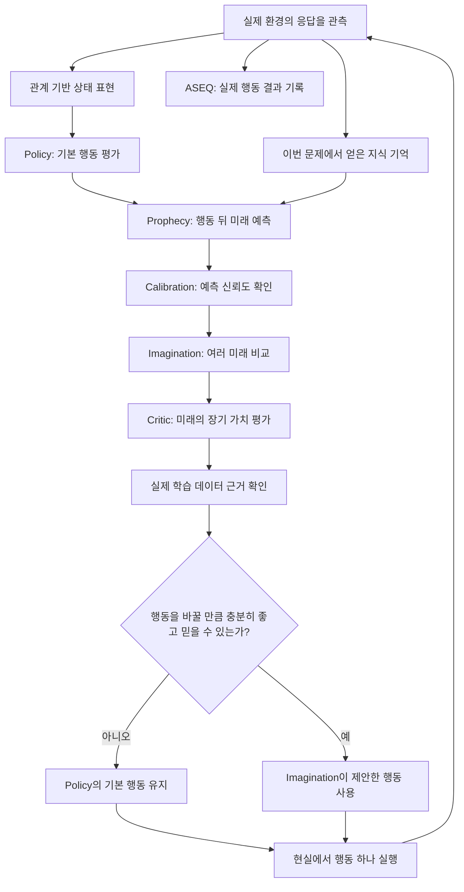

# 현재 연구 상태

이 페이지는 **“AASSR 연구가 지금 정확히 어디까지 왔는가?”**를 설명한다.

코드 이름을 잔뜩 나열하는 문서가 아니라, 처음 보는 연구자가 다음 네 가지를 구분할 수 있게 만드는 것이 목적이다.

```text
현재 실제로 사용 중인 구조
≠
과거에 문제를 찾기 위해 수행한 진단 실험
≠
현재 구조에서 얻은 작은 규모의 성능 증거
≠
아직 앞으로 증명해야 할 최종 주장
```

AASSR의 실제 현재 실행 구조는 아래 파일을 최종 기준으로 삼는다.

```text
src/aassr_v2/current_manifest.py
```

현재 세대의 코드상 이름은 다음과 같다.

```text
aassr-current-generation-v2
```

이 버전 문자열을 외울 필요는 없다. **“지금 문서에서 현재라고 부르는 구조가 어느 세대인지 정확하게 구분하기 위한 이름”**이라고 이해하면 된다.

---

# 1. 30초 요약

현재 AASSR은 핵심 구조를 하나의 실행 흐름으로 통합한 상태다.

쉽게 말하면 다음 과정을 반복한다.

```text
실제 환경의 응답을 본다
        ↓
현재 상황을 관계 중심으로 정리한다
        ↓
제자리 반복 경험을 확인한다
        ↓
기본 정책이 행동 후보를 평가한다
        ↓
행동 뒤에 가능한 여러 미래를 예측한다
        ↓
그 예측을 믿을 수 있는지 확인한다
        ↓
여러 단계의 가상 미래를 비교한다
        ↓
그 미래가 최종 성공에 좋은지 평가한다
        ↓
그 가치 평가를 뒷받침할 실제 경험이 충분한지 확인한다
        ↓
근거가 충분할 때만 기본 행동을 다른 행동으로 바꾼다
        ↓
현실에서 행동 하나를 실행한다
```

현재 가장 중요한 연구 상황은 다음 한 문장으로 정리할 수 있다.

> **AASSR의 주요 구조는 거의 완성됐지만, 미래 상상 기능이 실제 최종 성공률을 안정적으로 높인다는 핵심 성능 증거는 아직 부족하다.**

즉 지금은 **알고리즘 구조 개발의 후반부**이자 **본격적인 대규모 성능 검증 직전**이다.

---

# 2. 전체 흐름



여기서 중요한 점은 **상상한 미래와 실제 경험을 섞지 않는 것**이다.

상상은 행동을 고르는 데 사용할 수 있지만, 세계 모델이 만들어낸 가상 미래를 실제로 경험한 사실처럼 자동으로 학습 근거에 넣지는 않는다.

더 자세히:

- [처음 읽는 사람을 위한 안내서](Beginner-Guide)
- [AASSR 5분 설명](AASSR-in-5-Minutes)
- [전체 구조](Core-Architecture)

---

# 3. 현재 구성요소를 쉬운 말로 보면

| 구성요소 | 지금 하는 일 | 현재 연구 상태 |
|---|---|---|
| [상태 표현](State-Representation) | 이름보다 역할과 관계를 중심으로 현재 상황을 표현 | 현재 사용 중 |
| [ASEQ](ASEQ) | 실제 `상태 → 행동 → 다음 상태`를 기억하고 반복된 제자리 행동을 줄임 | 메커니즘 증거 있음 |
| [Policy](Policy) | 현재 상태에서 기본 행동을 평가 | 현재 사용 중 |
| [Knowledge](Knowledge) | 이번 문제에서 실제 응답을 통해 이미 얻은 사실을 기억 | 현재 사용 중 |
| [Prophecy](Prophecy) | 행동 뒤에 가능한 여러 미래와 확률을 예측 | 현재 사용 중, 성능 검증 진행 중 |
| [Calibration](Calibration) | 미래 예측이 이 상황에서도 믿을 만한지 평가 | 현재 사용 중, 성능 기여 검증 진행 중 |
| [Imagination](Imagination) | 실제 행동 전 여러 단계의 미래를 가상으로 비교 | 구조는 구현됨, 최종 성능 효과는 아직 미증명 |
| [Critic](Critic) | 상상한 미래가 최종 성공에 얼마나 좋은지 평가 | 현재 사용 중, 더 넓은 학습 경험 필요 |
| [가치 평가 데이터 근거](Critic-Support-and-OOD) | Critic의 높은 값이 실제 경험으로 뒷받침되는지 확인 | 현재 사용 중, OOD 과신 억제 확인 |
| [Skills](Skills) | 성공한 관계 구조를 새 문제에서 재사용 | 구현됨, 충분한 성능 증거는 아직 부족 |

---

# 4. 코드에서는 현재 구조를 어떻게 기록하나?

아래 문자열은 **사람이 외워야 할 용어가 아니라 코드가 현재 구조를 정확히 고정하기 위한 식별자**다.

## 4.1 관측과 상태 표현

```text
observation = response-causal-relational-public-state-v3+latest-http-status
policy_state_input = relational-public-structural-v3+latest-http-status
```

쉬운 뜻:

- 에이전트가 실제 응답을 통해 볼 수 있는 정보만 사용한다.
- 가장 최근에 관측한 공개 HTTP 상태 코드도 보존한다.
- 환경 내부에만 존재하는 숨은 정답이나 실패 카운터를 직접 입력으로 주지 않는다.
- 객체 이름 자체보다 관계 구조를 중심으로 학습한다.

관련: [상태 표현](State-Representation), [정보 누출과 공정 평가](Causality-Leakage-and-Evaluation)

## 4.2 ASEQ

```text
aseq = semantic-self-loop-empirical-v3
```

쉬운 뜻:

- ASEQ는 실제로 경험한 `(현재 상태 S, 행동 A, 다음 상태 S')`를 기록한다.
- 같은 행동이라는 이유만으로 금지하지 않는다.
- 의미상 같은 상태에서 행동했는데 다시 같은 상태로 돌아오는 **제자리 반복**이 실제 경험에서 반복 확인될 때만 억제한다.
- 실제로 상태가 변한 반복 행동은 허용한다.

관련: [ASEQ](ASEQ)

## 4.3 기본 정책

```text
policy = relational-invariant-dqn+information-residual-v1
```

쉬운 뜻:

기본 Policy는 DQN 계열로 장기적인 행동 가치를 배우고, **정보를 얻는 행동이 미래 판단에 줄 수 있는 추가 가치**는 별도 내부 항목으로 분리한다.

이 정보 관련 항목은 환경의 실제 목표 보상에 중간 점수를 몰래 추가하는 것과 다르다.

관련: [Policy](Policy), [Q-learning·DQN·TD](Q-Learning-DQN-and-TD)

## 4.4 미래 예측 모델

현재 Prophecy의 정확한 코드 식별자는 다음이다.

```text
relational-conditional-mixture-ensemble-v5-status-balanced
```

전체 출력 명세는 다음처럼 기록되어 있다.

```text
relational-descriptor-v3+latest-http-status+legal-action-mask+active-success-failure-truncation-mixture-v5
```

쉬운 뜻:

Prophecy는 단순히 “다음 상태 숫자 하나”를 예측하지 않는다.

행동 뒤에:

```text
정상 진행
접근 거부
요청 제한
성공
실제 실패
외부 제한 종료
```

같은 서로 다른 결과가 있을 수 있으므로, 가능한 결과들을 따로 유지하고 각각의 확률을 표현한다.

또 새 미래 상태에서 어떤 행동들이 실제로 가능한지도 함께 예측한다.

상태 코드처럼 드물게 나타나는 범주가 학습에서 무시되지 않도록 현재 상태 코드 학습은 다음 명세를 사용한다.

```text
class-balanced-categorical-public-http-status-v2
```

관련: [Prophecy](Prophecy), [혼합 분포·앙상블·보정](Mixture-Ensemble-and-Calibration)

## 4.5 예측 신뢰도 보정

현재 Calibration의 정확한 코드 식별자는 다음이다.

```text
semantic-probability-holdout-calibration-v3-status-aware
```

이 문자열은 위키 무결성 검사에서도 현재 구조를 확인하는 기준으로 사용한다.

쉬운 뜻:

```text
어떤 결과가 일어날 확률
```

과

```text
그 확률 예측 자체를 얼마나 믿을 수 있는가
```

를 구분한다.

관련: [Calibration](Calibration)

## 4.6 Imagination

현재 Imagination은 대략 다음 원칙을 따른다.

```text
실제 실행할 객체는 구체적으로 구분
계산 중 중복되는 관계 구조는 합쳐서 계산량 절약
환경이 정하는 결과는 확률 평균
에이전트가 고를 수 있는 다음 행동은 가장 좋은 후보 선택
여러 탐색 깊이의 계산을 묶어서 처리
```

즉:

```text
환경 결과 분기 → 확률 기댓값
행동 선택 분기 → 최댓값
```

을 구분한다.

관련: [Imagination](Imagination), [환경 결과 노드와 행동 선택 노드](Chance-and-Decision-Nodes)

## 4.7 Critic

현재 Critic은 실제 희소 보상 경험으로 미래의 장기 가치를 학습한다.

```text
성공 경험  +1
실제 실패  -1
그 외       0
```

에서 출발해 앞으로의 장기적인 결과를 평가하려는 것이다.

관련: [Critic](Critic)

## 4.8 Critic의 실제 데이터 근거 확인

현재 코드 식별자는 다음이다.

```text
local-real-training-support-fail-closed-v1
```

쉬운 뜻:

Critic이 어떤 상상된 미래에 높은 점수를 냈더라도 **비슷한 실제 학습 경험이 거의 없다면 그 숫자를 그대로 믿지 않는다.**

근거가 부족할 때는 Imagination이 기본 Policy의 행동을 함부로 바꾸지 못하게 한다.

관련: [가치 평가 데이터 근거와 학습 분포 밖(OOD)](Critic-Support-and-OOD)

## 4.9 Skill

```text
skills = relational-aseq-template-v1
```

쉬운 뜻:

과거 성공에서 실제 객체 이름을 그대로 암기하기보다:

```text
목록 역할의 경로
→ 인증된 사용자 역할
→ 목표 객체 역할
```

같은 관계 구조를 뽑아 새 문제의 실제 객체에 다시 연결하려고 한다.

관련: [Skills](Skills)

---

# 5. 보상과 내부 신호를 구분해야 한다

AASSR을 읽을 때 가장 중요한 구분 중 하나다.

```text
환경 보상
≠ 누적 보상
≠ Q값
≠ 정보 가치 잔차
≠ 미래 결과 확률
≠ 예측 신뢰도
≠ Critic 값
≠ Critic 값을 뒷받침하는 실제 데이터 근거
```

## 환경 보상

현재 핵심 연구 환경의 목표 보상은 단순하다.

```text
최종 성공    +1
실제 실패    -1
그 외 대부분  0
```

## 정보 가치 잔차

어떤 행동이 즉시 보상은 없더라도 앞으로 중요한 정보를 줄 수 있다.

AASSR은 이런 정보를 내부적으로 평가할 수 있지만 **환경의 최종 목표 보상 자체를 바꾸지는 않는다.**

## 결과 확률과 예측 신뢰도

```text
접근 거부가 20% 확률로 일어난다
```

와

```text
그 20%라는 예측을 믿어도 되는가
```

는 다른 문제다.

## Critic 값과 실제 데이터 근거

```text
이 미래는 가치가 0.9다
```

라는 신경망 출력과

```text
비슷한 미래를 실제 학습에서 충분히 본 적이 있다
```

도 다른 문제다.

더 자세히: [한국어 중심 용어 안내서](Terminology-Guide)

---

# 6. 연구 증거는 어느 단계까지 왔나?

AASSR 위키에서는 증거를 다음처럼 단계별로 구분한다.

```text
1단계 — 구조가 코드에 존재
2단계 — 회귀 테스트로 구조의 기본 의미 확인
3단계 — 좁은 진단 실험으로 특정 메커니즘 확인
4단계 — 작은 규모의 현재 구조 실제 환경 실험
5단계 — 여러 난수 시드의 비교 실험
6단계 — 설정을 모두 고정한 뒤 최종 비공개 평가
```

이를 현재 연구에 적용하면 다음과 같다.

| 연구 항목 | 현재 증거 수준 | 해석 |
|---|---|---|
| 현재 실행 구조 통합 | 높음 | 실제 코드와 회귀 테스트에서 확인 |
| 숨은 정보 차단·공정한 관측 | 높음 | 구조와 회귀 테스트로 확인 |
| ASEQ 제자리 반복 억제 | 비교적 강함 | 별도 진단 실험에서 반복 억제 효과 관측 |
| 관계 기반 표현의 새 문제 전이 효과 | 중간 | 유망한 증거가 있지만 현재 최종 다중 비교 필요 |
| Prophecy의 여러 결과 예측 | 구조적으로 강함 | 현재 구조와 회귀 검증 완료, 더 넓은 실제 성능 검증 필요 |
| Calibration | 구조적으로 확인 | 최종 의사결정 성능 기여는 추가 검증 필요 |
| Critic 데이터 근거 확인 | 메커니즘 확인 | 작은 현재 실험에서 근거 없는 행동 변경을 실제로 막음 |
| Imagination의 실제 성공률 향상 | **아직 부족** | 가장 중요한 미해결 질문 중 하나 |
| Skills의 새 문제 재사용 효과 | 초기 | 구현과 일부 검증은 있으나 충분한 성능 증거 부족 |
| 전체 AASSR의 DQN/DreamerV3 대비 우위 | **아직 미증명** | 최종 비교 실험 전 |
| 창의적인 새로운 해결 과정 | 장기 연구 | 아직 직접적인 핵심 성능 주장으로 사용하지 않음 |

연구 질문별 정확한 가설과 증거는 [연구 질문-증거 연결표](Evidence-Matrix)에서 확인한다.

---

# 7. ASEQ는 현재 무엇까지 확인됐나?

ASEQ는 현재 AASSR에서 비교적 메커니즘 증거가 강한 부분이다.

과거의 focused 진단에서는 기본 탐욕 정책이 새 문제에서 제자리 반복에 빠지는 현상이 나타났다.

대표적인 진단 결과는:

```text
기본 탐욕 행동 선택에서 진전 없이 멈춤  24 / 24
정확한 ASEQ 제자리 반복 억제 적용 후     0 / 24
```

이었다.

이 결과로 말할 수 있는 것은:

> **실제로 반복 관측된 의미상 동일한 `S → A → S`를 억제하면 제자리 반복 현상을 강하게 줄일 수 있었다.**

이다.

하지만 이것만으로:

> “ASEQ가 전체 AASSR의 최종 성공률을 항상 높인다.”

라고 말할 수는 없다.

즉 **메커니즘 효과와 전체 성능 효과를 구분한다.**

관련: [ASEQ](ASEQ), [연구 질문-증거 연결표](Evidence-Matrix)

---

# 8. 최근 2,048 상태 전이 실험은 무엇을 보여줬나?

현재 세대를 수리한 뒤 2,048개의 실제 학습 상태 전이를 사용한 작은 CUDA 실험이 있다.

이 실험은 **최종 성능 발표용이 아니라 다음 대규모 실험을 하기 전에 병목을 찾는 진단**이다.

관측된 결과:

```text
학습 중 성공 경험     32회

Imagination 끔        8 / 20
Imagination 켬        8 / 20

L0 평가               4 / 4 성공
L1 평가               4 / 4 성공
L2 평가               4 / 4 실제 실패

실제 Imagination 행동 변경  0회
```

처음 보면:

```text
8/20 = 8/20
→ Imagination이 쓸모없다?
```

라고 생각할 수 있다.

하지만 현재 해석은 더 조심스럽다.

## 8.1 L2 학습 경험이 없었다

2,048 상태 전이의 작은 학습 예산 안에서 에이전트는 L0과 L1 경험은 얻었지만 **L2 실제 학습 상태 전이를 얻지 못했다.**

즉 L2는 모델에게 사실상 학습 분포 밖 영역이었다.

## 8.2 Imagination은 행동 변경 후보를 찾기는 했다

계획기는 일부 상황에서 기본 Policy와 다른 행동 후보를 만들었다.

하지만 마지막 단계에서:

```text
이 Critic 값 주변에 실제 학습 경험이 충분한가?
```

를 확인했을 때 근거가 부족했다.

그래서 실제 행동 변경은 0회가 됐다.

## 8.3 이것은 예전 실패와 다르다

이전 구조에서는 근거가 부족한 상상도 실제 행동을 너무 쉽게 바꾸면서 잘못된 개입이 많이 발생했다.

현재 작은 실험에서는 반대로 **근거가 없는 영역에서 행동 변경을 보수적으로 막았다.**

따라서 현재 가장 타당한 해석은:

> **Imagination이 최종 성능을 높였다는 증거는 아직 없지만, 학습 분포 밖에서 근거 없는 행동 변경을 막는 안전장치는 의도대로 작동했다.**

이다.

---

# 9. 현재 가장 큰 병목: 더 어려운 영역의 실제 경험 부족

현재 연구에서 가장 중요한 병목은 **frontier/sample coverage**, 즉 아직 충분히 배우지 못한 더 어려운 문제 영역까지 실제 경험이 도달하지 못하는 것이다.

한국어로 풀면:

> **미래 예측기와 Critic이 더 어려운 문제를 제대로 평가하려면 그 주변의 실제 경험이 필요한데, 작은 학습 예산에서는 그 경험을 충분히 얻지 못했다.**

흐름을 그림으로 보면:

```text
L0/L1 경험은 쌓임
        ↓
L2로 충분히 진입하지 못함
        ↓
L2 Prophecy 학습 자료 부족
        ↓
L2 Critic 학습 자료 부족
        ↓
L2 근처의 실제 데이터 근거 부족
        ↓
Imagination이 다른 행동을 제안해도 마지막 안전장치에서 거부
        ↓
실제 행동 변경 0회
```

따라서 현재 다음 질문은:

> **알고리즘을 또 바꾸기 전에 학습 상태 전이 수를 늘렸을 때 현재 구조가 스스로 더 어려운 문제 영역까지 도달하는가?**

이다.

이 질문을 확인하기 전부터 특정 정답 행동을 선호하도록 규칙을 넣거나 보상을 추가하면 연구의 원래 목적이 흐려질 수 있다.

---

# 10. 2026년 8월 11일 실패 진단은 현재 결과가 아니다

이 구분은 매우 중요하다.

2026년 8월 11일의 이전 Imagination 진단에서는 다음과 같은 문제가 있었다.

```text
Imagination 끔   4 / 20
Imagination 켬   4 / 20
행동 변경       86회
그중 나쁜 상태 관련 행동 변경 58 / 86
```

이 결과는 **현재 구조의 성능 숫자가 아니다.**

이 실험은 이전 구조에서 왜 Imagination이 좋지 않은 행동을 자주 선택하는지 원인을 찾는 데 사용됐다.

그 진단을 통해 다음과 같은 문제들이 드러났다.

- 공개 상태 코드 정보가 표현에서 충분히 보존되지 않음
- 여러 실제 가능한 미래를 평균 하나로 뭉개는 문제
- 환경 결과와 다음 행동 선택을 같은 방식으로 처리하는 문제
- Critic의 학습 분포 밖 과신
- 실제 행동이 바뀌기 전부터 행동 변경 횟수를 세던 진단 오류
- 관계상 같은 구조를 구체적인 객체 이름별로 중복 계산하던 문제

이후 현재 구조에서는 이 문제들을 각각 분리해서 수리했다.

자세히: [2026-08-11 Imagination 실패 진단](Historical-Imagination-Diagnostic-2026-08-11)

---

# 11. 지금 확실하게 말할 수 있는 것

## 11.1 현재 실행 구조는 하나로 통합되어 있다

현재 `main`의 실행 구조는 하나의 builder와 manifest를 기준으로 한다.

과거 구현은 재현을 위해 저장소에 남아 있을 수 있지만 현재 활성 구성요소로 자동 사용하지 않는다.

## 11.2 에이전트는 숨은 정답을 직접 입력으로 받지 않는다

현재 관측은 실제 응답과 공개된 정보에 기반한다.

환경 내부의 정답, 숨은 단계 번호, 정확한 남은 실패 횟수 같은 정보를 직접 정책 입력으로 주지 않는다.

## 11.3 ASEQ의 제자리 반복 억제 효과는 진단에서 관측됐다

반복 행동 전체를 금지하지 않고, 실제로 반복 확인된 `S → A → S` 패턴만 억제해도 제자리 반복을 크게 줄일 수 있었다.

## 11.4 현재 Prophecy는 여러 가능한 미래를 확률적으로 표현한다

하나의 평균 미래만 만드는 구조가 아니라 서로 다른 결과 유형과 각각의 확률을 유지한다.

## 11.5 환경 결과와 행동 선택을 계획에서 구분한다

```text
환경 결과 → 확률 기댓값
에이전트 행동 선택 → 가장 좋은 행동 선택
```

을 분리한다.

## 11.6 실제 경험이 부족한 영역에서는 Critic을 과신하지 않도록 막는다

최근 작은 실험에서 이 안전장치가 실제 행동 변경을 막는 방향으로 작동했다.

---

# 12. 아직 말할 수 없는 것

다음 문장들은 **아직 최종적으로 증명되지 않았다.**

## 12.1 “Imagination이 성공률을 높인다”

아직 현재 세대에서 충분한 여러 난수 시드 비교가 없다.

최근 2,048 상태 전이 실험에서는 끈 경우와 켠 경우가 모두 `8/20`이었다.

## 12.2 “AASSR이 DQN보다 항상 우수하다”

현재 세대의 최종 raw DQN / relational DQN / AASSR 비교가 아직 끝나지 않았다.

## 12.3 “AASSR이 DreamerV3보다 우수하다”

공정한 공식 DreamerV3 비교 경로는 준비하고 있지만 최종 다중 비교 결과가 아직 없다.

## 12.4 “Skill이 새 문제 일반화를 크게 높인다”

구조와 일부 검증은 있지만 충분한 현재 세대 성능 증거가 부족하다.

## 12.5 “AASSR은 인간과 다른 창의적 해결법을 만든다”

이 질문은 연구 철학상 중요하지만 현재 핵심 성능 주장과 분리한다.

먼저:

```text
스스로 성공을 발견할 수 있는가?
전이할 수 있는가?
미래 예측과 계획이 실제 성능에 도움이 되는가?
```

를 검증해야 한다.

---

# 13. 앞으로의 핵심 비교 실험

현재 최종 비교 구조는 다음 다섯 조건을 중심으로 설계되어 있다.

| 조건 | 쉬운 뜻 | 무엇을 알아보기 위한가? |
|---|---|---|
| `dqn_raw` | 원본에 가까운 관측을 쓰는 DQN | 가장 기본적인 학습 기준 |
| `dqn_relational` | 관계 기반 표현만 사용하는 DQN | 관계 표현 자체의 효과 |
| `dreamerv3_relational` | 공식 DreamerV3에 관계 기반 환경 연결 | 외부의 강한 세계 모델 강화학습 비교군 |
| `aassr_current_no_imagination` | 현재 AASSR에서 Imagination만 끔 | Imagination 이외 AASSR 구조의 효과 |
| `aassr_current_full` | 같은 AASSR 체크포인트에서 Imagination을 켬 | Imagination 자체의 추가 효과 |

이 비교를 통해 질문을 분리한다.

```text
Raw DQN
   ↓
Relational DQN
= 관계 기반 표현의 효과

Relational DQN
   ↓
AASSR without Imagination
= Knowledge / Prophecy / Calibration / Critic / Skill 등 비-Imagination 구조의 효과

AASSR without Imagination
   ↓
AASSR Full
= Imagination 자체의 추가 효과

DreamerV3
↔
AASSR Full
= 서로 다른 세계 모델 기반 강화학습 계열 비교
```

중요한 공정성 규칙:

> **AASSR의 Imagination 끔/켬 비교는 동일한 학습 체크포인트를 사용하고 평가할 때 Imagination만 바꾼다.**

그래야 성능 차이가 다른 학습 결과 때문이 아니라 Imagination 때문인지 볼 수 있다.

관련: [실험 설계와 결과](Experiments)

---

# 14. 다음 큰 실험 전에 확인하는 것

비싼 장기 실험을 돌리기 전에 다음을 확인한다.

## 코드와 구조

- 현재 실행 경로가 과거 구현을 몰래 사용하지 않는가?
- 상태 표현이 숨은 정답을 포함하지 않는가?
- Prophecy가 여러 결과와 확률을 올바르게 보존하는가?
- Calibration이 결과 확률과 신뢰도를 섞지 않는가?
- Critic이 실제 희소 보상 의미를 배우는가?
- 외부 제한 종료와 실제 실패를 구분하는가?
- 실제 경험과 가상 경험을 섞지 않는가?

## 공정한 비교

- 비교군이 같은 실제 상태 전이 예산을 쓰는가?
- 평가 중 모델이 더 학습하지 않는가?
- Imagination 끔/켬이 동일 체크포인트를 사용하는가?
- 최종 비공개 평가 문제를 미리 사용하지 않았는가?

## 실제 실행 성능

- GPU/CPU 최적화가 알고리즘 의미를 바꾸지 않았는가?
- 묶음 계산과 기준 계산이 같은 선택을 내는가?
- 긴 실험이 중간 실패 시에도 진행 기록을 보존하는가?

---

# 15. 연구 진행도를 숫자로 굳이 표현하면

연구 진행도는 단순 퍼센트 하나로 재기 어렵다.

구조를 만드는 진행도와 성능을 증명하는 진행도가 다르기 때문이다.

현재 상태를 대략적으로 표현하면:

```text
문제 정의와 연구 철학          ██████████  거의 완료
공정한 관측·평가 설계          █████████░  매우 진행됨
ASEQ 메커니즘                  █████████░  강한 증거 있음
관계 기반 표현                 ████████░░  상당히 진행됨
Prophecy 구조                  █████████░  구조는 성숙
Calibration 구조               ████████░░  구조는 성숙, 성능 기여 추가 검증
Critic 구조                    ████████░░  구조는 성숙, frontier 경험 필요
Imagination 구조               █████████░  구조는 거의 완성
Imagination 성능 증명          ███░░░░░░░  아직 핵심 미해결
Skill 성능 증명                █████░░░░░  중간 단계
전체 비교 실험                 ██░░░░░░░░  본격 검증 전
최종 비공개 평가               ░░░░░░░░░░  아직 시작하지 않음
```

그래서 전체 연구를 한 문장으로 표현하면:

> **“구조 개발과 오류 수리는 상당 부분 끝났고, 이제 충분한 실제 학습 경험을 확보한 뒤 AASSR의 각 구성요소가 최종 성능을 실제로 높이는지 인과적으로 검증해야 하는 단계”**

라고 보는 것이 가장 정확하다.

---

# 16. 무엇을 먼저 읽으면 되나?

## 연구가 처음이라면

[처음 읽는 사람을 위한 안내서](Beginner-Guide) → [AASSR 5분 설명](AASSR-in-5-Minutes)

## 영어 연구 용어가 어렵다면

[한국어 중심 용어 안내서](Terminology-Guide) → [연구·개발 영어 해설](Research-Jargon-Guide)

## 현재 모델의 세부 구조가 궁금하다면

[상태 표현](State-Representation) → [Policy](Policy) → [Prophecy](Prophecy) → [Calibration](Calibration) → [Critic](Critic) → [Imagination](Imagination)

## 무엇이 실제로 증명됐는지 따지고 싶다면

[연구 질문](Research-Questions) → [연구 질문-증거 연결표](Evidence-Matrix) → [실험 설계와 결과](Experiments)

## 직접 실험을 다시 돌리고 싶다면

[실험 재현 방법](Reproduction)

---

# 17. 현재 구조의 필수 코드 표식

아래 문자열은 현재 구조와 문서가 서로 어긋나지 않았는지 자동 검사할 때 사용한다.

```text
aassr-current-generation-v2
relational-conditional-mixture-ensemble-v5-status-balanced
semantic-probability-holdout-calibration-v3-status-aware
local-real-training-support-fail-closed-v1
```

이 문자열들은 독자가 외워야 할 전문용어가 아니다. **코드와 문서가 같은 현재 세대를 가리키는지 확인하기 위한 기계용 식별자**다.
