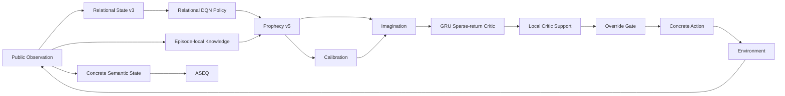

# 현재 연구 상태 (Current Status)

> **문서 기준:** `main`의 현재 [실행 구조 명세(runtime contract)](Current-Status)  
> **[현재 세대(Current generation)](Current-Status):** `aassr-current-generation-v2`  
> **Executable [최종 기준(source of truth)](Current-Status):** `src/aassr_v2/current_manifest.py`

이 페이지는 AASSR의 “지금 상태”를 설명한다. 가장 중요한 원칙은 **현재 코드**, **과거 [진단 실험(diagnostic)](Evidence-Matrix)**, **현재 성능 [증거(evidence)](Evidence-Matrix)**, **앞으로 검증할 [연구 주장(claim)](Evidence-Matrix)**을 한 문장에 섞지 않는 것이다.

> [!IMPORTANT]
> 연구 브랜치에서 진행 중인 변경은 `main`에 합쳐지기 전까지 이 페이지의 [현재 구조(current architecture)](Current-Status)로 취급하지 않는다. 위키가 특정 실험 브랜치 이름을 [현재(current)](Current-Status) 최종 기준로 사용하지 않는다.

---

## 목차

1. [30초 요약](#1-30초-요약)
2. [현재 architecture contract](#2-현재-architecture-contract)
3. [Evidence level](#3-evidence-level)
4. [지금 확실하게 말할 수 있는 것](#4-지금-확실하게-말할-수-있는-것)
5. [아직 말할 수 없는 것](#5-아직-말할-수-없는-것)
6. [2026-08-11 diagnostic은 어디에 위치하는가](#6-2026-08-11-diagnostic은-어디에-위치하는가)
7. [현재 Imagination contract](#7-현재-imagination-contract)
8. [Current benchmark design](#8-current-benchmark-design)
9. [다음 validation gate](#9-다음-validation-gate)
10. [현재 연구를 한 문장으로](#10-현재-연구를-한-문장으로)

---

# 1. 30초 요약

현재 AASSR은 다음 closed loop를 구현한다.



핵심은 다음 세 문장이다.

1. **학습의 사실 근거는 real [상태 전이(transition)](MDP-and-POMDP)이다.**
2. **[Imagination(가상 미래 탐색)](Imagination)은 현재 [실험 규칙(protocol)](Ablation-Benchmarking-and-Reproducibility)에서 [계획(planning)](Counterfactual-Planning-and-Search)에 사용한다.**
3. **[예측 신뢰도(prediction reliability)](Calibration)와 [가치 평가 데이터 근거(Critic support)](Critic-Support-and-OOD)가 부족하면 [계획기(planner)](Counterfactual-Planning-and-Search) [기본 행동 덮어쓰기(override)](Imagination)는 [근거가 부족하면 보수적으로 거부하는(fail-closed)](Critic-Support-and-OOD)한다.**

관련 페이지: [Research Architecture](Research-Architecture), [Imagination](Imagination), [Causality, Leakage & Fair Evaluation](Causality-Leakage-and-Evaluation)

---

# 2. 현재 architecture contract

`src/aassr_v2/current_manifest.py`가 [현재 실행 구조(current runtime)](Current-Status)의 단일 [구성요소 명세(component contract)](Current-Status)다.

| Layer | Current [명세(contract)](Current-Status) | 의미 |
|---|---|---|
| [관측(Observation)](MDP-and-POMDP) | `response-causal-relational-public-state-v3+latest-http-status` | 실제 [응답(response)](State-Representation)에서 인과적으로 볼 수 있는 [공개된(public)](State-Representation) 정보만 사용 |
| [ASEQ(실제 상태-행동-다음 상태 기록)](ASEQ) | `semantic-self-loop-empirical-v3` | 실제 `(S,A,S')` 중 semantic [제자리 반복(self-loop)](ASEQ) 증거 관리 |
| [Policy(정책 모델)](Policy) | `relational-invariant-dqn+information-residual-v1` | external sparse-[누적 보상(return)](Value-Functions-and-Bellman-Equation) Q와 [정보 가치 잔차(information residual)](Policy) 분리 |
| [Policy](Policy) [상태(state)](State-Representation) | `relational-public-structural-v3+latest-http-status` | rename-invariant 구조 + 공개된 [상태 코드(status)](Terminology-Guide) |
| [Policy](Policy) [행동(action)](Reinforcement-Learning) | `relational-role-features-v1` | concrete ID보다 행동 role 중심 |
| [Prophecy(미래 예측 모델)](Prophecy) | `relational-conditional-mixture-ensemble-v5-status-balanced` | [여러 결과 형태를 가진(multimodal)](Mixture-Ensemble-and-Calibration) [확률적(stochastic)](Stochasticity-Uncertainty-and-Probability) [관계 기반(relational)](Relational-Representation-and-Generalization) [세계 모델(world model)](Model-Based-RL-and-World-Models) |
| [Prophecy](Prophecy) 상태 코드 [학습 목표(objective)](Terminology-Guide) | `class-balanced-categorical-public-http-status-v2` | [드문(rare)](Loss-Functions-and-Class-Imbalance) 공개된 상태 코드를 [범주형(categorical)](Loss-Functions-and-Class-Imbalance) 학습 목표로 학습 |
| [Calibration(예측 신뢰도 보정)](Calibration) | `semantic-probability-holdout-calibration-v3-status-aware` | [결과 확률(outcome probability)](Stochasticity-Uncertainty-and-Probability)와 [신뢰도(reliability)](Calibration)를 분리하고 [상태 코드까지 고려하는(status-aware)](Calibration) [검증용 분리 데이터(holdout)](Calibration) 평가 |
| [Knowledge(에피소드 지식)](Knowledge) | `episode-local-response-knowledge-context-v1` | real 응답에서 이미 알아낸 [현재 에피소드 안에서만 유지되는(episode-local)](Knowledge) 사실과 [정보의 출처 기록(provenance)](Knowledge) |
| [Imagination](Imagination) | [탐색의 첫 행동(root)](Imagination) concrete execution + structural compute dedup + probability chance / max decision 계획 | [반사실적 계획(counterfactual planning)](Counterfactual-Planning-and-Search) |
| [Critic(미래 가치 평가기)](Critic) | 관계 기반 [GRU(게이트 순환 유닛)](GRU-and-Sequence-Models) discounted sparse-누적 보상 + zero-memory suffix [학습(training)](Terminology-Guide) | imagined future의 external 누적 보상 추정 |
| 가치 평가 데이터 근거 | `local-real-training-support-fail-closed-v1` | 현재 [가치(value)](Value-Functions-and-Bellman-Equation) estimate 주변의 real [데이터 근거(support)](Critic-Support-and-OOD) 확인 |
| [Skills(성공 절차 재사용)](Skills) | `relational-aseq-template-v1` | 반복 성공 ASeq의 관계 기반 template 재사용 |
| Training [Imagination](Imagination) | `disabled-same-checkpoint` | OFF/ON causal comparison을 위해 persistent 학습 [실제 행동 개입(intervention)](Imagination) 비활성 |
| Chance 학습 목표 | `expected-external-sparse-return` | 확률적 outcome은 probability expectation으로 backup |

각 용어가 낯설면 [Concept Index](Concept-Index) 또는 [Glossary](Glossary)에서 내려가면 된다.

---

# 3. Evidence level

AASSR 위키는 모든 주장을 다음 계층 중 하나에 놓는다.

```text
L0 — Architecture contract
     코드와 manifest에 현재 설계가 존재

L1 — Regression / invariant evidence
     구현이 의도한 수학적·구조적 계약을 지킴

L2 — Mechanism diagnostic
     특정 병목 또는 메커니즘 효과를 좁은 실험에서 확인

L3 — Reduced current-generation validation
     현재 architecture를 작은 예산/seed로 실제 환경에서 확인

L4 — Multi-seed benchmark
     고정 protocol에서 여러 research seed 비교

L5 — Final blinded evaluation
     protocol freeze 뒤 미소비 final seed로 평가
```

예:

```text
Prophecy v5가 main에 있음                  -> L0
chance backup regression이 통과             -> L1
ASEQ로 24/24 stall이 0/24가 됨             -> L2
current repaired 2k validation               -> L3
five-condition 3-seed aggregate              -> L4
final blind                                   -> L5
```

관련: [Evidence Matrix](Evidence-Matrix), [Ablation, Benchmarking & Reproducibility](Ablation-Benchmarking-and-Reproducibility)

---

# 4. 지금 확실하게 말할 수 있는 것

## 4.1 Current-generation runtime은 하나의 active stack으로 통합되어 있다

현재 manifest의 `LEGACY_COMPONENTS_ACTIVE = ()` 계약에 따라 현재 builder는 과거 v0.4/effect-composition 세대를 [현재 활성(active)](Current-Status) [구성요소(component)](Research-Architecture)로 섞지 않는다.

따라서 위키의 현재 mechanism 설명은 [State Representation](State-Representation), [Policy](Policy), [Prophecy](Prophecy), [Calibration](Calibration), [Critic](Critic), [Imagination](Imagination), [Skills](Skills)의 [현재 세대(current-generation)](Current-Status) 페이지를 기준으로 읽는다.

## 4.2 Response-causal public observation이 current contract다

Current 상태는 latest 공개된 HTTP 상태 코드를 포함하지만 [숨겨진(hidden)](MDP-and-POMDP) audit pressure, exact 숨겨진 session countdown 같은 simulator 내부 정답을 직접 보지 않는다.

```text
public observed 403          -> 허용
hidden lockout count = 1     -> learner input으로 직접 사용 금지
```

관련: [State Representation](State-Representation), [Causality, Leakage & Fair Evaluation](Causality-Leakage-and-Evaluation)

## 4.3 ASEQ에는 self-loop mechanism evidence가 있다

과거 L1 [학습 중 보지 못한(unseen)](Relational-Representation-and-Generalization) 진단 실험에서:

```text
raw greedy stalled       24 / 24
exact ASEQ stalled        0 / 24
```

가 관측됐다.

이것은 **[ASEQ](ASEQ)가 전체 AASSR 성능을 증명한다**는 뜻이 아니라, 관측된 semantic 제자리 반복를 억제하는 좁은 [메커니즘 증거(mechanism evidence)](Evidence-Matrix)다.

관련: [ASEQ](ASEQ), [Evidence Matrix](Evidence-Matrix#rq3-aseq가-진전-없는-self-loop를-줄이는가)

## 4.4 Current Prophecy는 deterministic v3 모델이 아니다

현재 명세는:

```text
relational-conditional-mixture-ensemble-v5-status-balanced
```

이다.

즉 현재 [Prophecy](Prophecy)는 단일 평균 future가 아니라 [mixture](Mixture-Ensemble-and-Calibration) outcome과 [상태 코드 데이터 불균형을 보정한(status-balanced)](Prophecy) supervision을 포함하는 확률적 관계 기반 세계 모델이다.

## 4.5 Chance와 Decision backup은 의도적으로 다르다

```text
환경 stochastic outcome
→ probability-weighted expectation

agent가 고를 future action
→ max
```

이 구분은 현재 계획기의 핵심 의미다. 환경의 랜덤 결과에 `max`를 쓰지 않는다.

관련: [Chance Nodes & Decision Nodes](Chance-and-Decision-Nodes)

## 4.6 Prediction reliability와 Critic support는 분리되어 있다

```text
Prophecy reliability
= 이 transition prediction을 믿을 수 있는가?

Critic local support
= 이 value estimate 주변에 real training evidence가 있는가?
```

둘 중 하나가 낮다고 해서 다른 하나를 대신할 수 없다.

관련: [Calibration](Calibration), [Critic, Support & OOD](Critic-Support-and-OOD)

---

# 5. 아직 말할 수 없는 것

현재 위키에서 다음 문장은 **final/현재 증거가 충분해질 때까지 보류**한다.

```text
“AASSR Full이 DQN보다 최종적으로 우수하다.”
“AASSR이 DreamerV3보다 우수하다.”
“Imagination이 성공률을 높인다.”
“Skill이 전체 sample efficiency를 유의미하게 높인다.”
“Creativity가 검증됐다.”
```

왜냐하면:

```text
architecture가 존재함
!=
mechanism이 좁은 diagnostic에서 작동함
!=
current multi-seed performance가 개선됨
```

이기 때문이다.

세부 연구 주장 상태는 [Evidence Matrix](Evidence-Matrix)에 정리한다.

---

# 6. 2026-08-11 diagnostic은 어디에 위치하는가

과거 2k [같은 체크포인트(same-checkpoint)](Experiments) 진단 실험에서:

```text
no-Imagination : 4 / 20
Full           : 4 / 20

Imagination plans       297
executed interventions   86
bad-status errors        58 / 86
```

가 관측됐다.

이 결과는 **현재 performance scoreboard가 아니다.**

당시 [구조(architecture)](Research-Architecture)의 잘못된 실제 행동 개입을 분석해 다음 repair를 설계한 [과거 기록(historical)](Development-History) 증거다.

```text
Relational State v2에서 status 소실
        ↓
Relational State v3 + latest status

semantic metric blind spot
        ↓
status-aware calibration

Critic global-ready 과신
        ↓
local real-training support

concrete root alias 계산 폭발
        ↓
structural root compute dedup
```

전체 분석: **[Historical Imagination Diagnostic — 2026-08-11](Historical-Imagination-Diagnostic-2026-08-11)**

> [!CAUTION]
> 따라서 `4/20`, `86`, `58/86`을 “현재 AASSR 성능”으로 인용하면 안 된다.

---

# 7. 현재 Imagination contract

## 7.1 Planning, not factual learning

```text
imagined transition
→ current decision 계산에 사용
→ real replay fact로 자동 승격하지 않음
```

Current comparison에서는 training-time [Imagination](Imagination) 실제 행동 개입을 끈다.

## 7.2 Root action identity

```text
실제 실행 identity
= concrete action

계산 identity
= relational legal slot
```

그래서 concrete alias는 구분해 실행하지만 구조적으로 같은 탐색의 첫 행동의 [학습 모델(model)](Terminology-Guide)/[Critic](Critic) 계산은 deduplicate할 수 있다.

## 7.3 Reliability gate

[예측 신뢰도(Prediction reliability)](Calibration)는 가치 bonus가 아니다.

```text
높은 reliability
≠ 높은 task value
```

## 7.4 Local support gate

[Critic](Critic)의 global readiness만으로 기본 행동 덮어쓰기하지 않는다.

```text
unsupported imagined state/action
→ fail closed
→ Policy fallback
```

## 7.5 Advantage margin

Planner가 [Policy](Policy)를 바꾸려면 candidate 가치가 [Policy](Policy) 탐색의 첫 행동보다 fixed [최소 차이 기준(margin)](Imagination)을 넘어야 한다.

이 최소 차이 기준은 [평가(evaluation)](Ablation-Benchmarking-and-Reproducibility) 전에 고정하고 결과를 보고 사후 조정하지 않는다.

---

# 8. Current benchmark design

최종 현재 세대 comparison은 다음 5개 condition을 구분한다.

| Condition | 분리하려는 효과 |
|---|---|
| `dqn_raw` | 가장 단순한 corrected model-free [비교 기준(baseline)](Ablation-Benchmarking-and-Reproducibility) |
| `dqn_relational` | [관계 기반 표현(relational representation)](Relational-Representation-and-Generalization) 효과 |
| `dreamerv3_relational` | external model-based imagination 비교 기준 |
| `aassr_current_no_imagination` | AASSR stack beyond [표현(representation)](Relational-Representation-and-Generalization) |
| `aassr_current_full` | [Imagination](Imagination) marginal effect |

AASSR OFF/ON은 반드시:

```text
one AASSR checkpoint
      /       \
   OFF         ON
```

이다.

따로 재학습하면 안 된다.

자세한 설계: [Experiments](Experiments), [Evidence Matrix](Evidence-Matrix)

---

# 9. 다음 validation gate

현재 구조의 성능 연구 주장을 올리기 전에 순서를 지킨다.

```text
[1] current unit / regression contract
        ↓
[2] target hardware path check
        ↓
[3] short real-environment smoke
        ↓
[4] reduced current-generation validation
        ↓
[5] reduced external baseline validation
        ↓
[6] multi-condition assembly
        ↓
[7] protocol freeze
        ↓
[8] multi-seed main benchmark
        ↓
[9] final blinded evaluation
```

각 단계의 실패는 다음 단계를 [성능 증거(performance evidence)](Evidence-Matrix)로 해석하지 않는 이유가 된다.

실행 절차: [Reproduction](Reproduction)

---

# 10. 현재 연구를 한 문장으로

> **AASSR 현재 세대은 sparse-[보상(reward)](Sparse-Reward-and-Credit-Assignment)·partial-[관측(observation)](MDP-and-POMDP) 환경에서 관계 기반 [DQN(딥 Q-네트워크)](Q-Learning-DQN-and-TD), empirical [ASEQ](ASEQ), 현재 에피소드 안에서만 유지되는 [Knowledge](Knowledge), 확률적 [조건부 혼합(conditional-mixture)](Prophecy) [Prophecy](Prophecy), 상태 코드까지 고려하는 [Calibration](Calibration), sparse-누적 보상 [GRU](GRU-and-Sequence-Models) [Critic](Critic), local real-training 데이터 근거, multi-step counterfactual [Imagination](Imagination), 관계 기반 [Skill(성공 절차 재사용)](Skills)을 하나의 response-causal [실행 구조(runtime)](Current-Status)으로 통합한 상태이며, 현재 연구의 핵심은 이 구조가 같은 체크포인트 및 multi-[난수 시드(seed)](Ablation-Benchmarking-and-Reproducibility) 평가에서 실제 장기 문제 해결 성능을 높이는지 분리 검증하는 것이다.**

이 문장보다 강한 성능 주장은 [Evidence Matrix](Evidence-Matrix)의 증거 level이 올라간 뒤 갱신한다.

---

## 다음으로 읽기

- [Evidence Matrix](Evidence-Matrix)
- [Research Questions](Research-Questions)
- [Experiments](Experiments)
- [Historical Imagination Diagnostic — 2026-08-11](Historical-Imagination-Diagnostic-2026-08-11)
- [Reproduction](Reproduction)
