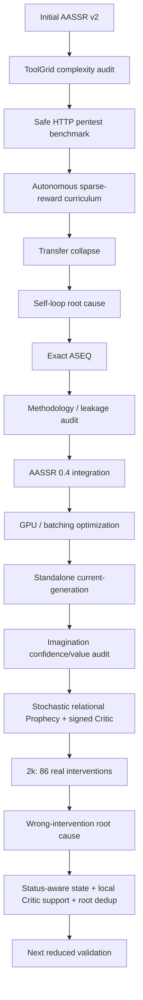

# Development History

AASSR은 한 번에 현재 구조로 만들어진 시스템이 아니다. 실험에서 병목을 찾고, 그 병목을 다시 분해하면서 구조가 바뀌었다.

이 페이지는 **왜 현재 구조가 이렇게 생겼는지**를 설명한다.

> [!NOTE]
> 과거 결과는 역사적 evidence다. 현재 generation의 성능 숫자와 직접 합치지 않는다.

---

# 1. 초기 AASSR v2

초기 AASSR v2의 큰 아이디어는 다음 closed loop였다.

```text
Observation
-> Knowledge
-> Policy
-> Prophecy
-> Imagination
-> real action
-> real transition
-> learning
```

당시에는 다음 구성요소가 중심이었다.

- generic action plugin
- OnlineFeatureMemory
- GOAL state difference
- Skill promotion
- pure-Python online GRU Prophecy
- parallel-universe Imagination
- information value learning
- automatic curriculum

이 구조는 연구 아이디어를 빠르게 연결하는 데 유용했지만, 이후 실제 transfer benchmark를 붙이면서 representation, calibration, evaluation fairness 문제가 차례로 드러났다.

---

# 2. ToolGrid: 복잡도를 분해하기 시작함 — PR #23

기존 complexity level이 사실상 solution horizon 하나에 너무 의존한다는 문제가 있었다.

그래서 ToolGrid에서는 복잡도를 적어도 두 축으로 분리했다.

```text
map size
3x3 / 5x5 / 7x7

semantic tool choices
4 / 8
```

이 과정에서 여러 production bug가 발견됐다.

- sparse calibration pre-ready cache
- terminal calibration semantics
- replay imbalance
- action encoding
- Bellman target masking
- training/evaluation checkpoint mismatch

특히 중요한 교정은 **Policy-only와 Imagination을 따로 재학습하지 않고 같은 checkpoint에서 비교**하기 시작한 것이다.

```text
one Hybrid checkpoint
      /     \
Policy-only  Imagination
```

이 same-checkpoint 원칙은 현재까지 유지된다.

---

# 3. Safe HTTP Pentest Benchmark — PR #24

Grid/Tool 환경에서 더 현실적인 장기 dependency 문제로 이동하기 위해 실제 네트워크 없이 HTTP-like pentest benchmark를 만들었다.

환경에는 다음이 들어갔다.

- login/session
- CSRF
- object authorization
- workflow prerequisite
- audit/lockout
- rate limit
- opaque seed-random identifiers

초기에는 object ID 정렬 순서가 own/target 역할과 연결되는 shortcut이 있었고 이를 제거했다.

40-seed benchmark validation 결과:

```text
Response-guided
Easy    100%
Medium   30%
Hard     20%
```

환경은 `accepted_for_agent_evaluation`로 확정됐다.

---

# 4. Autonomous curriculum: 최초 성공은 찾았지만 transfer가 무너짐 — PR #25

Guided trajectory와 중간 보상을 제거한 상태에서도 쉬운 환경에서는 첫 proof를 자율적으로 발견했다.

```text
first autonomous success: transition 41
curriculum: L0 -> L1 -> L2
performance drop: L2 -> L1 demotion
```

그러나 full unseen benchmark에서는 proof가 0이었다.

처음에는 이를 “상위 난도로 지식이 전이되지 않는다”는 문제로 봤다.

checkpoint cross-evaluation을 해보니 first collapse boundary는 대략:

```text
L0 minimal
   |
   v
L1 decoy exposure
```

이었다.

하지만 더 자세히 보면 route discovery 자체는 상당 부분 유지되고, 이후 동일 browse 행동을 반복하며 stalled되는 패턴이 강했다.

---

# 5. Self-loop root cause — PR #26

재학습 없이 기존 checkpoint에 여러 repetition-control을 붙여 원인을 분리했다.

raw greedy에서는:

```text
3 checkpoints x 8 L1 seeds
= stalled 24 / 24
```

exact ASEQ guard에서는:

```text
stalled 0 / 24
```

여기서 중요한 결론:

> **전이 실패의 상당 부분은 “정답 구조를 전혀 모름”보다, 이미 상태를 바꾸지 않는 행동을 greedy Q가 계속 선택하는 self-loop 문제였다.**

---

# 6. Exact ASEQ를 학습과 평가에 일관되게 사용 — PR #27

기존 train-only repetition filter 대신 같은 exact ASEQ rule을 training/evaluation 모두에 적용했다.

6k focused run 결과:

```text
legacy filter training successes : 29
exact ASEQ training successes    : 50
```

최종 exact-ASEQ unseen:

```text
L0  8/8
L1  7/8
L2  1/8
```

이때부터 ASEQ는 단순 diagnostic hack이 아니라 current design의 독립 component로 자리 잡았다.

---

# 7. Training mechanism audit — PR #28, #29

self-loop를 고친 뒤에도 “학습 때와 평가 때의 환경/action surface가 정말 같은가?”를 다시 감사했다.

주요 문제:

- train-only action suppression
- stall/rate-limit reset 뒤 TD bootstrap continuation
- hidden simulator state가 semantic fingerprint에 섞일 위험
- curriculum metadata leakage
- exact audit pressure/session countdown leakage
- target rank shortcut
- final seed blinding 규칙

수정 방향:

```text
agent-visible observation only
+
semantic self-loop ASEQ
+
explicit TD episode boundaries
+
train/eval action-surface consistency
```

`response_causal_observation_v3`가 이 감사에서 current observation contract로 자리 잡았다.

---

# 8. AASSR 0.4 integration — PR #30

분리돼 있던 AASSR 구성요소를 하나의 canonical 0.4 closed loop로 다시 연결했다.

```text
observable state
-> semantic state
-> ASEQ
-> Policy + Skill
-> Knowledge-bound Prophecy
-> Imagination
-> real transition
-> Knowledge / Prophecy / Policy learning
```

이때 마지막 methodology audit에서 다음도 수정됐다.

- same-transition hindsight Knowledge leak
- drifting holdout set
- evaluation learning leak
- recurrent hidden state episode-boundary leak
- Skill macro budget leak

즉 0.4는 “기능을 더 넣은 버전”이라기보다 **기존 아이디어를 fair evaluation contract 안에 다시 묶은 세대**였다.

---

# 9. Performance engineering — PR #31, #32

Full AASSR은 작은 GRU/world-model 호출을 매우 많이 해서 GPU가 있어도 느렸다.

따라서 알고리즘 의미를 유지하면서 hot path를 batch화했다.

- Prophecy batch prediction
- holdout validation batching
- depth-batched Imagination
- process-level scheduling
- CUDA throughput path

이 과정은 current-generation의 hardware-aware design으로 이어졌다.

---

# 10. Standalone current-generation — PR #33

과거 v0.4와 현재 실험 코드가 섞이지 않도록 **현역 runtime을 standalone generation으로 분리**했다.

주요 변화:

```text
Observation : response_causal_observation_v3
ASEQ        : semantic exact self-loop guard
Policy      : relational DQN + information residual
Prophecy    : relational learned world model
Critic      : relational GRU
Imagination : current multi-step tree
```

그리고 최종 비교를 5-condition으로 확장했다.

```text
dqn_raw
dqn_relational
dreamerv3_relational
aassr_current_no_imagination
aassr_current_full
```

이 세대에서 legacy modules는 current runtime에서 `LEGACY_COMPONENTS_ACTIVE = ()`로 격리된다.

---

# 11. Imagination audit: “작동하지 않음”에서 “잘못 개입함”으로 — PR #34

초기 current Imagination을 분석하자 두 단계의 문제가 드러났다.

## 단계 A: confidence가 value처럼 사용됨

예측 confidence가 높은 행동이 미래 가치와 무관하게 선택되는 문제가 있었다.

이를 제거하자 반대 문제가 생겼다.

## 단계 B: Critic value가 tie로 붕괴

Imagination plan은 만들어지지만 Policy와 다른 행동을 고를 만큼 value separation이 없었다.

```text
Imagination runs exist
but
interventions = 0
```

그래서 representation/world-model/Critic/planner contract를 크게 다시 감사했다.

주요 수리:

- concrete ID target 제거
- relational next-state prediction
- legal-action mask prediction
- multimodal future mixture
- probability vs reliability 분리
- chance expectation / decision max 분리
- signed sparse-return Critic
- root preservation
- structural branching

---

# 12. 2026-08-11 repaired 2k: 실제 intervention 발생

2,048-transition same-checkpoint run에서:

```text
plans          297
interventions   86
```

즉 Critic tie collapse는 해소됐다.

하지만 성능:

```text
no-Imagination 4/20
Full           4/20
```

그리고 86 intervention 중 58개가 `403/404/429` error였다.

따라서 병목은 다음처럼 이동했다.

```text
Imagination cannot act
        |
        v
Imagination can act
        |
        v
Imagination acts in unsupported/wrong regions
```

---

# 13. Current repair after the 2k audit

2k trace에서 세 가지 큰 원인이 드러났다.

1. latest public HTTP status 누락
2. semantic calibration의 response-risk blind spot
3. global Critic readiness만으로 unseen L3 override 허용

현재 manifest에는 이를 반영한 다음 contract가 들어가 있다.

```text
relational state v3 + latest HTTP status
status-supervised stochastic Prophecy v3
status-aware calibration
local Critic support fail-closed gate
structural root compute dedup
```

이제 다음 질문은:

> **이 수리들이 intervention을 단순히 줄이는 데 그치지 않고, 올바른 intervention을 남겨 실제 sparse-reward success를 높이는가?**

이다.

---

# 14. 연구 흐름 한 장 요약



---

# 15. 왜 실패한 실험을 남기는가?

AASSR의 구조 대부분은 “처음부터 그럴듯해서 넣은 기능”이 아니라 실제 failure trace에서 나온 수정이다.

예:

```text
stalled trace
-> ASEQ

same-checkpoint mismatch
-> frozen paired evaluation

403/404 wrong interventions
-> status-aware relational state/calibration

L3 unsupported override
-> local Critic support
```

따라서 실패 기록을 지우면 현재 구조의 이유도 사라진다.

이 위키에서는 실패 실험도 **Historical evidence**로 남기되, current performance와 섞지 않는 것을 원칙으로 한다.
