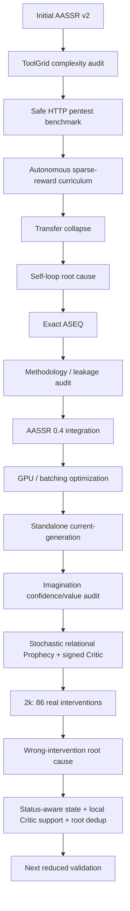

# Development History

AASSR은 한 번에 현재 구조로 만들어진 시스템이 아니다. 실험에서 병목을 찾고, 그 병목을 다시 분해하면서 구조가 바뀌었다.

이 페이지는 **왜 현재 구조가 이렇게 생겼는지**를 설명한다.

> [!NOTE]
> 과거 결과는 역사적 [증거(evidence)](Evidence-Matrix)다. 현재 generation의 성능 숫자와 직접 합치지 않는다.

---

# 1. 초기 AASSR v2

초기 AASSR v2의 큰 아이디어는 다음 closed loop였다.

```text
Observation
-> Knowledge
-> Policy
-> Prophecy
-> Imagination
-> real action
-> real transition
-> learning
```

당시에는 다음 구성요소가 중심이었다.

- generic [행동(action)](Reinforcement-Learning) plugin
- OnlineFeatureMemory
- GOAL [상태(state)](State-Representation) difference
- [Skill(성공 절차 재사용)](Skills) [다음 난이도로 승급(promotion)](Curriculum-Learning)
- pure-Python [경험이 들어올 때마다 갱신하는 온라인 방식(online)](Neural-Networks-and-Optimization) [GRU(게이트 순환 유닛)](GRU-and-Sequence-Models) [Prophecy(미래 예측 모델)](Prophecy)
- parallel-universe [Imagination(가상 미래 탐색)](Imagination)
- [정보(information)](Information-Theory-and-Intrinsic-Motivation) [가치(value)](Value-Functions-and-Bellman-Equation) [학습(learning)](Reinforcement-Learning)
- automatic [난이도 조절 학습(curriculum)](Curriculum-Learning)

이 구조는 연구 아이디어를 빠르게 연결하는 데 유용했지만, 이후 실제 [전이(transfer)](Relational-Representation-and-Generalization) [표준 비교 실험(benchmark)](Ablation-Benchmarking-and-Reproducibility)를 붙이면서 [표현(representation)](Relational-Representation-and-Generalization), [예측 신뢰도 보정(calibration)](Calibration), [평가(evaluation)](Ablation-Benchmarking-and-Reproducibility) fairness 문제가 차례로 드러났다.

---

# 2. ToolGrid: 복잡도를 분해하기 시작함 — PR #23

기존 complexity [난이도 단계(level)](Curriculum-Learning)이 사실상 solution [미래를 내다보는 범위(horizon)](Counterfactual-Planning-and-Search) 하나에 너무 의존한다는 문제가 있었다.

그래서 ToolGrid에서는 복잡도를 적어도 두 축으로 분리했다.

```text
map size
3x3 / 5x5 / 7x7

semantic tool choices
4 / 8
```

이 과정에서 여러 production bug가 발견됐다.

- [드문 보상만 있는(sparse)](Sparse-Reward-and-Credit-Assignment) 예측 신뢰도 보정 pre-ready cache
- [에피소드 종료(terminal)](Replay-Buffer-and-Episode-Boundaries) 예측 신뢰도 보정 [의미 규칙(semantics)](State-Representation)
- [저장된 경험의 재사용(replay)](Replay-Buffer-and-Episode-Boundaries) [데이터 수의 불균형(imbalance)](Loss-Functions-and-Class-Imbalance)
- 행동 [학습용 수치 표현으로 바꾸는 인코딩(encoding)](State-Representation)
- Bellman [대상 또는 학습 목표값(target)](Terminology-Guide) masking
- [학습(training)](Terminology-Guide)/평가 [체크포인트(checkpoint)](Reproduction) [서로 맞지 않는 불일치(mismatch)](Causality-Leakage-and-Evaluation)

특히 중요한 교정은 **[Policy(정책 모델)](Policy)-only와 [Imagination](Imagination)을 따로 재학습하지 않고 같은 체크포인트에서 비교**하기 시작한 것이다.

```text
one Hybrid checkpoint
      /     \
Policy-only  Imagination
```

이 [같은 체크포인트(same-checkpoint)](Experiments) 원칙은 현재까지 유지된다.

---

# 3. Safe HTTP Pentest Benchmark — PR #24

Grid/Tool 환경에서 더 현실적인 장기 dependency 문제로 이동하기 위해 실제 네트워크 없이 HTTP-like pentest 표준 비교 실험를 만들었다.

환경에는 다음이 들어갔다.

- login/[한 번의 접속 세션(session)](Terminology-Guide)
- CSRF
- object authorization
- workflow prerequisite
- [공정성과 구현을 점검하는 감사(audit)](Causality-Leakage-and-Evaluation)/[복구할 수 없는 실패 잠금(lockout)](Replay-Buffer-and-Episode-Boundaries)
- [비율(rate)](Terminology-Guide) [제한(limit)](Terminology-Guide)
- opaque [난수 시드(seed)](Ablation-Benchmarking-and-Reproducibility)-random identifiers

초기에는 object ID 정렬 순서가 own/대상/목표값 역할과 연결되는 [정답 정보를 우회적으로 이용하는 지름길(shortcut)](Causality-Leakage-and-Evaluation)이 있었고 이를 제거했다.

40-난수 시드 표준 비교 실험 [검증(validation)](Ablation-Benchmarking-and-Reproducibility) 결과:

```text
Response-guided
Easy    100%
Medium   30%
Hard     20%
```

환경은 `accepted_for_agent_evaluation`로 확정됐다.

---

# 4. Autonomous curriculum: 최초 성공은 찾았지만 transfer가 무너짐 — PR #25

Guided [경험 경로(trajectory)](Reinforcement-Learning)와 중간 보상을 제거한 상태에서도 쉬운 환경에서는 첫 proof를 자율적으로 발견했다.

```text
first autonomous success: transition 41
curriculum: L0 -> L1 -> L2
performance drop: L2 -> L1 demotion
```

그러나 full [학습 중 보지 못한(unseen)](Relational-Representation-and-Generalization) 표준 비교 실험에서는 proof가 0이었다.

처음에는 이를 “상위 난도로 지식이 전이되지 않는다”는 문제로 봤다.

체크포인트 cross-evaluation을 해보니 first [여러 결과가 하나로 뭉개지는 붕괴(collapse)](Mixture-Ensemble-and-Calibration) [경계(boundary)](Replay-Buffer-and-Episode-Boundaries)는 대략:

```text
L0 minimal
   |
   v
L1 decoy exposure
```

이었다.

하지만 더 자세히 보면 route [스스로 새로운 성공 경로를 발견하는 것(discovery)](Research-Questions) 자체는 상당 부분 유지되고, 이후 동일 browse 행동을 반복하며 [진전 없이 반복하다 멈춘(stalled)](ASEQ)되는 패턴이 강했다.

---

# 5. Self-loop root cause — PR #26

재학습 없이 기존 체크포인트에 여러 repetition-control을 붙여 원인을 분리했다.

[가공하지 않은 원본(raw)](State-Representation) [현재 추정값이 가장 큰 행동만 고르는 탐욕 선택(greedy)](Exploration-and-Exploitation)에서는:

```text
3 checkpoints x 8 L1 seeds
= stalled 24 / 24
```

[정확히 동일한(exact)](ASEQ) [ASEQ(실제 상태-행동-다음 상태 기록)](ASEQ) [잘못된 행동을 제한하는 보호 규칙(guard)](ASEQ)에서는:

```text
stalled 0 / 24
```

여기서 중요한 결론:

> **전이 실패의 상당 부분은 “정답 구조를 전혀 모름”보다, 이미 상태를 바꾸지 않는 행동을 탐욕 선택 Q가 계속 선택하는 [제자리 반복(self-loop)](ASEQ) 문제였다.**

---

# 6. Exact ASEQ를 학습과 평가에 일관되게 사용 — PR #27

기존 train-only [반복(repetition)](ASEQ) filter 대신 같은 정확히 동일한 [ASEQ](ASEQ) [규칙(rule)](Terminology-Guide)을 학습/평가 모두에 적용했다.

6k [특정 범위에 집중한(focused)](Experiments) [실험 실행(run)](Reproduction) 결과:

```text
legacy filter training successes : 29
exact ASEQ training successes    : 50
```

최종 exact-[ASEQ](ASEQ) 학습 중 보지 못한:

```text
L0  8/8
L1  7/8
L2  1/8
```

이때부터 [ASEQ](ASEQ)는 단순 [진단 실험(diagnostic)](Evidence-Matrix) hack이 아니라 [현재(current)](Current-Status) [설계(design)](Design-Rationale)의 독립 [구성요소(component)](Research-Architecture)로 자리 잡았다.

---

# 7. Training mechanism audit — PR #28, #29

제자리 반복를 고친 뒤에도 “학습 때와 평가 때의 환경/행동 [현재 선택 가능한 영역(surface)](Terminology-Guide)가 정말 같은가?”를 다시 감사했다.

주요 문제:

- train-only 행동 [후보 억제(suppression)](ASEQ)
- stall/rate-limit [환경 초기화(reset)](Replay-Buffer-and-Episode-Boundaries) 뒤 TD [다음 상태 가치 이어받기(bootstrap)](Replay-Buffer-and-Episode-Boundaries) [계속 진행되는 상태(continuation)](Chance-and-Decision-Nodes)
- [숨겨진(hidden)](MDP-and-POMDP) [환경 시뮬레이터(simulator)](MDP-and-POMDP) 상태가 [의미 기준(semantic)](State-Representation) fingerprint에 섞일 위험
- 난이도 조절 학습 [부가 정보(metadata)](State-Representation) [정보 누출(leakage)](Causality-Leakage-and-Evaluation)
- 정확히 동일한 감사 [환경 내부의 숨은 압박 값(pressure)](Causality-Leakage-and-Evaluation)/접속 세션 [남은 횟수 카운트다운(countdown)](Causality-Leakage-and-Evaluation) 정보 누출
- 대상/목표값 rank 지름길
- [최종(final)](Ablation-Benchmarking-and-Reproducibility) 난수 시드 blinding 규칙

수정 방향:

```text
agent-visible observation only
+
semantic self-loop ASEQ
+
explicit TD episode boundaries
+
train/eval action-surface consistency
```

`response_causal_observation_v3`가 이 감사에서 현재 [관측(observation)](MDP-and-POMDP) [명세(contract)](Current-Status)로 자리 잡았다.

---

# 8. AASSR 0.4 integration — PR #30

분리돼 있던 AASSR 구성요소를 하나의 canonical 0.4 closed loop로 다시 연결했다.

```text
observable state
-> semantic state
-> ASEQ
-> Policy + Skill
-> Knowledge-bound Prophecy
-> Imagination
-> real transition
-> Knowledge / Prophecy / Policy learning
```

이때 마지막 methodology 감사에서 다음도 수정됐다.

- same-[상태 전이(transition)](MDP-and-POMDP) [결과를 본 뒤 얻은 사후 정보(hindsight)](Causality-Leakage-and-Evaluation) [Knowledge(에피소드 지식)](Knowledge) [정보 누출(leak)](Causality-Leakage-and-Evaluation)
- drifting [검증용 분리 데이터(holdout)](Calibration) [집합(set)](Terminology-Guide)
- 평가 학습 정보 누출
- [과거 정보를 이어가는 순환형(recurrent)](GRU-and-Sequence-Models) [숨은 환경 상태(hidden state)](MDP-and-POMDP) episode-boundary 정보 누출
- [Skill](Skills) [여러 행동을 묶은 상위 행동(macro)](Hierarchical-RL-and-Skills) [실험에 허용된 전이 수 한도(budget)](Ablation-Benchmarking-and-Reproducibility) 정보 누출

즉 0.4는 “기능을 더 넣은 버전”이라기보다 **기존 아이디어를 fair 평가 명세 안에 다시 묶은 세대**였다.

---

# 9. Performance engineering — PR #31, #32

[전체 AASSR 조건(Full)](Experiments) AASSR은 작은 [GRU](GRU-and-Sequence-Models)/[세계 모델(world-model)](Model-Based-RL-and-World-Models) 호출을 매우 많이 해서 GPU가 있어도 느렸다.

따라서 알고리즘 의미를 유지하면서 hot [경로(path)](Counterfactual-Planning-and-Search)를 [여러 입력 묶음(batch)](Reproduction)화했다.

- [Prophecy](Prophecy) 묶음 [예측(prediction)](Terminology-Guide)
- 검증용 분리 데이터 검증 [묶음 처리(batching)](Reproduction)
- depth-batched [Imagination](Imagination)
- process-level scheduling
- CUDA [처리량(throughput)](Reproduction) 경로

이 과정은 [현재 세대(current-generation)](Current-Status)의 hardware-aware 설계으로 이어졌다.

---

# 10. Standalone current-generation — PR #33

과거 v0.4와 현재 실험 코드가 섞이지 않도록 **현역 [실행 구조(runtime)](Current-Status)을 standalone generation으로 분리**했다.

주요 변화:

```text
Observation : response_causal_observation_v3
ASEQ        : semantic exact self-loop guard
Policy      : relational DQN + information residual
Prophecy    : relational learned world model
Critic      : relational GRU
Imagination : current multi-step tree
```

그리고 최종 비교를 5-condition으로 확장했다.

```text
dqn_raw
dqn_relational
dreamerv3_relational
aassr_current_no_imagination
aassr_current_full
```

이 세대에서 [구버전 호환 코드(legacy)](Development-History) modules는 [현재 실행 구조(current runtime)](Current-Status)에서 `LEGACY_COMPONENTS_ACTIVE = ()`로 격리된다.

---

# 11. Imagination audit: “작동하지 않음”에서 “잘못 개입함”으로 — PR #34

초기 현재 [Imagination](Imagination)을 분석하자 두 단계의 문제가 드러났다.

## 단계 A: confidence가 value처럼 사용됨

예측 [예측 신뢰 정도(confidence)](Calibration)가 높은 행동이 미래 가치와 무관하게 선택되는 문제가 있었다.

이를 제거하자 반대 문제가 생겼다.

## 단계 B: Critic value가 tie로 붕괴

[Imagination](Imagination) [계획(plan)](Counterfactual-Planning-and-Search)은 만들어지지만 [Policy](Policy)와 다른 행동을 고를 만큼 가치 separation이 없었다.

```text
Imagination runs exist
but
interventions = 0
```

그래서 표현/세계 모델/[Critic(미래 가치 평가기)](Critic)/[계획기(planner)](Counterfactual-Planning-and-Search) 명세를 크게 다시 감사했다.

주요 수리:

- [실제 개체를 구분하는(concrete)](State-Representation) ID 대상/목표값 제거
- [관계 기반(relational)](Relational-Representation-and-Generalization) [다음 상태(next-state)](MDP-and-POMDP) 예측
- [가능 행동 마스크(legal-action mask)](Prophecy) 예측
- [여러 결과 형태를 가진(multimodal)](Mixture-Ensemble-and-Calibration) [미래(future)](Counterfactual-Planning-and-Search) [여러 결과의 혼합 분포(mixture)](Mixture-Ensemble-and-Calibration)
- [확률(probability)](Stochasticity-Uncertainty-and-Probability) vs [신뢰도(reliability)](Calibration) 분리
- [환경의 확률 분기(chance)](Chance-and-Decision-Nodes) [확률 기댓값(expectation)](Chance-and-Decision-Nodes) / [의사결정(decision)](Chance-and-Decision-Nodes) max 분리
- signed sparse-[누적 보상(return)](Value-Functions-and-Bellman-Equation) [Critic](Critic)
- [탐색의 첫 행동(root)](Imagination) [의미 보존(preservation)](Ablation-Benchmarking-and-Reproducibility)
- [구조 기반(structural)](Relational-Representation-and-Generalization) [여러 미래로 갈라지는 분기(branching)](Chance-and-Decision-Nodes)

---

# 12. 2026-08-11 repaired 2k: 실제 intervention 발생

2,048-상태 전이 같은 체크포인트 실험 실행에서:

```text
plans          297
interventions   86
```

즉 [Critic](Critic) tie 붕괴는 해소됐다.

하지만 성능:

```text
no-Imagination 4/20
Full           4/20
```

그리고 86 [실제 행동 개입(intervention)](Imagination) 중 58개가 `403/404/429` [오차(error)](Loss-Functions-and-Class-Imbalance)였다.

따라서 병목은 다음처럼 이동했다.

```text
Imagination cannot act
        |
        v
Imagination can act
        |
        v
Imagination acts in unsupported/wrong regions
```

---

# 13. Current repair after the 2k audit

2k [과정을 추적한 기록(trace)](Development-History)에서 세 가지 큰 원인이 드러났다.

1. [가장 최근의(latest)](Current-Status) [공개된(public)](State-Representation) HTTP [상태 코드(status)](Terminology-Guide) 누락
2. 의미 기준 예측 신뢰도 보정의 response-risk [결과를 미리 보지 않는 비공개 평가(blind)](Ablation-Benchmarking-and-Reproducibility) spot
3. [전체 범위(global)](Terminology-Guide) [Critic](Critic) readiness만으로 학습 중 보지 못한 L3 [기본 행동 덮어쓰기(override)](Imagination) 허용

현재 manifest에는 이를 반영한 다음 명세가 들어가 있다.

```text
relational state v3 + latest HTTP status
status-supervised stochastic Prophecy v3
status-aware calibration
local Critic support fail-closed gate
structural root compute dedup
```

이제 다음 질문은:

> **이 수리들이 실제 행동 개입을 단순히 줄이는 데 그치지 않고, 올바른 실제 행동 개입을 남겨 실제 sparse-[보상(reward)](Sparse-Reward-and-Credit-Assignment) [성공(success)](Terminology-Guide)를 높이는가?**

이다.

---

# 14. 연구 흐름 한 장 요약



---

# 15. 왜 실패한 실험을 남기는가?

AASSR의 구조 대부분은 “처음부터 그럴듯해서 넣은 기능”이 아니라 실제 [실패(failure)](Replay-Buffer-and-Episode-Boundaries) 추적 기록에서 나온 수정이다.

예:

```text
stalled trace
-> ASEQ

same-checkpoint mismatch
-> frozen paired evaluation

403/404 wrong interventions
-> status-aware relational state/calibration

L3 unsupported override
-> local Critic support
```

따라서 실패 기록을 지우면 현재 구조의 이유도 사라진다.

이 위키에서는 실패 실험도 **Historical 증거**로 남기되, 현재 [성능(performance)](Ablation-Benchmarking-and-Reproducibility)와 섞지 않는 것을 원칙으로 한다.
