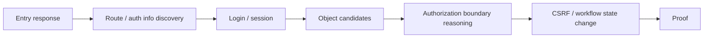

# Experiments

이 페이지는 AASSR의 **실험 설계, 비교군, 현재까지의 핵심 결과, 결과를 해석할 때의 경계**를 정리한다.

> [!IMPORTANT]
> AASSR 저장소에는 여러 세대의 결과가 함께 존재한다. 이 페이지에서는 결과를 **benchmark validation / mechanism diagnostic / current-generation validation / future final suite**로 나누어 기록한다. 서로 다른 세대의 숫자를 한 표에서 단순 비교하지 않는다.

---

# 1. 연구 질문

AASSR의 큰 연구 질문은 다음과 같다.

> **중간 보상이 거의 없는 sparse-reward 환경에서, 에이전트가 경험의 구조를 기억하고 미래를 예측하며 실제 행동 전에 가능한 결과를 상상하면 일반적인 model-free RL보다 더 안정적으로 장기 문제를 해결할 수 있는가?**

이를 한 번에 검증하면 어느 부분이 효과를 냈는지 알 수 없기 때문에 현재 실험은 여러 하위 질문으로 나눈다.

1. 환경 자체가 너무 쉽거나 불가능하지 않은가?
2. raw representation보다 relational representation이 도움이 되는가?
3. ASEQ가 self-loop를 실제로 줄이는가?
4. AASSR의 non-Imagination stack이 relational DQN보다 나은가?
5. 같은 AASSR checkpoint에서 Imagination ON이 OFF보다 나은가?
6. AASSR Full은 official DreamerV3와 어떻게 다른가?

---

# 2. 보상 계약

현재 pentest 계열 실험의 외부 reward는 다음으로 고정한다.

```text
proof success       +1
true lockout        -1
stall                0
rate-limit trunc.    0
transition-cap       0
ordinary transition  0
```

다음은 사용하지 않는다.

- guided trajectory
- oracle action injection
- response-guided 정답 경로 주입
- intermediate shaping reward
- 사람이 만든 성공 action sequence 주입

즉 성공과 실제 실패를 제외한 대부분의 transition은 reward `0`이다.

---

# 3. HTTP Pentest Benchmark

실제 네트워크를 공격하지 않고도 web penetration-testing과 비슷한 장기 의사결정 구조를 만들기 위해 **safe in-process HTTP lab**을 사용한다.

## 3.1 환경 흐름



환경은 다음을 모사한다.

- HTTP-like status: `200/302/400/401/403/404/409/429`
- login redirect
- session cookie
- CSRF token
- object authorization
- state-changing workflow prerequisites
- audit / lockout
- rate limit
- session expiration
- decoy routes
- seed마다 달라지는 opaque identifiers

실제 network socket, shell, external HTTP client는 사용하지 않는다.

## 3.2 난도

| Tier | Objects | Decoys | Lockout | Rate limit | Session TTL | Partial observability |
|---|---:|---:|---:|---:|---:|---:|
| Easy | 3 | 0 | 4 | 16 | 8 | 1.0 |
| Medium | 8 | 4 | 3 | 12 | 7 | 0.0 |
| Hard | 14 | 8 | 3 | 16 | 12 | 0.0 |

## 3.3 Benchmark validation baseline

40 evaluation seeds에서 환경 자체를 검증한 결과:

| Tier | Oracle | Random | Browse-first | Response-guided | Abstract Q |
|---|---:|---:|---:|---:|---:|
| Easy | 100.0% | 0.0% | 0.3% | **100.0%** | 0.0% |
| Medium | 100.0% | 0.0% | 0.0% | **30.0%** | 0.0% |
| Hard | 100.0% | 0.0% | 0.0% | **20.0%** | 0.0% |

해석:

- Oracle이 모든 seed에서 풀 수 있으므로 환경이 구조적으로 불가능하지 않다.
- Random으로는 사실상 풀리지 않는다.
- 응답 의미를 적극적으로 사용하는 strong heuristic은 Easy를 풀지만 난도가 올라가며 성능이 떨어진다.
- Hard에서도 일부 seed는 풀리므로 전부 불가능한 saturation 구간은 아니다.

최종 환경 판정은:

```text
accepted_for_agent_evaluation
```

이다.

이 판정은 **AASSR의 우위를 의미하지 않는다.** 단지 agent comparison에 사용할 수 있는 환경이라는 뜻이다.

---

# 4. ASEQ self-loop diagnostics

## 질문

> DQN이 higher-level transfer에서 실패한 이유가 목표 자체를 이해하지 못해서인가, 아니면 같은 행동을 반복하는 self-loop 때문인가?

재학습 없이 기존 checkpoint를 평가한 결과, L1 unseen에서 raw greedy는 3 checkpoint × 8 seeds = 24 episodes 모두 stalled였다.

exact ASEQ guard를 적용하면:

```text
raw greedy       : stalled 24/24
exact ASEQ guard : stalled  0/24
```

성공률:

| checkpoint | raw greedy | exact ASEQ |
|---|---:|---:|
| L2 first reached | 0/8 | 2/8 |
| L2 pre-demotion | 0/8 | 7/8 |
| post-demotion retrained | 0/8 | 5/8 |

따라서 **self-loop가 실제 주요 병목 중 하나였음**을 확인했다.

자세한 해석: **[ASEQ](ASEQ)**

---

# 5. Exact-ASEQ consistent retraining

학습과 평가에 같은 exact ASEQ 규칙을 일관되게 사용한 6k focused run:

| training mode | training successes | L0 | L1 | L2 |
|---|---:|---:|---:|---:|
| legacy filter | 29 | 15 | 14 | 0 |
| exact ASEQ | **50** | **30** | **19** | **1** |

최종 unseen + exact ASEQ evaluation:

| trained with | L0 | L1 | L2 |
|---|---:|---:|---:|
| legacy filter | 1/8 | 1/8 | 0/8 |
| exact ASEQ | **8/8** | **7/8** | **1/8** |

그러나 제한이 있다.

- research seed 1개
- unseen seed 8개
- L0~L2 focused experiment
- current-generation Full AASSR의 최종 성능 실험이 아님

따라서 이 결과는 **ASEQ 메커니즘의 유효성 evidence**이지, 전체 AASSR의 최종 성능 숫자로 사용하지 않는다.

---

# 6. Current-generation five-condition design

최종 current-generation 비교는 다음 5개 row를 목표로 한다.

| Condition | 학습 representation | World model / Imagination | 목적 |
|---|---|---|---|
| `dqn_raw` | raw v3 | 없음 | 가장 단순한 corrected DQN 기준선 |
| `dqn_relational` | relational | 없음 | representation 효과 분리 |
| `dreamerv3_relational` | relational | official DreamerV3 | 표준 model-based baseline |
| `aassr_current_no_imagination` | relational | AASSR stack, planner OFF | AASSR non-Imagination 효과 |
| `aassr_current_full` | relational | AASSR stack, planner ON | Imagination marginal effect |

비교 해석:

```text
dqn_raw -> dqn_relational
= representation effect

dqn_relational -> AASSR no-Imagination
= AASSR stack beyond representation

AASSR no-Imagination -> Full
= same-checkpoint Imagination marginal effect

dqn_relational -> DreamerV3
= official world-model + imagined actor-critic baseline

DreamerV3 <-> AASSR Full
= model-based imagination family comparison
```

## Same-checkpoint rule

AASSR OFF/ON은 **절대 따로 재학습하지 않는다.**

```text
one AASSR training run
        |
        v
frozen checkpoint
      /    \
     /      \
 OFF eval  ON eval
```

평가 중 persistent learning state가 바뀌면 hard failure다.

---

# 7. Official DreamerV3 baseline

DreamerV3는 저장소 안에서 알고리즘을 AASSR에 맞게 뜯어고친 버전이 아니다.

원칙:

- pinned official `danijar/dreamerv3`
- upstream Agent/RSSM/imagination/actor-critic/loss 수정 없음
- 별도 Linux/WSL + JAX/CUDA process
- current relational state 사용
- fixed 240-way structural categorical action vocabulary
- 현재 unavailable action을 선택하면 public structural distance로 nearest legal slot에 deterministic projection
- hidden scenario, reward, correct action을 projection에 사용하지 않음

Canonical configuration:

```text
preset      : dmc_proprio + size1m
train ratio : 1024
dtype       : bfloat16
platform    : cuda
```

과학적 sample budget은 **실제 primitive HTTP action**만 센다.

---

# 8. Repaired Imagination 2k validation — 2026-08-11

## 설계

- research seed: `7`
- training budget: `2,048 real transitions`
- 하나의 AASSR checkpoint 학습
- same frozen checkpoint에서 OFF/ON 비교
- fixed intervention margin: `0.05`

## 결과

| Condition | Success | L0 | L1 | L2 | L3 | L4 | True failure |
|---|---:|---:|---:|---:|---:|---:|---:|
| no-Imagination | **4/20** | 4/4 | 0/4 | 0/4 | 0/4 | 0/4 | 0 |
| Full | **4/20** | 4/4 | 0/4 | 0/4 | 0/4 | 0/4 | 2 |

Full diagnostics:

```text
Imagination plans        297
switch candidates        218
executed interventions    86
changed actions            86
```

86개 intervention은 모두 L3 `object_choices`에서 발생했다.

그중:

```text
PluginOutcome.error=True : 58 / 86
404                       : 30
403                       : 26
429                       :  2
direct success-producing  :  0
```

## 이 결과가 의미하는 것

이전 단계의 병목은 미래 가치가 tie로 붕괴해 Imagination이 **0회 intervention**하는 것이었다.

2k run에서는 Critic이 충분히 값을 갈라 86회 override했다.

즉:

```text
과거 병목
Imagination cannot influence action
        |
        v
해결
        |
        v
새 병목
Imagination confidently changes to wrong actions
```

## Matched-state audit

68개 intervention state에서 동일 scenario + 동일 semantic state의 no-Imagination counterpart를 찾았다.

```text
Full intervention -> error
Policy original    -> no error
= 50 cases

Full intervention -> no error
Policy original    -> error
= 0 cases
```

따라서 단순 stochastic bad luck만으로 설명하기 어렵다.

---

# 9. 2k 이후 확인된 root causes

## 9.1 Latest HTTP status 누락

당시 relational v2는 public `403/404/429` status channel을 버리고 있었다.

그 결과 위험 신호가 semantic representation에서 충분히 드러나지 않았다.

## 9.2 Calibration metric blind spot

당시 probability-weighted semantic score는 약 `0.916`, terminal match는 약 `0.991`이었지만 실제 intervention quality는 나빴다.

즉 전체 semantic score가 높아도 decision-critical response error를 놓칠 수 있었다.

## 9.3 Global critic readiness != local support

학습 성공은 L0에 집중되어 있었고 curriculum focus도 L1까지만 갔는데, Critic은 unseen L3에서 86번 override했다.

따라서 “Critic이 학습됨”과 “현재 state/action에서 Critic을 믿을 수 있음”을 분리해야 했다.

## 9.4 Root alias 계산 폭발

L3에서 concrete roots는 약 `172`, structural relational roots는 약 `17`이었다.

같은 구조의 alias를 depth-1에서 전부 다시 계산해 Full이 no-Imagination보다 매우 느려졌다.

---

# 10. 2k 이후 코드에 들어간 repair

현재 manifest 기준:

1. relational public state v3 + latest HTTP status
2. status-supervised stochastic Prophecy
3. status-aware semantic calibration
4. local real-training Critic support gate
5. structural root compute deduplication
6. chance probability / decision max backup 유지
7. expected external sparse return objective 유지

> [!CAUTION]
> 이 수리들은 **코드에 구현되어 있다는 것**과 **새 장기 실험에서 성능 향상이 확인됐다는 것**이 다르다. 다음 reduced validation 결과가 나오기 전에는 성능 개선을 확정적으로 주장하지 않는다.

---

# 11. 실험 결과를 보고할 때 반드시 같이 보는 지표

성공률 하나만 보면 원인을 놓칠 수 있다.

현재 권장 지표:

- proof success
- true failure
- stalled
- truncation / rate-limit
- stage milestone reach
- mean requests
- curriculum focus/exposure
- Imagination plan count
- intervention count
- changed action count
- direct success-producing intervention
- intervention error rate
- root coverage
- semantic top-k quality
- probability-weighted semantic quality
- legal-mask accuracy
- terminal accuracy
- HTTP status accuracy
- local Critic support pass/fail
- runtime / wall time

---

# 12. 아직 하지 않은 최종 주장

현재 위키에서 다음 표현은 사용하지 않는다.

```text
“AASSR이 DreamerV3보다 우수하다”
“AASSR Full이 DQN보다 최종적으로 우수하다”
“Imagination이 성능을 향상시킨다”
```

이들은 final/reduced five-condition evidence가 충분히 나온 뒤에만 판단한다.

현재 가장 정확한 표현은:

> **AASSR current-generation은 sparse-reward pentest benchmark에서 relational Policy, empirical ASEQ, stochastic world model, sparse-return Critic, multi-step Imagination을 하나의 runtime으로 통합했으며, Imagination이 실제 행동을 변경할 수 있음까지는 확인됐다. 현재 연구는 그 intervention의 신뢰성과 일반화 성능을 검증하는 단계다.**

다음: **[Current Status](Current-Status)**
