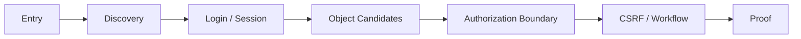

# 실험 설계와 결과 (Experiments)

이 페이지는 AASSR의 **실험 [실험 규칙(protocol)](Ablation-Benchmarking-and-Reproducibility), 비교 조건, [증거(evidence)](Evidence-Matrix) level, [과거 기록(historical)](Development-History) [진단 실험(diagnostic)](Evidence-Matrix), [현재(current)](Current-Status) [연구 주장(claim)](Evidence-Matrix) boundary**를 정리한다.

> [!IMPORTANT]
> AASSR 저장소에는 여러 세대의 결과가 함께 남아 있다. 이 페이지에서는 숫자를 반드시 다음 중 하나로 분류한다.
>
> ```text
> [표준 비교 실험(benchmark)](Ablation-Benchmarking-and-Reproducibility) [검증(validation)](Ablation-Benchmarking-and-Reproducibility)
> mechanism 진단 실험
> 과거 기록 root-cause 진단 실험
> [현재 세대(current-generation)](Current-Status) reduced 검증
> multi-[난수 시드(seed)](Ablation-Benchmarking-and-Reproducibility) 표준 비교 실험
> [최종 비공개 평가(final blind)](Ablation-Benchmarking-and-Reproducibility)ed [평가(evaluation)](Ablation-Benchmarking-and-Reproducibility)
> ```
>
> 서로 다른 세대의 숫자를 한 표에 섞어 “성능 추세”처럼 해석하지 않는다.

전체 연구 질문과 가설: [Research Questions](Research-Questions)  
RQ별 변수·지표·연구 주장 상태: [Evidence Matrix](Evidence-Matrix)

---

## 목차

1. [실험 철학](#1-실험-철학)
2. [보상과 관측 계약](#2-보상과-관측-계약)
3. [Benchmark validation](#3-benchmark-validation)
4. [RQ1 — Autonomous first success](#4-rq1--autonomous-first-success)
5. [RQ2 — Raw vs Relational](#5-rq2--raw-vs-relational)
6. [RQ3 — ASEQ self-loop](#6-rq3--aseq-self-loop)
7. [RQ4/RQ5 — Prophecy & Calibration](#7-rq4rq5--prophecy--calibration)
8. [RQ6 — Critic local support](#8-rq6--critic-local-support)
9. [RQ7 — Imagination same-checkpoint](#9-rq7--imagination-same-checkpoint)
10. [RQ8 — Five-condition final suite](#10-rq8--five-condition-final-suite)
11. [RQ9 — Skill](#11-rq9--skill)
12. [통계와 보고 형식](#12-통계와-보고-형식)
13. [최종 claim gate](#13-최종-claim-gate)

---

# 1. 실험 철학

AASSR은 여러 메커니즘이 결합된 시스템이다.

```text
Relational Representation
+ ASEQ
+ Policy
+ Knowledge
+ Prophecy
+ Calibration
+ Critic
+ Local Support
+ Imagination
+ Skills
```

따라서 Full AASSR 하나만 돌려 [비교 기준(baseline)](Ablation-Benchmarking-and-Reproducibility)과 비교하면 **왜 차이가 났는지 알 수 없다.**

연구 설계는 다음 순서로 효과를 분리한다.

```text
dqn_raw
  ↓ representation effect
dqn_relational
  ↓ AASSR stack beyond representation
aassr_current_no_imagination
  ↓ Imagination marginal effect
aassr_current_full
```

그리고 외부 model-based family comparison:

```text
dreamerv3_relational
↔
aassr_current_full
```

관련 개념: [Ablation](Ablation-Benchmarking-and-Reproducibility), [Confounder](Ablation-Benchmarking-and-Reproducibility), [Same-checkpoint evaluation](Causality-Leakage-and-Evaluation)

---

# 2. 보상과 관측 계약

## 2.1 External reward

현재 pentest 계열 task [보상(reward)](Sparse-Reward-and-Credit-Assignment):

```text
proof success       +1
true failure        -1
stall                0
rate-limit trunc.    0
transition-cap       0
ordinary transition  0
```

다음은 task 보상로 사용하지 않는다.

- guided progress score
- oracle route proximity
- [숨겨진(hidden)](MDP-and-POMDP) target proximity
- intermediate proof hint
- 사람이 만든 성공 [행동(action)](Reinforcement-Learning) sequence

즉 [sparse reward](Sparse-Reward-and-Credit-Assignment) 자체를 유지한다.

## 2.2 Internal information signal

[Policy](Policy)의 [정보 가치 잔차(information residual)](Policy)은 external 보상와 별도다.

```text
external task reward
!=
internal information-value signal
```

따라서 정보 가치 잔차을 “중간 보상 shaping”으로 보고 [성공(success)](Terminology-Guide) 보상에 더한 값으로 해석하면 안 된다.

## 2.3 Observation boundary

Learner는 [response-causal](Causality-Leakage-and-Evaluation) [공개된(public)](State-Representation) information만 사용한다.

허용 예:

- 실제 [응답(response)](State-Representation)에서 관측한 latest HTTP-like [상태 코드(status)](Terminology-Guide)
- 발견된 route/profile/object relation
- 현재 legal 행동 surface
- 응답에서 획득한 session/CSRF fact

금지 예:

- 숨겨진 target [식별 방식(identity)](State-Representation)
- exact 숨겨진 audit pressure
- exact 숨겨진 session countdown
- future outcome
- 숨겨진 [난이도 조절 학습(curriculum)](Curriculum-Learning) label을 [학습 주체(learner)](Terminology-Guide) [상태(state)](State-Representation)로 직접 주입

---

# 3. Benchmark validation

AASSR은 실제 외부 시스템을 공격하지 않고 **safe in-process HTTP decision lab**을 사용한다.



환경은 다음과 같은 공개된 inter행동 structure를 모사한다.

- `200/302/400/401/403/404/409/429`
- redirect
- session
- CSRF
- object authorization
- workflow prerequisites
- audit / lockout
- rate limit
- session expiration
- decoy routes
- 난수 시드마다 바뀌는 opaque identifiers

실제 [신경망(network)](Neural-Networks-and-Optimization) socket, shell, external target은 사용하지 않는다.

## 3.1 난도 validation

40 평가 난수 시드s에서 표준 비교 실험 검증 비교 기준:

| Tier | Oracle | Random | Browse-first | Response-guided | Abstract Q |
|---|---:|---:|---:|---:|---:|
| Easy | 100.0% | 0.0% | 0.3% | **100.0%** | 0.0% |
| Medium | 100.0% | 0.0% | 0.0% | **30.0%** | 0.0% |
| Hard | 100.0% | 0.0% | 0.0% | **20.0%** | 0.0% |

이 결과의 의미:

```text
Oracle 100%
→ task가 구조적으로 불가능하지 않음

Random ~0%
→ 무작위 행동만으로 쉽게 풀리지 않음

Response-guided degradation
→ 난도 차이가 존재
```

이 결과는 **AASSR 우위 증거가 아니다.** [표준 비교 실험(Benchmark)](Ablation-Benchmarking-and-Reproducibility)가 [에이전트(agent)](Reinforcement-Learning) comparison에 사용할 수 있는지 검증한 것이다.

---

# 4. RQ1 — Autonomous first success

질문:

> guided trajectory와 shaping 보상 없이 real 성공 experience가 발생하는가?

관련: [Research Questions — RQ1](Research-Questions#rq1--희소-보상만으로-최초-성공을-발견할-수-있는가)

## 관측해야 할 값

- first proof [상태 전이(transition)](MDP-and-POMDP) index
- total [학습(training)](Terminology-Guide) proofs
- 난이도 조절 학습 promotion / demotion
- frontier exposure
- stalled episodes

## 중요한 fairness rule

[난이도 조절 학습(Curriculum)](Curriculum-Learning)은 difficulty exposure를 조절할 수 있지만 **정답 행동을 주면 안 된다.**

```text
허용
Easy → Medium → Hard exposure

금지
“이 상태에서는 login을 눌러라”
“이 object가 정답이다”
```

## 현재 evidence 해석

과거 autonomous pilot과 focused 학습에서 human-written 성공 sequence 없이 proof가 발생한 사례가 있다.

이것은:

> “autonomous proof discovery가 가능하다”

라는 좁은 증거다.

이것만으로:

> “AASSR이 비교 기준보다 sample-efficient하다”

를 말할 수는 없다.

---

# 5. RQ2 — Raw vs Relational

질문:

> [Relational Representation](Relational-Representation-and-Generalization)이 concrete ID 중심 [표현(representation)](Relational-Representation-and-Generalization)보다 [학습 중 보지 못한(unseen)](Relational-Representation-and-Generalization) [전이(transfer)](Relational-Representation-and-Generalization)를 개선하는가?

## 핵심 control

```text
dqn_raw
vs
dqn_relational
```

가능한 한 표현 외 요소를 고정한다.

| 고정 | 변경 |
|---|---|
| 보상 | 표현 |
| 상태 전이 budget | 표현 |
| [DQN(딥 Q-네트워크)](Q-Learning-DQN-and-TD) 학습 실험 규칙 | 표현 |
| eval 난수 시드s | 표현 |
| 난이도 조절 학습 exposure | 표현 |

## Primary metrics

- 학습 중 보지 못한 성공
- tier별 성공
- milestone reach
- stalled rate
- mean requests

## Secondary diagnostics

- 상태/행동 collision rate
- 표현 alias frequency
- rename permutation consistency

> [!NOTE]
> Current [State Representation v3](State-Representation)은 latest 공개된 HTTP 상태 코드를 보존한다. 따라서 과거 [관계 기반(relational)](Relational-Representation-and-Generalization) v2와 현재 v3 결과를 같은 표현 condition으로 취급하면 안 된다.

---

# 6. RQ3 — ASEQ self-loop

질문:

> semantic `S → A → S` 증거를 사용하면 stalled behavior를 줄일 수 있는가?

## 6.1 No-retraining diagnostic

과거 L1 학습 중 보지 못한에서 3 [체크포인트(checkpoint)](Reproduction)s × 8 난수 시드s:

```text
raw greedy stalled       24 / 24
exact ASEQ stalled        0 / 24
```

성공:

| 체크포인트 | raw greedy | exact [ASEQ(실제 상태-행동-다음 상태 기록)](ASEQ) |
|---|---:|---:|
| L2 first reached | 0/8 | 2/8 |
| L2 pre-demotion | 0/8 | 7/8 |
| post-demotion retrained | 0/8 | 5/8 |

이 결과는 **[ASEQ](ASEQ) guard의 mechanism 진단 실험**이다.

## 6.2 Consistent retraining diagnostic

학습과 평가 모두 exact [ASEQ](ASEQ) rule을 사용한 focused run:

| 학습 mode | 학습 successes | L0 | L1 | L2 |
|---|---:|---:|---:|---:|
| legacy filter | 29 | 15 | 14 | 0 |
| exact [ASEQ](ASEQ) | **50** | **30** | **19** | **1** |

Unseen 평가:

| trained with | L0 | L1 | L2 |
|---|---:|---:|---:|
| legacy filter | 1/8 | 1/8 | 0/8 |
| exact [ASEQ](ASEQ) | **8/8** | **7/8** | **1/8** |

제한:

- research 난수 시드 1개
- 학습 중 보지 못한 난수 시드 8개
- focused L0~L2 experiment
- 현재 Full final 표준 비교 실험가 아님

따라서 이 숫자를 현재 AASSR leaderboard에 넣지 않는다.

---

# 7. RQ4/RQ5 — Prophecy & Calibration

Current [Prophecy](Prophecy) [명세(contract)](Current-Status):

```text
relational-conditional-mixture-ensemble-v5-status-balanced
```

Current [Calibration](Calibration) 명세:

```text
semantic-probability-holdout-calibration-v3-status-aware
```

두 모듈은 하나의 [평가지표(metric)](Ablation-Benchmarking-and-Reproducibility)으로 평가하면 안 된다.

## 7.1 Prophecy prediction metrics

### State structure
- semantic descriptor error / similarity
- top-k outcome semantic quality

### Action surface
- legal-mask accuracy
- legal-slot precision / recall

### Terminal
- [현재 활성(active)](Current-Status) / 성공 / [실패(failure)](Replay-Buffer-and-Episode-Boundaries) / [외부 제한 종료(truncation)](Replay-Buffer-and-Episode-Boundaries) class accuracy
- [드문(rare)](Loss-Functions-and-Class-Imbalance) [에피소드 종료(terminal)](Replay-Buffer-and-Episode-Boundaries) recall

### Public status
- [범주형(categorical)](Loss-Functions-and-Class-Imbalance) 상태 코드 accuracy
- 상태 코드 confusion matrix
- 드문 `403/404/429` recall

### Multimodality
- mixture [구성요소(component)](Research-Architecture) usage
- outcome mass normalization
- multiple empirical outcome preservation

## 7.2 Calibration metrics

Prediction quality와 [신뢰도(reliability)](Calibration) quality는 다르다.

필요한 진단 실험:

```text
reliability bucket
→ actual holdout prediction quality
```

예:

| Reliability bucket | Observed quality |
|---|---:|
| 0.9–1.0 | ? |
| 0.8–0.9 | ? |
| 0.7–0.8 | ? |
| ... | ... |

가능하면 expected calibration error류의 summary뿐 아니라 **[의사결정에 중요한(decision-critical)](Calibration) channel별 신뢰도**를 같이 본다.

## 7.3 왜 이게 필요해졌나?

2026-08-11 진단 실험에서 전체 semantic quality는 높게 보였지만 [계획기(planner)](Counterfactual-Planning-and-Search) [실제 행동 개입(intervention)](Imagination)은 많은 `403/404/429` 오류를 만들었다.

전체 [탐색의 첫 행동(root)](Imagination) cause는 별도 보관한다.

→ [Historical Imagination Diagnostic — 2026-08-11](Historical-Imagination-Diagnostic-2026-08-11)

---

# 8. RQ6 — Critic local support

[Critic](Critic)은 real sparse [누적 보상(return)](Value-Functions-and-Bellman-Equation)을 학습한다.

하지만 다음은 다르다.

```text
Critic has trained globally
!=
current state/action is supported by real training data
```

## 핵심 ablation

가능한 비교:

```text
same checkpoint
same planner
same Prophecy

A: local support gate OFF
B: local support gate ON
```

단, [판정 관문(gate)](Terminology-Guide) OFF가 위험한 unsupported 행동을 허용할 수 있으므로 진단 실험 [환경(environment)](Reinforcement-Learning)와 실패 accounting을 엄격히 유지한다.

## Primary mechanism metrics

- [데이터 근거(support)](Critic-Support-and-OOD) pass rate
- 데이터 근거 reject rate
- unsupported high-value candidate count
- 실제 행동 개입 error rate
- successful 실제 행동 개입 rate
- 계획기 activity after 판정 관문

## Fail-closed의 두 실패 모드

### 너무 느슨함

```text
OOD value extrapolation
→ planner exploit
```

### 너무 엄격함

```text
모든 root unsupported
→ intervention 0
→ planner inert
```

따라서 **안전성과 계획기 usability를 동시에 측정**한다.

---

# 9. RQ7 — Imagination same-checkpoint

가장 중요한 causal experiment 중 하나다.

## 9.1 Rule

```text
one AASSR training run
        ↓
frozen checkpoint
     /             \
OFF                   ON
Policy-only       Imagination
```

OFF와 ON을 따로 재학습하면 hard comparison 실패다.

## 9.2 왜 training-time Imagination을 끄는가?

현재 primary marginal-effect comparison에서 training-time 계획기가 replay distribution까지 바꾸면:

```text
planner effect
+ training trajectory effect
+ replay effect
```

가 섞인다.

그래서 현재 manifest는:

```text
training_imagination = disabled-same-checkpoint
```

계약을 둔다.

## 9.3 Planner metrics

### Opportunity
- plan count
- 탐색의 첫 행동 count
- structural 탐색의 첫 행동 count

### Gate
- unreliable suppressions
- unsupported suppressions
- insufficient-advantage suppressions

### Intervention
- switch candidates
- final 실제 행동 개입s
- changed 행동s
- direct success-producing 실제 행동 개입s
- bad-status 실제 행동 개입s

### Final task
- 성공
- true 실패
- stalled
- 외부 제한 종료
- milestone reach

### Runtime
- wall time
- world-model calls
- [Critic(미래 가치 평가기)](Critic) calls
- dedup ratio

## 9.4 Historical 2026-08-11 result

과거 진단 실험:

```text
no-Imagination 4/20
Full           4/20
interventions  86
bad-status     58/86
```

이 숫자는 현재 v5/[상태 코드까지 고려하는(status-aware)](Calibration)/local-support [구조(architecture)](Research-Architecture)의 final result가 아니다.

상세: [Historical Imagination Diagnostic — 2026-08-11](Historical-Imagination-Diagnostic-2026-08-11)

---

# 10. RQ8 — Five-condition final suite

최종 현재 세대 comparison row:

| Condition | [표현(Representation)](Relational-Representation-and-Generalization) | Model-based 구성요소 | 역할 |
|---|---|---|---|
| `dqn_raw` | raw 현재 | none | corrected model-free 비교 기준 |
| `dqn_relational` | 관계 기반 현재 | none | 표현 [구성요소 제거 비교(ablation)](Ablation-Benchmarking-and-Reproducibility) |
| `dreamerv3_relational` | 관계 기반 현재 | official [DreamerV3(외부 세계 모델 강화학습 비교군)](Experiments) | external model-based 비교 기준 |
| `aassr_current_no_imagination` | 관계 기반 현재 | AASSR models, 계획기 OFF | non-[Imagination(가상 미래 탐색)](Imagination) AASSR stack |
| `aassr_current_full` | 관계 기반 현재 | AASSR 계획기 ON | [Imagination](Imagination) marginal effect |

## 10.1 AASSR OFF/ON checkpoint 수

AASSR는 체크포인트 하나다.

```text
Raw DQN checkpoint
Relational DQN checkpoint
DreamerV3 checkpoint
AASSR checkpoint
```

그 AASSR 체크포인트를 OFF/ON 두 평가 mode로 사용한다.

## 10.2 Fair sample budget

과학적 sample budget은 **real primitive 환경 행동**으로 센다.

Imagined rollout step은 환경 sample로 세지 않는다.

다만 compute cost는 별도 [실행 구조(runtime)](Current-Status) 평가지표으로 반드시 보고한다.

## 10.3 DreamerV3 fairness boundary

[DreamerV3](Experiments) 비교 기준은 upstream 알고리즘을 AASSR에 유리하도록 개조하는 것이 아니라, pinned official implementation을 현재 [관측(observation)](MDP-and-POMDP)/행동 interface에 adapter로 연결하는 방향을 사용한다.

최종 result에는 반드시:

- upstream pin
- preset
- JAX platform
- train ratio
- dtype
- adapter 명세

를 기록한다.

---

# 11. RQ9 — Skill

[Skill](Skills)은 primary five-condition suite와 별도 mechanism experiment로 보는 편이 해석이 쉽다.

질문:

> repeated successful real ASeq를 관계 기반 template로 승격하면 학습 중 보지 못한 난수 시드에서 primitive-only보다 재사용 효율이 좋아지는가?

## 비교 후보

```text
primitive-only
vs
concrete macro
vs
relational Skill
```

## 지표

- [Skill(성공 절차 재사용)](Skills) promotion count
- promotion precision
- concrete rebinding 성공
- unavailable primitive rate
- [Skill](Skills) completion 성공
- 상태 전이s saved
- [확률적(stochastic)](Stochasticity-Uncertainty-and-Probability) rollout branch survival
- primitive [탐색(exploration)](Exploration-and-Exploitation) suppression

[Skill](Skills)이 잘 작동해도 그것이 곧 “창의성”은 아니다.

관련: [Hierarchical RL & Skills](Hierarchical-RL-and-Skills)

---

# 12. 통계와 보고 형식

최종 performance table은 평균 성공률 하나로 끝내지 않는다.

## 12.1 최소 보고 단위

```text
research seed
×
tier / evaluation pool
×
condition
```

각 cell에서:

- 성공 count / denominator
- true 실패
- stalled
- 외부 제한 종료
- mean/median requests
- 실행 구조

을 보존한다.

## 12.2 Aggregate

가능하면:

- mean across research 난수 시드s
- standard deviation
- 난수 시드-level raw values
- binomial 성공 uncertainty 또는 적절한 confidence interval

을 함께 보고한다.

작은 `n`에서 소수점 둘째 자리까지 정밀한 차이를 과해석하지 않는다.

## 12.3 Mechanism metric과 final metric 분리

```text
Prophecy accuracy
Critic support pass
Planner intervention
```

은 **mechanism 평가지표**이다.

```text
proof success
true failure
```

은 **task 평가지표**이다.

Mechanism 평가지표이 좋아졌다고 final 성공가 자동으로 좋아진 것은 아니다.

---

# 13. 최종 claim gate

다음 표현은 증거 level을 충족하기 전까지 사용하지 않는다.

```text
“AASSR이 DQN보다 우수하다.”
“AASSR이 DreamerV3보다 우수하다.”
“Imagination이 성능을 향상시킨다.”
“Relational representation이 일반화를 유의미하게 개선한다.”
```

각 문장을 사용하려면 대응되는 RQ의 현재 세대 controlled 증거가 있어야 한다.

Claim 상태는 [Evidence Matrix](Evidence-Matrix)와 [Current Status](Current-Status)에 기록한다.

---

## 결과 분류 예시

```text
24/24 stall → 0/24
= ASEQ mechanism diagnostic

2026-08-11 4/20 vs 4/20, 86 interventions
= historical Imagination root-cause diagnostic

current Prophecy v5 manifest
= architecture contract

future five-condition multi-seed aggregate
= current performance evidence

final unseen blind set
= final claim evidence
```

---

## 다음으로 읽기

- [Research Questions](Research-Questions)
- [Evidence Matrix](Evidence-Matrix)
- [Current Status](Current-Status)
- [Historical Imagination Diagnostic — 2026-08-11](Historical-Imagination-Diagnostic-2026-08-11)
- [Reproduction](Reproduction)
