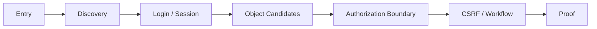

# Experiments

이 페이지는 AASSR의 **실험 protocol, 비교 조건, evidence level, historical diagnostic, current claim boundary**를 정리한다.

> [!IMPORTANT]
> AASSR 저장소에는 여러 세대의 결과가 함께 남아 있다. 이 페이지에서는 숫자를 반드시 다음 중 하나로 분류한다.
>
> ```text
> benchmark validation
> mechanism diagnostic
> historical root-cause diagnostic
> current-generation reduced validation
> multi-seed benchmark
> final blinded evaluation
> ```
>
> 서로 다른 세대의 숫자를 한 표에 섞어 “성능 추세”처럼 해석하지 않는다.

전체 연구 질문과 가설: [Research Questions](Research-Questions)  
RQ별 변수·지표·claim 상태: [Evidence Matrix](Evidence-Matrix)

---

## 목차

1. [실험 철학](#1-실험-철학)
2. [보상과 관측 계약](#2-보상과-관측-계약)
3. [Benchmark validation](#3-benchmark-validation)
4. [RQ1 — Autonomous first success](#4-rq1--autonomous-first-success)
5. [RQ2 — Raw vs Relational](#5-rq2--raw-vs-relational)
6. [RQ3 — ASEQ self-loop](#6-rq3--aseq-self-loop)
7. [RQ4/RQ5 — Prophecy & Calibration](#7-rq4rq5--prophecy--calibration)
8. [RQ6 — Critic local support](#8-rq6--critic-local-support)
9. [RQ7 — Imagination same-checkpoint](#9-rq7--imagination-same-checkpoint)
10. [RQ8 — Five-condition final suite](#10-rq8--five-condition-final-suite)
11. [RQ9 — Skill](#11-rq9--skill)
12. [통계와 보고 형식](#12-통계와-보고-형식)
13. [최종 claim gate](#13-최종-claim-gate)

---

# 1. 실험 철학

AASSR은 여러 메커니즘이 결합된 시스템이다.

```text
Relational Representation
+ ASEQ
+ Policy
+ Knowledge
+ Prophecy
+ Calibration
+ Critic
+ Local Support
+ Imagination
+ Skills
```

따라서 Full AASSR 하나만 돌려 baseline과 비교하면 **왜 차이가 났는지 알 수 없다.**

연구 설계는 다음 순서로 효과를 분리한다.

```text
dqn_raw
  ↓ representation effect
dqn_relational
  ↓ AASSR stack beyond representation
aassr_current_no_imagination
  ↓ Imagination marginal effect
aassr_current_full
```

그리고 외부 model-based family comparison:

```text
dreamerv3_relational
↔
aassr_current_full
```

관련 개념: [Ablation](Ablation-Benchmarking-and-Reproducibility), [Confounder](Ablation-Benchmarking-and-Reproducibility), [Same-checkpoint evaluation](Causality-Leakage-and-Evaluation)

---

# 2. 보상과 관측 계약

## 2.1 External reward

현재 pentest 계열 task reward:

```text
proof success       +1
true failure        -1
stall                0
rate-limit trunc.    0
transition-cap       0
ordinary transition  0
```

다음은 task reward로 사용하지 않는다.

- guided progress score
- oracle route proximity
- hidden target proximity
- intermediate proof hint
- 사람이 만든 성공 action sequence

즉 [sparse reward](Sparse-Reward-and-Credit-Assignment) 자체를 유지한다.

## 2.2 Internal information signal

[Policy](Policy)의 information residual은 external reward와 별도다.

```text
external task reward
!=
internal information-value signal
```

따라서 information residual을 “중간 reward shaping”으로 보고 success reward에 더한 값으로 해석하면 안 된다.

## 2.3 Observation boundary

Learner는 [response-causal](Causality-Leakage-and-Evaluation) public information만 사용한다.

허용 예:

- 실제 response에서 관측한 latest HTTP-like status
- 발견된 route/profile/object relation
- 현재 legal action surface
- response에서 획득한 session/CSRF fact

금지 예:

- hidden target identity
- exact hidden audit pressure
- exact hidden session countdown
- future outcome
- hidden curriculum label을 learner state로 직접 주입

---

# 3. Benchmark validation

AASSR은 실제 외부 시스템을 공격하지 않고 **safe in-process HTTP decision lab**을 사용한다.



환경은 다음과 같은 public interaction structure를 모사한다.

- `200/302/400/401/403/404/409/429`
- redirect
- session
- CSRF
- object authorization
- workflow prerequisites
- audit / lockout
- rate limit
- session expiration
- decoy routes
- seed마다 바뀌는 opaque identifiers

실제 network socket, shell, external target은 사용하지 않는다.

## 3.1 난도 validation

40 evaluation seeds에서 benchmark validation baseline:

| Tier | Oracle | Random | Browse-first | Response-guided | Abstract Q |
|---|---:|---:|---:|---:|---:|
| Easy | 100.0% | 0.0% | 0.3% | **100.0%** | 0.0% |
| Medium | 100.0% | 0.0% | 0.0% | **30.0%** | 0.0% |
| Hard | 100.0% | 0.0% | 0.0% | **20.0%** | 0.0% |

이 결과의 의미:

```text
Oracle 100%
→ task가 구조적으로 불가능하지 않음

Random ~0%
→ 무작위 행동만으로 쉽게 풀리지 않음

Response-guided degradation
→ 난도 차이가 존재
```

이 결과는 **AASSR 우위 evidence가 아니다.** Benchmark가 agent comparison에 사용할 수 있는지 검증한 것이다.

---

# 4. RQ1 — Autonomous first success

질문:

> guided trajectory와 shaping reward 없이 real success experience가 발생하는가?

관련: [Research Questions — RQ1](Research-Questions#rq1--희소-보상만으로-최초-성공을-발견할-수-있는가)

## 관측해야 할 값

- first proof transition index
- total training proofs
- curriculum promotion / demotion
- frontier exposure
- stalled episodes

## 중요한 fairness rule

Curriculum은 difficulty exposure를 조절할 수 있지만 **정답 action을 주면 안 된다.**

```text
허용
Easy → Medium → Hard exposure

금지
“이 상태에서는 login을 눌러라”
“이 object가 정답이다”
```

## 현재 evidence 해석

과거 autonomous pilot과 focused training에서 human-written success sequence 없이 proof가 발생한 사례가 있다.

이것은:

> “autonomous proof discovery가 가능하다”

라는 좁은 evidence다.

이것만으로:

> “AASSR이 baseline보다 sample-efficient하다”

를 말할 수는 없다.

---

# 5. RQ2 — Raw vs Relational

질문:

> [Relational Representation](Relational-Representation-and-Generalization)이 concrete ID 중심 representation보다 unseen transfer를 개선하는가?

## 핵심 control

```text
dqn_raw
vs
dqn_relational
```

가능한 한 representation 외 요소를 고정한다.

| 고정 | 변경 |
|---|---|
| reward | representation |
| transition budget | representation |
| DQN training protocol | representation |
| eval seeds | representation |
| curriculum exposure | representation |

## Primary metrics

- unseen success
- tier별 success
- milestone reach
- stalled rate
- mean requests

## Secondary diagnostics

- state/action collision rate
- representation alias frequency
- rename permutation consistency

> [!NOTE]
> Current [State Representation v3](State-Representation)은 latest public HTTP status를 보존한다. 따라서 과거 relational v2와 current v3 결과를 같은 representation condition으로 취급하면 안 된다.

---

# 6. RQ3 — ASEQ self-loop

질문:

> semantic `S → A → S` evidence를 사용하면 stalled behavior를 줄일 수 있는가?

## 6.1 No-retraining diagnostic

과거 L1 unseen에서 3 checkpoints × 8 seeds:

```text
raw greedy stalled       24 / 24
exact ASEQ stalled        0 / 24
```

성공:

| checkpoint | raw greedy | exact ASEQ |
|---|---:|---:|
| L2 first reached | 0/8 | 2/8 |
| L2 pre-demotion | 0/8 | 7/8 |
| post-demotion retrained | 0/8 | 5/8 |

이 결과는 **ASEQ guard의 mechanism diagnostic**이다.

## 6.2 Consistent retraining diagnostic

학습과 평가 모두 exact ASEQ rule을 사용한 focused run:

| training mode | training successes | L0 | L1 | L2 |
|---|---:|---:|---:|---:|
| legacy filter | 29 | 15 | 14 | 0 |
| exact ASEQ | **50** | **30** | **19** | **1** |

Unseen evaluation:

| trained with | L0 | L1 | L2 |
|---|---:|---:|---:|
| legacy filter | 1/8 | 1/8 | 0/8 |
| exact ASEQ | **8/8** | **7/8** | **1/8** |

제한:

- research seed 1개
- unseen seed 8개
- focused L0~L2 experiment
- current Full final benchmark가 아님

따라서 이 숫자를 current AASSR leaderboard에 넣지 않는다.

---

# 7. RQ4/RQ5 — Prophecy & Calibration

Current [Prophecy](Prophecy) contract:

```text
relational-conditional-mixture-ensemble-v5-status-balanced
```

Current [Calibration](Calibration) contract:

```text
semantic-probability-holdout-calibration-v3-status-aware
```

두 모듈은 하나의 metric으로 평가하면 안 된다.

## 7.1 Prophecy prediction metrics

### State structure
- semantic descriptor error / similarity
- top-k outcome semantic quality

### Action surface
- legal-mask accuracy
- legal-slot precision / recall

### Terminal
- active / success / failure / truncation class accuracy
- rare terminal recall

### Public status
- categorical status accuracy
- status confusion matrix
- rare `403/404/429` recall

### Multimodality
- mixture component usage
- outcome mass normalization
- multiple empirical outcome preservation

## 7.2 Calibration metrics

Prediction quality와 reliability quality는 다르다.

필요한 diagnostic:

```text
reliability bucket
→ actual holdout prediction quality
```

예:

| Reliability bucket | Observed quality |
|---|---:|
| 0.9–1.0 | ? |
| 0.8–0.9 | ? |
| 0.7–0.8 | ? |
| ... | ... |

가능하면 expected calibration error류의 summary뿐 아니라 **decision-critical channel별 reliability**를 같이 본다.

## 7.3 왜 이게 필요해졌나?

2026-08-11 diagnostic에서 전체 semantic quality는 높게 보였지만 planner intervention은 많은 `403/404/429` 오류를 만들었다.

전체 root cause는 별도 보관한다.

→ [Historical Imagination Diagnostic — 2026-08-11](Historical-Imagination-Diagnostic-2026-08-11)

---

# 8. RQ6 — Critic local support

[Critic](Critic)은 real sparse return을 학습한다.

하지만 다음은 다르다.

```text
Critic has trained globally
!=
current state/action is supported by real training data
```

## 핵심 ablation

가능한 비교:

```text
same checkpoint
same planner
same Prophecy

A: local support gate OFF
B: local support gate ON
```

단, gate OFF가 위험한 unsupported action을 허용할 수 있으므로 diagnostic environment와 failure accounting을 엄격히 유지한다.

## Primary mechanism metrics

- support pass rate
- support reject rate
- unsupported high-value candidate count
- intervention error rate
- successful intervention rate
- planner activity after gate

## Fail-closed의 두 실패 모드

### 너무 느슨함

```text
OOD value extrapolation
→ planner exploit
```

### 너무 엄격함

```text
모든 root unsupported
→ intervention 0
→ planner inert
```

따라서 **안전성과 planner usability를 동시에 측정**한다.

---

# 9. RQ7 — Imagination same-checkpoint

가장 중요한 causal experiment 중 하나다.

## 9.1 Rule

```text
one AASSR training run
        ↓
frozen checkpoint
     /             \
OFF                   ON
Policy-only       Imagination
```

OFF와 ON을 따로 재학습하면 hard comparison failure다.

## 9.2 왜 training-time Imagination을 끄는가?

현재 primary marginal-effect comparison에서 training-time planner가 replay distribution까지 바꾸면:

```text
planner effect
+ training trajectory effect
+ replay effect
```

가 섞인다.

그래서 current manifest는:

```text
training_imagination = disabled-same-checkpoint
```

계약을 둔다.

## 9.3 Planner metrics

### Opportunity
- plan count
- root count
- structural root count

### Gate
- unreliable suppressions
- unsupported suppressions
- insufficient-advantage suppressions

### Intervention
- switch candidates
- final interventions
- changed actions
- direct success-producing interventions
- bad-status interventions

### Final task
- success
- true failure
- stalled
- truncation
- milestone reach

### Runtime
- wall time
- world-model calls
- Critic calls
- dedup ratio

## 9.4 Historical 2026-08-11 result

과거 diagnostic:

```text
no-Imagination 4/20
Full           4/20
interventions  86
bad-status     58/86
```

이 숫자는 current v5/status-aware/local-support architecture의 final result가 아니다.

상세: [Historical Imagination Diagnostic — 2026-08-11](Historical-Imagination-Diagnostic-2026-08-11)

---

# 10. RQ8 — Five-condition final suite

최종 current-generation comparison row:

| Condition | Representation | Model-based component | 역할 |
|---|---|---|---|
| `dqn_raw` | raw current | none | corrected model-free baseline |
| `dqn_relational` | relational current | none | representation ablation |
| `dreamerv3_relational` | relational current | official DreamerV3 | external model-based baseline |
| `aassr_current_no_imagination` | relational current | AASSR models, planner OFF | non-Imagination AASSR stack |
| `aassr_current_full` | relational current | AASSR planner ON | Imagination marginal effect |

## 10.1 AASSR OFF/ON checkpoint 수

AASSR는 checkpoint 하나다.

```text
Raw DQN checkpoint
Relational DQN checkpoint
DreamerV3 checkpoint
AASSR checkpoint
```

그 AASSR checkpoint를 OFF/ON 두 평가 mode로 사용한다.

## 10.2 Fair sample budget

과학적 sample budget은 **real primitive environment action**으로 센다.

Imagined rollout step은 environment sample로 세지 않는다.

다만 compute cost는 별도 runtime metric으로 반드시 보고한다.

## 10.3 DreamerV3 fairness boundary

DreamerV3 baseline은 upstream 알고리즘을 AASSR에 유리하도록 개조하는 것이 아니라, pinned official implementation을 current observation/action interface에 adapter로 연결하는 방향을 사용한다.

최종 result에는 반드시:

- upstream pin
- preset
- JAX platform
- train ratio
- dtype
- adapter contract

를 기록한다.

---

# 11. RQ9 — Skill

[Skill](Skills)은 primary five-condition suite와 별도 mechanism experiment로 보는 편이 해석이 쉽다.

질문:

> repeated successful real ASeq를 relational template로 승격하면 unseen seed에서 primitive-only보다 재사용 효율이 좋아지는가?

## 비교 후보

```text
primitive-only
vs
concrete macro
vs
relational Skill
```

## 지표

- Skill promotion count
- promotion precision
- concrete rebinding success
- unavailable primitive rate
- Skill completion success
- transitions saved
- stochastic rollout branch survival
- primitive exploration suppression

Skill이 잘 작동해도 그것이 곧 “창의성”은 아니다.

관련: [Hierarchical RL & Skills](Hierarchical-RL-and-Skills)

---

# 12. 통계와 보고 형식

최종 performance table은 평균 성공률 하나로 끝내지 않는다.

## 12.1 최소 보고 단위

```text
research seed
×
tier / evaluation pool
×
condition
```

각 cell에서:

- success count / denominator
- true failure
- stalled
- truncation
- mean/median requests
- runtime

을 보존한다.

## 12.2 Aggregate

가능하면:

- mean across research seeds
- standard deviation
- seed-level raw values
- binomial success uncertainty 또는 적절한 confidence interval

을 함께 보고한다.

작은 `n`에서 소수점 둘째 자리까지 정밀한 차이를 과해석하지 않는다.

## 12.3 Mechanism metric과 final metric 분리

```text
Prophecy accuracy
Critic support pass
Planner intervention
```

은 **mechanism metric**이다.

```text
proof success
true failure
```

은 **task metric**이다.

Mechanism metric이 좋아졌다고 final success가 자동으로 좋아진 것은 아니다.

---

# 13. 최종 claim gate

다음 표현은 evidence level을 충족하기 전까지 사용하지 않는다.

```text
“AASSR이 DQN보다 우수하다.”
“AASSR이 DreamerV3보다 우수하다.”
“Imagination이 성능을 향상시킨다.”
“Relational representation이 일반화를 유의미하게 개선한다.”
```

각 문장을 사용하려면 대응되는 RQ의 current-generation controlled evidence가 있어야 한다.

Claim 상태는 [Evidence Matrix](Evidence-Matrix)와 [Current Status](Current-Status)에 기록한다.

---

## 결과 분류 예시

```text
24/24 stall → 0/24
= ASEQ mechanism diagnostic

2026-08-11 4/20 vs 4/20, 86 interventions
= historical Imagination root-cause diagnostic

current Prophecy v5 manifest
= architecture contract

future five-condition multi-seed aggregate
= current performance evidence

final unseen blind set
= final claim evidence
```

---

## 다음으로 읽기

- [Research Questions](Research-Questions)
- [Evidence Matrix](Evidence-Matrix)
- [Current Status](Current-Status)
- [Historical Imagination Diagnostic — 2026-08-11](Historical-Imagination-Diagnostic-2026-08-11)
- [Reproduction](Reproduction)
