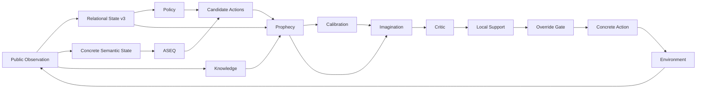

# AASSR Wiki

> **AASSR (An Agent for Solving Sparse Reward problem)**는 [희소 보상(sparse reward)](Sparse-Reward-and-Credit-Assignment), [부분 관측(partial observability)](MDP-and-POMDP), 큰 동적 행동 공간에서 **실제 경험을 구조화하고, [world model](Model-Based-RL-and-World-Models)로 미래를 예측한 뒤, [counterfactual planning](Counterfactual-Planning-and-Search)으로 여러 가능성을 비교하는 [강화학습](Reinforcement-Learning) 연구 시스템**이다.

> [!IMPORTANT]
> 이 위키는 `main`의 **current-generation runtime**을 기준으로 작성한다. 과거 AASSR v0.4, 초기 Prophecy/Imagination, effect-composition 계열은 연구 역사와 재현을 위해 남아 있지만 현행 구조와 섞어서 설명하지 않는다.

---

# 이 위키는 어떻게 읽는가?

이 위키는 단순한 코드 설명서가 아니라 **AASSR을 중심으로 관련 강화학습 개념까지 연결하는 작은 백과사전**을 목표로 한다.

본문에서 중요한 전문용어가 처음 등장할 때 가능한 한 해당 개념 페이지로 링크한다.

예를 들어:

```text
AASSR
 ↓
Prophecy
 ↓
World Model
 ↓
Model-Based RL
 ↓
MDP / POMDP
 ↓
Markov Property
```

또는:

```text
Imagination
 ↓
Counterfactual Planning
 ↓
Chance Node / Decision Node
 ↓
Expected Value / Bellman Equation
 ↓
Probability / Uncertainty
```

처럼 **모르는 단어를 눌러 계속 더 기초적인 개념으로 내려갈 수 있다.**

전체 지식 지도는 **[Concept Index / 개념 지도](Concept-Index)** 에 있다.

각 AASSR 주제는 다음 깊이로 연결한다.

```text
왜 이 문제가 필요한가?
        ↓
관련 일반 개념은 무엇인가?
        ↓
연구 질문은 무엇인가?
        ↓
어떤 설계로 답하려 하는가?
        ↓
수학 / 알고리즘은 무엇인가?
        ↓
실제 코드는 어떻게 구현되는가?
        ↓
어떤 실험이 그 주장을 검증하는가?
        ↓
어떤 failure mode가 있는가?
        ↓
무엇이 아직 미검증인가?
```

---

# 개념 사전부터 읽고 싶다면

AASSR을 처음 접하면서 강화학습 용어까지 함께 보고 싶다면 다음 순서를 권장한다.

1. **[Reinforcement Learning](Reinforcement-Learning)** — agent, environment, state, action, reward, return, policy, value
2. **[MDP and POMDP](MDP-and-POMDP)** — Markov property, state와 observation, partial observability
3. **[Sparse Reward & Credit Assignment](Sparse-Reward-and-Credit-Assignment)** — delayed reward, long horizon, reward shaping
4. **[Exploration & Exploitation](Exploration-and-Exploitation)** — epsilon-greedy, information gain, intrinsic motivation
5. **[Value Functions & Bellman Equation](Value-Functions-and-Bellman-Equation)** — `V`, `Q`, return, Bellman backup, bootstrapping
6. **[Q-Learning, DQN & TD](Q-Learning-DQN-and-TD)** — AASSR Policy의 model-free 기반
7. **[Model-Based RL & World Models](Model-Based-RL-and-World-Models)** — Prophecy와 Imagination의 일반적 배경
8. **[Stochasticity, Uncertainty & Probability](Stochasticity-Uncertainty-and-Probability)** — probability, uncertainty, reliability, value, support의 차이
9. **[Counterfactual Planning & Search](Counterfactual-Planning-and-Search)** — rollout, horizon, branching, beam, pruning
10. **[Ablation, Benchmarking & Reproducibility](Ablation-Benchmarking-and-Reproducibility)** — 왜 실험을 여러 control로 쪼개는가?

전체 목록은 **[Concept Index](Concept-Index)** 를 참고한다.

---

# 30초 요약



핵심 흐름:

1. [**Public observation**](MDP-and-POMDP)처럼 실제로 관측 가능한 정보만 본다.
2. [**Relational State v3**](State-Representation)로 이름이 바뀐 환경에서도 구조를 알아보면서 latest public HTTP status를 보존한다. 이 설계의 일반적 배경은 [relational representation과 invariance](Relational-Representation-and-Generalization)다.
3. [**ASEQ**](ASEQ)로 실제 `(S,A,S')` 경험과 [self-loop](ASEQ)를 다룬다.
4. [**Policy**](Policy)가 [DQN/TD](Q-Learning-DQN-and-TD) 기반 sparse-return 행동 가치를 이용해 기본 행동을 선택한다.
5. [**Knowledge**](Knowledge)가 현재 episode에서 실제 response로 알아낸 사실의 causal context와 provenance를 보존한다. 미래 정보를 과거 prediction에 넣지 않는 [anti-hindsight boundary](Causality-Leakage-and-Evaluation)가 중요하다.
6. [**Prophecy**](Prophecy)가 행동 후 가능한 미래의 [확률 분포](Stochasticity-Uncertainty-and-Probability)를 예측한다. 일반적으로는 [world model](Model-Based-RL-and-World-Models)에 해당한다.
7. [**Calibration**](Calibration)이 [holdout](Mixture-Ensemble-and-Calibration)을 이용해 그 prediction을 믿어도 되는지 확인한다. [outcome probability와 reliability](Stochasticity-Uncertainty-and-Probability)는 다른 값이다.
8. [**Imagination**](Imagination)이 [counterfactual planning](Counterfactual-Planning-and-Search)을 수행하며 [chance node와 decision node](Chance-and-Decision-Nodes)를 구분한다.
9. [**Critic**](Critic)이 [discounted sparse return](Value-Functions-and-Bellman-Equation) 관점에서 미래 가치를 평가한다. sequence 표현에는 [GRU](GRU-and-Sequence-Models)를 사용한다.
10. [**Local Critic support**](Critic-Support-and-OOD)가 [OOD extrapolation](Critic-Support-and-OOD)을 막는다.
11. 반복 성공한 구조는 [**Skill**](Skills)의 relational template로 재사용될 수 있다. 일반적 배경은 [Hierarchical RL](Hierarchical-RL-and-Skills)이다.
12. prediction reliability, Critic support, value advantage가 충분할 때만 Policy 행동을 실제로 override한다.

여기서 특히 다음 다섯 값은 같은 뜻이 아니다.

```text
Outcome probability
Prediction reliability
Critic value
Local support
Policy/Planner advantage
```

자세한 구분: **[Stochasticity, Uncertainty & Probability](Stochasticity-Uncertainty-and-Probability)**

---

# 연구부터 읽기

AASSR을 연구 프로젝트로 이해하려면 다음 순서를 권장한다.

1. **[Sparse Reward Problem](Sparse-Reward-Problem)**  
   AASSR이 정확히 어떤 문제를 풀려고 하는가? 일반 배경은 [Sparse Reward & Credit Assignment](Sparse-Reward-and-Credit-Assignment)에서 본다.

2. **[Research Questions](Research-Questions)**  
   핵심 질문을 어떤 하위 가설로 나눴는가?

3. **[Research Architecture](Research-Architecture)**  
   각 연구 질문이 실제 current-generation 설계로 어떻게 연결되는가?

4. **[Design Rationale](Design-Rationale)**  
   왜 relational representation, mixture model, calibration, chance expectation, local support 같은 선택을 했는가?

5. **[Experiments](Experiments)**  
   어떤 [baseline/control/ablation](Ablation-Benchmarking-and-Reproducibility)으로 각 효과를 분리하는가?

6. **[Current Status](Current-Status)**  
   지금까지 무엇이 확인됐고 무엇이 아직 주장 불가능한가?

---

# 기술적으로 깊게 읽기

각 메커니즘은 별도 deep-dive와 일반 개념 페이지를 함께 연결한다.

| AASSR 주제 | 핵심 질문 | 관련 일반 개념 |
|---|---|---|
| **[State Representation](State-Representation)** | public observation만으로 transfer 가능한 Relational State v3를 어떻게 구성하는가? | [POMDP](MDP-and-POMDP), [Relational Generalization](Relational-Representation-and-Generalization) |
| **[ASEQ](ASEQ)** | 실제 `(S,A,S')` 중 어떤 반복만 막아야 하는가? | [Trajectory](Reinforcement-Learning), [Exploration](Exploration-and-Exploitation) |
| **[Policy](Policy)** | sparse reward와 information value를 섞지 않고 행동을 어떻게 평가하는가? | [DQN/TD](Q-Learning-DQN-and-TD), [Bellman](Value-Functions-and-Bellman-Equation) |
| **[Knowledge](Knowledge)** | 무엇을 언제 알았으며 hindsight leak을 어떻게 막는가? | [POMDP memory](MDP-and-POMDP), [Causality/Leakage](Causality-Leakage-and-Evaluation) |
| **[Prophecy](Prophecy)** | stochastic multimodal future를 어떻게 예측하는가? | [World Model](Model-Based-RL-and-World-Models), [Mixture Model](Mixture-Ensemble-and-Calibration) |
| **[Calibration](Calibration)** | outcome probability와 model reliability를 어떻게 분리하는가? | [Uncertainty](Stochasticity-Uncertainty-and-Probability), [Holdout Calibration](Mixture-Ensemble-and-Calibration) |
| **[Critic](Critic)** | imagined future의 sparse return과 local support를 어떻게 평가하는가? | [GRU](GRU-and-Sequence-Models), [OOD/Support](Critic-Support-and-OOD) |
| **[Imagination](Imagination)** | chance expectation과 agent decision max를 어떻게 연결하는가? | [Planning](Counterfactual-Planning-and-Search), [Chance vs Decision](Chance-and-Decision-Nodes) |
| **[Skills](Skills)** | 성공 ASeq를 concrete ID 암기 없이 어떻게 재사용하는가? | [Hierarchical RL](Hierarchical-RL-and-Skills), [Transfer](Relational-Representation-and-Generalization) |
| **[Core Architecture](Core-Architecture)** | 이 모든 것이 실제 current runtime에서 어떻게 연결되는가? | [Concept Index](Concept-Index) |

실행과 재현은 **[Reproduction](Reproduction)**, 짧은 용어 정의는 **[Glossary](Glossary)**, 긴 설명은 **[Concept Index](Concept-Index)** 에서 본다.

---

# 핵심 연구 질문

AASSR의 가장 큰 질문은 다음과 같다.

> **중간 보상이 거의 없는 환경에서 에이전트가 정답 경로나 중간 목표를 사람이 주입하지 않아도 경험 구조와 미래 예측을 이용해 스스로 장기 행동 과정을 만들 수 있는가?**

이 질문에는 여러 일반 RL 문제가 겹쳐 있다.

```text
[Sparse reward / credit assignment]
        ↓
[Exploration difficulty]
        ↓
[Partial observability]
        ↓
[Representation / transfer]
        ↓
[World-model uncertainty]
        ↓
[Long-horizon planning]
        ↓
[OOD value extrapolation]
        ↓
[Fair evaluation / ablation]
```

이를 현재 실험 가능한 질문으로 나누면:

```text
희소 보상만으로 최초 성공을 발견할 수 있는가?
        ↓
관계 표현이 unseen transfer를 개선하는가?
        ↓
ASEQ가 진전 없는 반복을 줄이는가?
        ↓
Prophecy가 usable future distribution을 학습하는가?
        ↓
Calibration이 잘못된 예측을 걸러내는가?
        ↓
Critic이 실제 sparse return으로 미래 가치를 구분하는가?
        ↓
Imagination이 같은 Policy보다 더 좋은 행동을 만들 수 있는가?
        ↓
성공 구조를 Skill로 transfer할 수 있는가?
        ↓
AASSR 전체가 강한 baseline보다 나은가?
```

연구 질문별 자세한 분해: **[Research Questions](Research-Questions)**

---

# 현재 source of truth

현재 실행 세대 이름:

```text
aassr-current-generation-v2
```

단일 source of truth:

```text
src/aassr_v2/current_manifest.py
```

현재 주요 component:

| Layer | Current contract | 개념 설명 |
|---|---|---|
| Observation | relational public state v3 + latest HTTP status | [State vs Observation](MDP-and-POMDP) |
| ASEQ | semantic self-loop empirical v3 | [ASEQ](ASEQ) |
| Policy | relational-invariant DQN + information residual | [DQN/TD](Q-Learning-DQN-and-TD), [Exploration](Exploration-and-Exploitation) |
| Prophecy | relational conditional-mixture ensemble v5, status-balanced | [World Model](Model-Based-RL-and-World-Models), [Mixture/Ensemble](Mixture-Ensemble-and-Calibration) |
| Calibration | semantic probability holdout calibration v3, status-aware | [Calibration](Mixture-Ensemble-and-Calibration) |
| Knowledge | episode-local response knowledge context | [Causality/Leakage](Causality-Leakage-and-Evaluation) |
| Imagination | structural compute dedup + probability chance / decision tree | [Planning](Counterfactual-Planning-and-Search) |
| Critic | relational GRU discounted sparse-return | [GRU](GRU-and-Sequence-Models), [Value](Value-Functions-and-Bellman-Equation) |
| Critic support | local real-training support, fail-closed | [OOD/Support](Critic-Support-and-OOD) |
| Skill | relational ASEQ template | [Hierarchical RL](Hierarchical-RL-and-Skills) |
| Training Imagination | disabled for same-checkpoint comparison | [Fair Evaluation](Causality-Leakage-and-Evaluation) |

---

# 현재 실험 구조

최종 current-generation comparison의 기본 축은 다음과 같다.

```text
dqn_raw
   |
   | representation effect
   v
dqn_relational
   |
   | AASSR stack beyond representation
   v
aassr_current_no_imagination
   |
   | Imagination marginal effect
   v
aassr_current_full
```

이 구조는 [ablation study와 confounder control](Ablation-Benchmarking-and-Reproducibility)을 위해 존재한다.

추가 [model-based RL](Model-Based-RL-and-World-Models) baseline으로 official pinned DreamerV3 relational adapter를 비교한다.

AASSR의 OFF/ON 비교는 반드시 **하나의 frozen checkpoint**에서 수행한다.

```text
one training run
      |
      v
frozen checkpoint
   /          \
OFF eval    ON eval
```

왜 이렇게 해야 하는지는 **[Same-checkpoint comparison](Ablation-Benchmarking-and-Reproducibility)** 과 **[Causality, Leakage & Fair Evaluation](Causality-Leakage-and-Evaluation)** 에서 설명한다.

---

# 현재 연구 상태를 읽을 때 주의할 점

AASSR에는 여러 세대의 실험 결과가 존재한다.

따라서 다음을 구분해야 한다.

```text
과거 mechanism evidence
current code validation
reduced diagnostic
multi-seed benchmark
final performance benchmark
```

[Regression test](Ablation-Benchmarking-and-Reproducibility)가 통과했다는 것, 작은 diagnostic에서 failure mechanism을 찾았다는 것, 최종 benchmark에서 성능이 좋아졌다는 것은 전부 다른 수준의 주장이다.

과거 실험에서 ASEQ가 self-loop를 줄였다는 evidence가 있어도 그것이 곧 current Full AASSR의 최종 성공률은 아니다.

마찬가지로 current code에 repair가 들어갔다고 해서 새 장기 실험에서 성능 향상이 검증된 것도 아니다.

이 경계는 **[Experiments](Experiments)**, **[Current Status](Current-Status)**, **[Ablation, Benchmarking & Reproducibility](Ablation-Benchmarking-and-Reproducibility)** 에서 명시한다.

---

# 연구 역사

AASSR은 여러 실패와 구조 변경을 거쳐 현재 세대로 왔다.

과거 구현과 실험 흐름은 **[Development History](Development-History)** 에서 따로 관리한다.

과거 코드는 [reproducibility](Ablation-Benchmarking-and-Reproducibility)를 위해 저장소에 남아 있지만 current runtime의 구성 요소로 자동 해석하면 안 된다.

---

# 빠른 경로

**강화학습부터 처음 보는 사람**  
[Reinforcement Learning](Reinforcement-Learning) → [MDP and POMDP](MDP-and-POMDP) → [Sparse Reward & Credit Assignment](Sparse-Reward-and-Credit-Assignment) → [AASSR in 5 Minutes](AASSR-in-5-Minutes)

**AASSR만 빠르게 보고 싶은 사람**  
[AASSR in 5 Minutes](AASSR-in-5-Minutes) → [Research Questions](Research-Questions) → [Research Architecture](Research-Architecture)

**왜 이렇게 설계했는지 보고 싶은 사람**  
[Sparse Reward Problem](Sparse-Reward-Problem) → [Design Rationale](Design-Rationale) → [Concept Index](Concept-Index)

**Prophecy/Imagination 수학까지 보고 싶은 사람**  
[Model-Based RL](Model-Based-RL-and-World-Models) → [Stochasticity & Uncertainty](Stochasticity-Uncertainty-and-Probability) → [Mixture/Calibration](Mixture-Ensemble-and-Calibration) → [Counterfactual Planning](Counterfactual-Planning-and-Search) → [Chance vs Decision](Chance-and-Decision-Nodes) → [Prophecy](Prophecy) → [Imagination](Imagination)

**Policy/Critic의 RL 기반을 보고 싶은 사람**  
[Value & Bellman](Value-Functions-and-Bellman-Equation) → [Q-Learning/DQN/TD](Q-Learning-DQN-and-TD) → [Replay & Boundaries](Replay-Buffer-and-Episode-Boundaries) → [GRU](GRU-and-Sequence-Models) → [Policy](Policy) → [Critic](Critic)

**연구 결과를 검증하고 싶은 사람**  
[Ablation & Benchmarking](Ablation-Benchmarking-and-Reproducibility) → [Causality & Leakage](Causality-Leakage-and-Evaluation) → [Experiments](Experiments) → [Current Status](Current-Status)

**구현을 검증하고 싶은 사람**  
[State Representation](State-Representation) → [Core Architecture](Core-Architecture) → [Policy](Policy) → [Prophecy](Prophecy) → [Calibration](Calibration) → [Critic](Critic) → [Imagination](Imagination)

**기억/재사용 계층을 보고 싶은 사람**  
[ASEQ](ASEQ) → [Knowledge](Knowledge) → [Hierarchical RL](Hierarchical-RL-and-Skills) → [Skills](Skills)

---

**전체 개념 지도:** [Concept Index](Concept-Index)  
**Current source of truth:** `src/aassr_v2/current_manifest.py`
