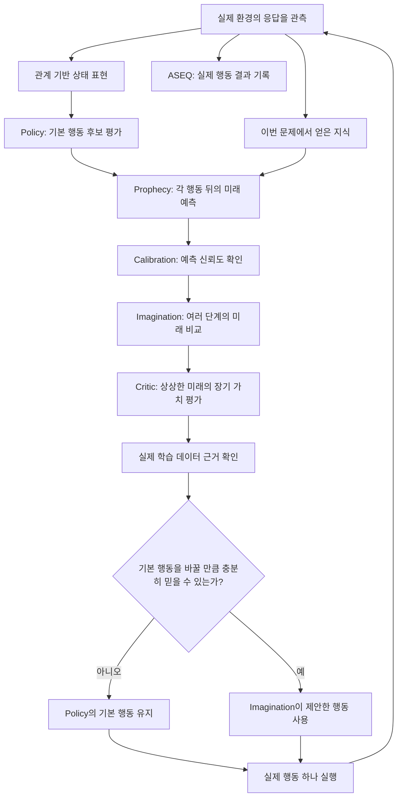

# AASSR 위키

> **이 위키는 강화학습 전공자를 위한 요약 노트가 아니다.**  
> AASSR을 처음 보는 학생, 아마추어 개발자, 개인 연구자가 **용어를 미리 알고 있지 않아도** 연구의 문제·구조·실험을 따라갈 수 있도록 만든 연구 백과사전이다.

처음 왔다면 바로 아래의 **[처음 읽는 사람을 위한 안내서](Beginner-Guide)**부터 읽는 것을 권한다.

---

# AASSR이 무엇인가?

AASSR은 **중간 힌트가 거의 없는 문제에서 인공지능이 스스로 여러 단계의 해결 과정을 찾아낼 수 있는가**를 연구하는 강화학습 시스템이다.

AASSR이라는 이름은 `An Agent for Solving Sparse Reward problem`에서 왔다.

여기서 **[희소 보상(sparse reward)](Sparse-Reward-and-Credit-Assignment)**은 성공에 도달하기 전까지 점수가 거의 주어지지 않는 문제를 뜻한다.

예를 들어:

```text
정보를 확인함          → 0점
새 경로를 발견함       → 0점
로그인을 시도함        → 0점
필요한 대상을 찾음     → 0점
최종 목표 달성         → +1점
실제로 문제 해결이 불가능해짐 → -1점
```

중간 행동 대부분이 `0점`이기 때문에 에이전트는 단순히 “점수가 오른 행동을 반복”하는 방식으로는 배우기 어렵다.

더 자세한 설명: **[희소 보상 문제](Sparse-Reward-Problem)**

---

# 이 연구의 가장 큰 질문

> **최종 목표 외에는 정답 힌트를 거의 주지 않았을 때, 에이전트가 실제 경험과 미래 예측을 이용해 스스로 장기적인 행동 과정을 만들어낼 수 있는가?**

이 질문은 너무 크기 때문에 실제 연구에서는 여러 작은 질문으로 나눈다.

```text
1. 사람의 정답 경로 없이 최초 성공을 발견할 수 있는가?
                 ↓
2. 이름이 다른 새 문제에서도 관계 구조를 재사용할 수 있는가?
                 ↓
3. 아무 진전이 없는 행동 반복을 경험으로 줄일 수 있는가?
                 ↓
4. 행동 뒤에 가능한 여러 미래를 제대로 예측할 수 있는가?
                 ↓
5. 그 예측을 어느 상황에서 믿어도 되는지 판단할 수 있는가?
                 ↓
6. 상상한 미래의 가치가 실제 경험으로 뒷받침되는지 확인할 수 있는가?
                 ↓
7. 미래를 상상하는 기능이 실제 행동을 더 좋게 만드는가?
                 ↓
8. 최종적으로 다른 강화학습 방법보다 성능이 좋은가?
```

정확한 가설과 검증 방법은 **[연구 질문](Research-Questions)**과 **[연구 질문-증거 연결표](Evidence-Matrix)**에서 볼 수 있다.

---

# 처음 보는 사람은 어디서 읽어야 하나?

## 1단계 — 강화학습도 낯설다

**[처음 읽는 사람을 위한 AASSR 안내서](Beginner-Guide)**

여기서는 다음을 처음부터 설명한다.

- 에이전트가 무엇인지
- 상태·관측·행동·보상이 무엇인지
- 희소 보상이 왜 어려운지
- AASSR의 각 구성요소가 왜 필요한지
- `Policy`, `Prophecy`, `Critic`, `Imagination`이 서로 어떻게 다른지

## 2단계 — 영어 단어에서 자꾸 막힌다

**[한국어 중심 용어 안내서](Terminology-Guide)**

영어 전문용어를 다음 순서로 설명한다.

```text
한국어 뜻
→ 영어 원어
→ 쉬운 설명
→ AASSR에서의 역할
→ 더 깊은 문서 링크
```

예를 들어 `OOD`만 던지는 대신:

> **[학습 분포 밖(OOD, Out-of-Distribution)](Critic-Support-and-OOD)** — 모델이 학습할 때 충분히 보지 못한 종류의 상태나 행동 영역

처럼 읽을 수 있게 한다.

## 3단계 — AASSR 전체 흐름을 빨리 알고 싶다

**[AASSR 5분 설명](AASSR-in-5-Minutes)**

## 4단계 — 현재 연구가 어디까지 진행됐는지 알고 싶다

**[현재 연구 상태](Current-Status)**

## 5단계 — 논문처럼 실험 근거를 따라가고 싶다

**[연구 질문](Research-Questions)** → **[연구 질문-증거 연결표](Evidence-Matrix)** → **[실험 설계와 결과](Experiments)**

---

# AASSR 전체 구조를 아주 쉽게 보면

AASSR은 하나의 거대한 신경망이 아니다.

문제 해결에 필요한 서로 다른 역할을 여러 구성요소로 나눈 시스템이다.

| 구성요소 | 쉬운 설명 | 해결하려는 질문 |
|---|---|---|
| [상태 표현](State-Representation) | 관측한 상황을 학습하기 좋은 형태로 정리 | “지금 상황을 어떻게 표현할까?” |
| [ASEQ](ASEQ) | 실제로 한 행동과 그 결과를 기억 | “아까 이 행동은 제자리 반복이었나?” |
| [Policy](Policy) | 지금 당장 가장 좋아 보이는 기본 행동을 선택 | “현재 정보만 보면 무엇을 할까?” |
| [Knowledge](Knowledge) | 이번 문제에서 실제 응답을 통해 알아낸 사실을 기억 | “지금까지 무엇을 알게 됐나?” |
| [Prophecy](Prophecy) | 행동 뒤에 생길 수 있는 미래를 예측 | “이 행동을 하면 어떤 일들이 가능할까?” |
| [Calibration](Calibration) | 미래 예측을 믿을 수 있는지 검사 | “내 예측이 이 상황에서도 정확한 편인가?” |
| [Imagination](Imagination) | 여러 행동의 미래를 실제 실행 전에 가상으로 비교 | “A와 B 중 어느 쪽 미래가 더 나을까?” |
| [Critic](Critic) | 상상한 미래가 최종 목표에 좋은지 평가 | “그 미래는 실제 성공에 얼마나 좋은가?” |
| [가치 평가 데이터 근거](Critic-Support-and-OOD) | 그 가치 평가를 뒷받침할 실제 학습 경험이 있는지 확인 | “그 숫자를 믿을 근거가 있나?” |
| [Skills](Skills) | 반복 성공한 행동 구조를 새 문제에서 재사용 | “전에 통했던 절차를 비슷한 문제에 다시 쓸 수 있나?” |

---

# 한 번의 행동은 어떻게 결정되나?

아래 그림은 현재 AASSR의 실제 의사결정 흐름을 단순화한 것이다.



중요한 점은 **상상 속에서 많은 미래를 계산해도 현실에서는 한 번에 행동 하나만 실행한다**는 것이다.

실제 결과를 받은 뒤 다시 관측하고, 다시 판단한다.

---

# 왜 이렇게 복잡하게 나눴나?

초보자가 AASSR을 볼 때 가장 먼저 드는 의문 중 하나다.

“그냥 큰 신경망 하나가 전부 결정하면 안 되나?”

가능은 하지만, AASSR이 연구하려는 문제에서는 서로 다른 종류의 오류를 구분해야 한다.

예를 들어:

```text
미래를 잘못 예측했다
```

와

```text
미래는 맞게 예측했지만 그 미래의 가치를 잘못 평가했다
```

는 전혀 다른 실패다.

또:

```text
가치 예측은 높게 나왔지만
그 상태를 실제 학습에서 거의 본 적이 없다
```

는 또 다른 문제다.

그래서 AASSR은 다음을 일부러 분리한다.

```text
미래 예측
≠ 예측을 믿을 수 있는 정도
≠ 미래의 장기 가치
≠ 그 가치 판단을 뒷받침하는 실제 데이터 근거
```

이 구분이 [Prophecy](Prophecy), [Calibration](Calibration), [Critic](Critic), [가치 평가 데이터 근거](Critic-Support-and-OOD)를 따로 두는 이유다.

---

# 가장 자주 헷갈리는 개념

## 보상 ≠ 누적 보상 ≠ Q값

**[보상(reward)](Sparse-Reward-and-Credit-Assignment)**은 환경이 지금 주는 점수다.

**[누적 보상(return)](Value-Functions-and-Bellman-Equation)**은 앞으로 받을 보상을 합친 장기 점수다.

**[Q값(Q-value)](Value-Functions-and-Bellman-Equation)**은 현재 상태에서 특정 행동을 했을 때 기대되는 장기 가치를 학습 모델이 추정한 값이다.

자세히: [가치 함수와 Bellman 식](Value-Functions-and-Bellman-Equation)

## 상태 ≠ 관측 ≠ 표현

**환경 상태([상태(state)](State-Representation))**는 실제 세계의 전체 상황이다.

**[관측(observation)](MDP-and-POMDP)**은 그중 에이전트가 실제로 볼 수 있는 정보다.

**[표현(representation)](Relational-Representation-and-Generalization)**은 관측을 신경망이 쓰기 좋은 숫자·구조로 바꾼 것이다.

자세히: [상태 표현](State-Representation)

## 결과 확률 ≠ 예측 신뢰도

“이 행동 뒤에 접근 거부가 20% 확률로 생긴다”는 것은 **결과 확률**이다.

“그 20%라는 예측 자체가 얼마나 믿을 만한가”는 **예측 신뢰도**다.

자세히: [Calibration](Calibration)

## 혼합 분포 ≠ 앙상블

**혼합 분포(mixture)**는 환경에서 실제로 여러 결과가 나올 수 있다는 뜻이다.

```text
70% 정상
20% 접근 거부
10% 요청 제한
```

**앙상블(ensemble)**은 여러 학습 모델을 같이 사용한다는 뜻이다.

자세히: [혼합·앙상블·보정](Mixture-Ensemble-and-Calibration)

## 실제 경험 ≠ 상상한 경험

환경에서 실제로 관측한 상태 전이는 학습의 사실 근거가 될 수 있다.

세계 모델이 만들어낸 가상 미래는 계획에는 사용할 수 있지만 **실제로 일어난 사실처럼 자동 취급하지 않는다.**

자세히: [인과성·정보 누출·공정 평가](Causality-Leakage-and-Evaluation)

## 에피소드 종료 ≠ 실제 실패 ≠ 외부 제한 종료

에피소드가 끝났다는 사실만으로 `-1` 실패라고 보면 안 된다.

예를 들어 실험의 행동 수 제한 때문에 강제로 끊긴 경우는 **[외부 제한 종료(truncation)](Replay-Buffer-and-Episode-Boundaries)**이지 문제 자체의 실패가 아닐 수 있다.

자세히: [경험 저장소와 에피소드 경계](Replay-Buffer-and-Episode-Boundaries)

---

# AASSR의 현재 세대는 무엇인가?

현재 실제 실행 구조의 최종 기준은 다음 파일이다.

```text
src/aassr_v2/current_manifest.py
```

현재 세대의 내부 이름은:

```text
aassr-current-generation-v2
```

이다.

이 문자열은 사람이 외워야 하는 개념이 아니라 **코드 버전을 정확하게 구분하기 위한 식별자**다.

현재 구조의 상세 구성은 **[현재 연구 상태](Current-Status)**에서 한국어 설명과 함께 볼 수 있다.

---

# 현재까지 증명된 것과 아직 남은 것은 다르다

AASSR 위키에서는 다음 두 문장을 절대 같은 뜻으로 사용하지 않는다.

```text
기능이 코드에 구현되어 있다
```

```text
그 기능이 최종 성능을 실제로 높인다는 것이 증명됐다
```

예를 들어 [Imagination(가상 미래 탐색)](Imagination)이 현재 코드에 존재하더라도, 이것만으로 “[Imagination](Imagination) 덕분에 AASSR의 성공률이 증가했다”고 말할 수는 없다.

증거 수준을 대략 다음처럼 구분한다.

```text
1단계  구조가 구현됨
2단계  단위·회귀 테스트에서 구조가 의도대로 작동
3단계  좁은 진단 실험에서 특정 메커니즘 효과 확인
4단계  작은 규모의 현재 버전 실제 환경 실험
5단계  여러 난수 시드로 비교 실험
6단계  모든 방법과 설정을 고정한 뒤 최종 비공개 평가
```

현재 어느 단계까지 왔는지는 **[현재 연구 상태](Current-Status)**에서 본다.

---

# 현재 결과를 읽을 때 주의할 점

2026년 8월 11일에는 이전 [Imagination](Imagination) 구조가 좋지 않은 행동을 자주 선택하는 문제가 발견됐다.

그 실험은 매우 중요하지만 **현재 버전의 성능 결과가 아니라 과거 실패 원인을 찾은 진단 실험**이다.

자세히: **[2026-08-11 Imagination 실패 진단](Historical-Imagination-Diagnostic-2026-08-11)**

현재 성능을 확인할 때는 과거 숫자를 섞지 말고:

**[현재 연구 상태](Current-Status)** → **[연구 질문-증거 연결표](Evidence-Matrix)**

순서로 확인한다.

---

# 연구를 깊게 읽는 추천 순서

## AASSR 자체를 이해하고 싶다

```text
처음 읽는 사람 안내서
        ↓
AASSR 5분 설명
        ↓
상태 표현
        ↓
ASEQ
        ↓
Policy
        ↓
Knowledge
        ↓
Prophecy
        ↓
Calibration
        ↓
Critic
        ↓
Imagination
        ↓
Skills
```

## 강화학습 이론까지 같이 공부하고 싶다

```text
강화학습
↓
MDP와 POMDP
↓
희소 보상과 보상 책임 배분
↓
Q-learning·DQN·TD
↓
세계 모델
↓
확률과 불확실성
↓
반사실적 계획
```

시작점: **[개념 지도](Concept-Index)**

## 연구가 정말 증명됐는지를 따지고 싶다

```text
연구 질문
↓
연구 질문-증거 연결표
↓
실험 설계
↓
현재 연구 상태
↓
재현 방법
```

---

# 빠른 링크

- **[처음 읽는 사람을 위한 안내서](Beginner-Guide)**
- **[AASSR 5분 설명](AASSR-in-5-Minutes)**
- **[한국어 중심 용어 안내서](Terminology-Guide)**
- [개념 지도](Concept-Index)
- [연구 질문](Research-Questions)
- **[연구 질문-증거 연결표](Evidence-Matrix)**
- **[현재 연구 상태](Current-Status)**
- [실험 설계와 결과](Experiments)
- [실험 재현 방법](Reproduction)
