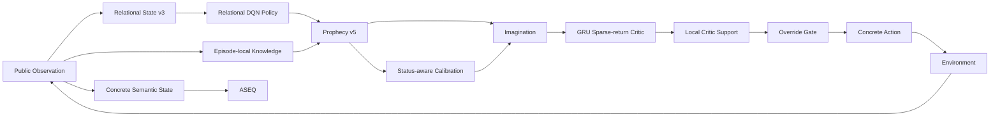

# AASSR 위키

> **AASSR (An [에이전트(Agent)](Reinforcement-Learning) for Solving [희소 보상(Sparse Reward)](Sparse-Reward-and-Credit-Assignment) problem)**는 [희소 보상](Sparse-Reward-and-Credit-Assignment), [부분 관측](MDP-and-POMDP), 큰 동적 행동 공간에서 **실제 경험을 구조화하고, 확률적 [world model](Model-Based-RL-and-World-Models)로 미래를 예측한 뒤, 신뢰 가능한 범위에서 [counterfactual planning](Counterfactual-Planning-and-Search)으로 행동을 비교하는 강화학습 연구 시스템**이다.

> [!IMPORTANT]
> 이 위키의 **현재 구조([현재 구조(current architecture)](Current-Status))** 는 항상 `main`의 `src/aassr_v2/current_manifest.py`를 [최종 기준(source of truth)](Current-Status)로 삼는다. 과거 실험은 [Development History](Development-History) 또는 별도 historical diagnostic 페이지에 남기고 current 성능처럼 섞지 않는다.

---

# 어디서 시작하면 될까?

## AASSR이 뭔지만 빨리 보고 싶다

**[AASSR in 5 Minutes](AASSR-in-5-Minutes)**

```text
Sparse Reward
→ Relational State
→ ASEQ
→ Policy
→ Prophecy
→ Calibration
→ Imagination
→ Critic Support
→ Action
```

## 이 연구가 정확히 뭘 증명하려는지 보고 싶다

**[Research Questions](Research-Questions)** → **[Evidence Matrix](Evidence-Matrix)** → **[Experiments](Experiments)**

```text
연구 질문
→ H1 / H0
→ 독립변수
→ 통제변수
→ metric
→ 현재 evidence
→ 주장 가능한 범위
```

## 지금 실제 모델이 어떤 버전인지 알고 싶다

**[Current Status](Current-Status)**

## 강화학습부터 잘 모르겠다

**[Concept Index](Concept-Index)** → [Reinforcement Learning](Reinforcement-Learning) → [MDP/POMDP](MDP-and-POMDP) → [Sparse Reward](Sparse-Reward-and-Credit-Assignment)

## 예전에 왜 Imagination이 이상한 행동을 했는지 궁금하다

**[Historical Imagination Diagnostic — 2026-08-11](Historical-Imagination-Diagnostic-2026-08-11)**

---

# 30초 구조



현재 핵심 contract:

| 영역 | Current 의미 |
|---|---|
| [State](State-Representation) | response-causal relational public state v3 + latest status |
| [ASEQ](ASEQ) | real semantic `(S,A,S')`, exact [제자리 반복(self-loop)](ASEQ) evidence |
| [Policy](Policy) | relational [DQN(딥 Q-네트워크)](Q-Learning-DQN-and-TD) + separate [정보 가치 잔차(information residual)](Policy) |
| [Knowledge](Knowledge) | episode-local real-response facts + provenance |
| [Prophecy](Prophecy) | [조건부 혼합(conditional-mixture)](Prophecy) ensemble v5, [상태 코드 데이터 불균형을 보정한(status-balanced)](Prophecy) stochastic [세계 모델(world model)](Model-Based-RL-and-World-Models) |
| [Calibration](Calibration) | probability-aware [상태 코드까지 고려하는(status-aware)](Calibration) [검증용 분리 데이터(holdout)](Calibration) reliability |
| [Critic](Critic) | relational [GRU(게이트 순환 유닛)](GRU-and-Sequence-Models) discounted external sparse-[누적 보상(return)](Value-Functions-and-Bellman-Equation) estimator |
| [Critic Support](Critic-Support-and-OOD) | local real-training support, fail closed |
| [Imagination](Imagination) | chance expectation / decision max [반사실적 계획(counterfactual planning)](Counterfactual-Planning-and-Search) |
| [Skills](Skills) | successful real ASeq → relational reusable template |

---

# 가장 중요한 연구 질문

AASSR의 큰 질문:

> **최종 목표 이외의 보상 힌트가 거의 없는 환경에서 [에이전트(agent)](Reinforcement-Learning)가 실제 경험과 예측을 이용해 스스로 장기 행동 과정을 만들어낼 수 있는가?**

현재 이 질문을 다음처럼 분해한다.

```text
RQ1  사람의 정답 경로 없이 최초 성공을 발견하는가?
  ↓
RQ2  relational representation이 unseen transfer를 돕는가?
  ↓
RQ3  ASEQ가 진전 없는 self-loop를 줄이는가?
  ↓
RQ4  Prophecy가 usable stochastic future를 학습하는가?
  ↓
RQ5  Calibration이 prediction reliability를 구분하는가?
  ↓
RQ6  Local support가 OOD Critic 과신을 막는가?
  ↓
RQ7  Imagination이 same checkpoint Policy보다 더 좋은 root를 만드는가?
  ↓
RQ8  Full AASSR이 strong baseline보다 나은가?

RQ9  성공 구조를 Skill로 unseen scenario에 재사용할 수 있는가?

Long-term
Creativity: 사람이 주지 않은 새로운 유효 경로가 나타나는가?
```

각 질문의 정확한 가설과 evidence는 **[Evidence Matrix](Evidence-Matrix)** 에 있다.

---

# 이 위키가 일부러 구분하는 것들

AASSR을 읽을 때 다음을 한 종류의 “점수”처럼 생각하면 거의 반드시 헷갈린다.

```text
Reward
≠ Return
≠ Q-value
≠ Information residual
≠ Outcome probability
≠ Prediction reliability
≠ Critic value
≠ Local support
≠ Planner advantage
```

또한:

```text
State
≠ Observation
≠ Representation
```

```text
Mixture
≠ Ensemble
```

```text
Prophecy reliability
≠ Critic support
```

```text
Chance node
= environment outcome → expectation

Decision node
= agent action → max
```

```text
Real transition
≠ Imagined transition
```

```text
Terminal
≠ True failure
≠ Truncation
≠ TD bootstrap boundary
```

짧은 정의: **[Glossary](Glossary)**  
긴 설명: **[Concept Index](Concept-Index)**

---

# 연구를 읽는 추천 순서

```text
Sparse Reward Problem
        ↓
Research Questions
        ↓
Evidence Matrix
        ↓
Research Architecture
        ↓
각 Core Mechanism
        ↓
Experiments
        ↓
Current Status
        ↓
Reproduction
```

- [Sparse Reward Problem](Sparse-Reward-Problem) — 왜 이 문제가 어려운가?
- [Research Questions](Research-Questions) — 무엇을 증명하려는가?
- [Evidence Matrix](Evidence-Matrix) — 각 질문을 어떻게 반증/검증하는가?
- [Research Architecture](Research-Architecture) — 질문이 설계로 어떻게 내려가는가?
- [Experiments](Experiments) — 어떤 비교와 지표를 쓰는가?
- [Current Status](Current-Status) — 지금 어디까지 evidence가 있는가?
- [Reproduction](Reproduction) — 같은 run을 어떻게 다시 만드는가?

---

# 기술적으로 깊게 읽는 추천 순서

## Policy / value 쪽

[Value Functions & Bellman](Value-Functions-and-Bellman-Equation) → [Q-Learning/DQN/TD](Q-Learning-DQN-and-TD) → [Replay & Boundaries](Replay-Buffer-and-Episode-Boundaries) → [Policy](Policy)

## Prophecy / world model 쪽

[MDP/POMDP](MDP-and-POMDP) → [Model-Based RL](Model-Based-RL-and-World-Models) → [Uncertainty](Stochasticity-Uncertainty-and-Probability) → [Mixture/Ensemble/Calibration](Mixture-Ensemble-and-Calibration) → [Prophecy](Prophecy)

## Imagination / planning 쪽

[Counterfactual Planning](Counterfactual-Planning-and-Search) → [Chance vs Decision](Chance-and-Decision-Nodes) → [Critic/OOD Support](Critic-Support-and-OOD) → [Imagination](Imagination)

## Transfer / Skill 쪽

[Relational Representation](Relational-Representation-and-Generalization) → [State Representation](State-Representation) → [ASEQ](ASEQ) → [Hierarchical RL & Skills](Hierarchical-RL-and-Skills) → [Skills](Skills)

---

# Current와 Historical을 어떻게 구분하는가?

## Current

현재 `main` manifest/code가 실제로 사용하는 architecture.

## Historical

과거 architecture/[체크포인트(checkpoint)](Reproduction)에서 얻은 mechanism 또는 failure evidence.

대표 historical negative result:

**[2026-08-11 Imagination diagnostic](Historical-Imagination-Diagnostic-2026-08-11)**

당시:

```text
4/20 vs 4/20
86 interventions
58/86 bad-status errors
```

가 관측됐지만, 이것을 current v5/상태 코드까지 고려하는/local-support architecture의 성능으로 인용하면 안 된다.

---

# 현재 성능 주장은 어디서 보나?

숫자가 필요하면 무조건 **[Current Status](Current-Status)** 와 **[Evidence Matrix](Evidence-Matrix)** 를 먼저 본다.

이 위키에서는:

```text
코드가 구현됨
```

과

```text
최종 benchmark에서 우수함
```

을 같은 주장으로 취급하지 않는다.

현재 `AASSR > DQN`, `AASSR > DreamerV3`, `Imagination improves success` 같은 강한 문장은 해당 current-generation controlled evidence가 완성된 뒤에만 사용한다.

---

# Source of truth

```text
Current runtime contract
→ src/aassr_v2/current_manifest.py

Current wiki source
→ wiki/*.md

Actual GitHub Wiki
→ main의 wiki/*.md가 자동 동기화
```

---

## 빠른 링크

**[AASSR in 5 Minutes](AASSR-in-5-Minutes)** · **[Concept Index](Concept-Index)** · **[Research Questions](Research-Questions)** · **[Evidence Matrix](Evidence-Matrix)** · **[Experiments](Experiments)** · **[Current Status](Current-Status)** · **[Reproduction](Reproduction)**
