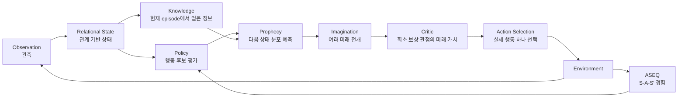

# AASSR Wiki

> **AASSR (Adaptive Autonomous State–Sequence Reasoning)**는 보상이 드물고, 가능한 행동이 많으며, 환경을 완전히 관찰할 수 없는 상황에서 **경험을 구조화하고, 미래를 예측하고, 여러 행동 결과를 상상한 뒤 실제 행동을 선택하는 강화학습 연구 시스템**이다.

> [!IMPORTANT]
> 이 위키는 **현재 연구 코드(current-generation)** 를 기준으로 작성한다. 과거 AASSR v0.4 및 초기 AASSR v2 구현은 재현을 위해 저장소에 남아 있지만, 현재 실행 경로와 섞어서 설명하지 않는다.

## 30초 요약

일반적인 강화학습 에이전트는 현재 상태에서 바로 행동 가치를 학습한다. AASSR은 여기에 다음 구조를 더한다.



핵심 아이디어는 간단하다.

1. **ASEQ**로 실제 경험 `(S, A, S')`를 기억한다.
2. **Policy**가 현재 가능한 행동들을 평가한다.
3. **Prophecy**가 행동을 했을 때 가능한 다음 상태들을 확률적으로 예측한다.
4. **Imagination**이 그 예측을 여러 단계 이어 붙여 여러 미래를 만든다.
5. **Critic**이 각 미래가 최종 `+1 / 0 / -1` 희소 보상 관점에서 얼마나 좋은지 평가한다.
6. 실제 환경에서는 가장 좋은 미래로 이어지는 **첫 행동 하나만 실행**하고 다시 관측한다.

## 왜 필요한가?

AASSR이 겨냥하는 문제는 단순한 `state -> action` 분류가 아니다.

```text
행동      행동      행동      행동      행동      성공
 0   ->    0   ->    0   ->    0   ->    0   ->   +1
```

중간 보상이 거의 없으면 에이전트는 다음을 알아내기 어렵다.

- 어떤 정보가 나중에 중요했는가?
- 같은 행동을 반복하고 있지만 실제 상태가 바뀌고 있는가?
- 지금 당장 Q값이 높은 행동보다 몇 단계 뒤 더 좋은 행동이 있는가?
- 이름만 바뀐 새로운 환경에서도 같은 구조를 알아볼 수 있는가?
- 실패가 비가역적일 때 실제로 시도하기 전에 위험을 추정할 수 있는가?

AASSR은 이 문제를 **경험 기억 + 관계 기반 표현 + world model + imagination + sparse-return critic**의 조합으로 다룬다.

## 현재 연구 상태

현재 실행 세대는 코드에서 `aassr-current-generation-v2`로 정의된다.

| 구성요소 | 현재 상태 | 한 줄 설명 |
|---|---|---|
| Observation | 🟢 Active | `response_causal_observation_v3` |
| Relational representation | 🟢 Active | seed마다 이름이 바뀌어도 구조가 같으면 같은 표현 |
| ASEQ | 🟢 Active | 실제로 반복 관측된 `S -> A -> S` self-loop만 보수적으로 억제 |
| Policy | 🟢 Active | relational DQN + information-value residual |
| Knowledge | 🟢 Active | episode-local response knowledge |
| Prophecy | 🟡 Experimental | 상태·legal action mask·terminal class·HTTP status를 확률적으로 예측 |
| Critic | 🟡 Experimental | 실제 희소 return `{-1,0,+1}`을 학습하는 GRU critic |
| Imagination | 🟡 Experimental | chance expectation + decision max 기반 다단계 planner |
| Skill | 🟡 Experimental | 반복 성공한 relational ASeq template 재사용 |
| DreamerV3 baseline | 🟡 Experimental | official pinned implementation과 비교 준비 중 |
| Final blind benchmark | ⚪ Not run | 방법론 동결 뒤 별도 수행 예정 |

### 가장 최근 2k 검증에서 확인된 것

2026-08-11 seed 7, **2,048 real transitions**로 학습한 단일 AASSR checkpoint를 고정한 뒤 Imagination OFF/ON을 비교했다.

| 조건 | 전체 성공 | L0 | L1 | L2 | L3 | L4 | true failure |
|---|---:|---:|---:|---:|---:|---:|---:|
| no-Imagination | 4/20 | 4/4 | 0/4 | 0/4 | 0/4 | 0/4 | 0 |
| Full Imagination | 4/20 | 4/4 | 0/4 | 0/4 | 0/4 | 0/4 | 2 |

중요한 점은 **Imagination이 더 이상 완전히 inert하지 않다는 것**이다. 같은 run에서 297개의 plan이 만들어졌고 86번 실제 Policy 행동을 바꿨다. 하지만 86회 개입 중 58회가 `403/404/429` 오류로 이어졌으며 직접 성공을 만든 intervention은 0회였다.

따라서 현재 결론은 **“Imagination이 작동한다”와 “Imagination이 성능을 높인다”를 분리해야 한다**는 것이다.

이 2k run 이후 코드에는 다음 수리가 들어갔다.

- public latest HTTP status를 relational state에 보존
- status-aware Prophecy/calibration
- 학습 분포 밖에서 Critic override를 막는 local support gate
- 동일 relational root의 concrete alias를 한 번만 계산하는 structural root deduplication

이 수리들의 **새로운 장기 성능 검증은 아직 별도 결과로 확정하지 않는다.**

## 추천 읽기 순서

처음 보는 경우:

1. **[AASSR in 5 Minutes](AASSR-in-5-Minutes)** — 수식 없이 전체 아이디어
2. **[Core Architecture](Core-Architecture)** — 실제 current-generation 구조
3. **[ASEQ](ASEQ)** — 반복 self-loop를 어떻게 다루는지
4. **[Experiments](Experiments)** — 환경, baseline, ablation, 결과
5. **[Current Status](Current-Status)** — 지금 무엇이 검증됐고 무엇이 남았는지

코드를 실행하려면 **[Reproduction](Reproduction)** 을 참고한다.

용어가 헷갈리면 **[Glossary](Glossary)** 를 참고한다.

## 위키 상태 표기

이 위키에서는 모든 큰 기능을 다음처럼 구분한다.

- 🟢 **Active / Stable enough for current runtime** — 현재 실행 경로에서 실제 사용 중
- 🟡 **Experimental** — 코드에는 들어가 있지만 성능 주장 또는 최종 설계가 아직 검증 중
- ⚪ **Historical / Pending** — 과거 재현용이거나 아직 실행 전

이 표기는 “코드가 존재하는가?”와 “연구적으로 성능이 입증됐는가?”를 분리하기 위한 것이다.

---

**Current source of truth:** `src/aassr_v2/current_manifest.py`  
**Current research branch at 작성 시점:** `agent/imagination-gate-ablation`
