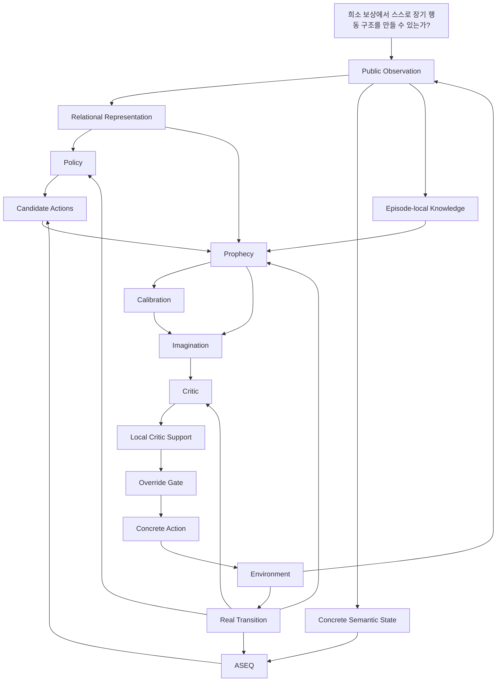

# 연구 구조 (Research Architecture)

이 페이지는 AASSR을 **연구 질문에서 실제 [현재 세대(current-generation)](Current-Status) 구현까지 한 흐름으로 연결해서** 설명한다.

단순한 소프트웨어 모듈 목록이 아니라,

```text
왜 필요한가?
  ↓
어떤 연구 가설인가?
  ↓
어떤 표현과 알고리즘을 쓰는가?
  ↓
실제 코드에서는 무엇이 동작하는가?
  ↓
어떤 실험으로 검증하는가?
```

순서로 내려간다.

> [!**중요**]
> 현재 실행 경로의 [최종 기준(source of truth)](Current-Status)는 `src/aassr_v2/current_manifest.py`다. 과거 v0.4, old effect-composition, 초기 [Imagination(가상 미래 탐색)](Imagination)/[Prophecy(미래 예측 모델)](Prophecy) 실험은 재현용으로 남아 있지만 [현재 실행 구조(current runtime)](Current-Status) 설명과 섞지 않는다.

---

# 1. 전체 연구 흐름



핵심 원칙은 다음 한 문장으로 요약된다.

> **상상은 계획에 사용하지만, 학습의 사실 근거는 실제 [상태 전이(transition)](MDP-and-POMDP)이다.**

---

# 2. Observation: 무엇을 볼 수 있는가?

## 연구 질문

> **에이전트에게 정답을 숨긴 채 실제로 관측 가능한 정보만으로 장기 문제를 풀게 할 수 있는가?**

현재 [관측(observation)](MDP-and-POMDP) [명세(contract)](Current-Status)는 `response-causal relational public state v3 + latest HTTP status`다.

에이전트가 사용할 수 있는 것은 [공개된(public)](State-Representation) 관측이다.

예:

- 실제 [응답(response)](State-Representation)에서 확인한 사실
- 발견된 route/profile/object 관계
- [현재 허용된(legal)](Terminology-Guide) [행동(action)](Reinforcement-Learning) [현재 선택 가능한 영역(surface)](Terminology-Guide)
- [한 번의 접속 세션(session)](Terminology-Guide) / CSRF 존재 여부
- self-counted [사용량(usage)](Terminology-Guide)
- self-observed [진행도(progress)](Terminology-Guide)
- [가장 최근의(latest)](Current-Status) 공개된 HTTP [상태 코드(status)](Terminology-Guide)

반대로 [숨겨진(hidden)](MDP-and-POMDP) [환경 시뮬레이터(simulator)](MDP-and-POMDP) [상태(state)](State-Representation)는 직접 주지 않는다.

예:

- 숨겨진 [난이도 조절 학습(curriculum)](Curriculum-Learning) [난이도 단계(level)](Curriculum-Learning)
- 숨겨진 workflow [탐색 깊이(depth)](Counterfactual-Planning-and-Search)
- [정확히 동일한(exact)](ASEQ) 숨겨진 접속 세션 [남은 횟수 카운트다운(countdown)](Causality-Leakage-and-Evaluation)
- 숨겨진 [공정성과 구현을 점검하는 감사(audit)](Causality-Leakage-and-Evaluation) [환경 내부의 숨은 압박 값(pressure)](Causality-Leakage-and-Evaluation)
- 정답 route/profile/object [식별 방식(identity)](State-Representation)
- [미래(future)](Counterfactual-Planning-and-Search) 상태

이 경계가 중요한 이유는 [세계 모델(world model)](Model-Based-RL-and-World-Models)이 예측해야 할 정보를 관측에 몰래 넣으면 연구 질문이 무너지기 때문이다.

---

# 3. 두 종류의 identity

AASSR에서는 "같은 상태"라는 말이 한 가지 의미가 아니다.

## 3.1 Concrete semantic identity

사용처:

- [ASEQ(실제 상태-행동-다음 상태 기록)](ASEQ)
- [현재 에피소드 안에서만 유지되는(episode-local)](Knowledge) 정확히 동일한 [반복(repetition)](ASEQ)
- cycle detection

예:

```text
route-12 != route-31
```

실제 [한 번의 문제 풀이 구간(episode)](Terminology-Guide)에서는 서로 다른 대상이므로 구분해야 한다.

## 3.2 Relational transfer identity

사용처:

- [Policy(정책 모델)](Policy)
- [Prophecy](Prophecy)
- [Critic(미래 가치 평가기)](Critic)
- [Skill(성공 절차 재사용)](Skills)
- [관계 기반(Relational)](Relational-Representation-and-Generalization) [DQN(딥 Q-네트워크)](Q-Learning-DQN-and-TD) [비교 기준(baseline)](Ablation-Benchmarking-and-Reproducibility)
- [DreamerV3(외부 세계 모델 강화학습 비교군)](Experiments) [서로 다른 입력·행동 형식을 연결하는 변환기(adapter)](Experiments)

여기서는 [실제 개체를 구분하는(concrete)](State-Representation) 이름보다 역할과 관계를 본다.

```text
route-12 = catalog-like role
route-31 = catalog-like role

=> same relational structure
```

## 왜 둘을 분리하는가?

둘 중 하나만 쓰면 문제가 생긴다.

[실제 개체를 구분하는(Concrete)](State-Representation)만 쓰면:

```text
새 seed에서 이름 변경
-> 전부 새로운 상태처럼 보임
-> transfer 약화
```

관계 기반만 쓰면:

```text
같은 역할의 서로 다른 concrete object
-> 같은 대상으로 잘못 취급
-> self-loop / 실행 identity 오류
```

그래서 AASSR은 **실행과 반복 판정에는 실제 개체를 구분하는 [의미 기준(semantic)](State-Representation) 식별 방식**, **학습과 [전이(transfer)](Relational-Representation-and-Generalization)에는 [관계 기반(relational)](Relational-Representation-and-Generalization) 식별 방식**를 쓴다.

---

# 4. ASEQ: 실제 경험의 최소 단위

[ASEQ](ASEQ)는 다음 상태 전이이다.

```text
(S, A, S')
```

초기 AASSR 문서에서는 [ASEQ](ASEQ)가 비교적 넓은 기억 구조로 해석되기도 했지만, 현재 세대에서는 역할이 더 명확하다.

핵심 [제자리 반복(self-loop)](ASEQ) [규칙(rule)](Terminology-Guide):

```text
S -> A -> S
```

이 패턴이 실제로 반복 관측되면 해당 행동을 보수적으로 억제한다.

반면

```text
S -> A -> S'
S' != S
```

처럼 상태가 실제로 변하면 같은 행동의 반복도 허용한다.

즉 "반복 행동 자체가 나쁘다"가 아니라 **진전 없는 동일 상태 전이 반복**만 막는다.

자세한 내용: **[ASEQ](ASEQ)**

---

# 5. Policy: 지금 무엇을 할 것인가?

## 연구 질문

> **현재 공개된 관계 기반 상태에서 어떤 행동이 장기적으로 유리한지 [환경 예측 모델 없이 직접 학습하는(model-free)](Reinforcement-Learning)하게 학습할 수 있는가?**

현재 [Policy](Policy)는 relational-invariant [DQN](Q-Learning-DQN-and-TD) + [정보 가치 잔차(information residual)](Policy)이다.

개념적으로:

```text
Q_total(S,A)
  = Q_task(S,A)
  + information_residual(S,A)
```

중요한 점은 정보 가치 잔차이 외부 [보상(reward)](Sparse-Reward-and-Credit-Assignment) [인위적인 형태 조정(shaping)](Sparse-Reward-and-Credit-Assignment)은 아니라는 것이다.

외부 [희소 보상(sparse reward)](Sparse-Reward-and-Credit-Assignment) 명세는 그대로 유지한다.

```text
success       +1
true failure  -1
otherwise      0
```

[Policy](Policy)의 역할은 **[Imagination](Imagination)이 없어도 행동을 선택할 수 있는 기본 actor**가 되는 것이다.

그래서 `aassr_current_no_imagination` [실험 조건(condition)](Ablation-Benchmarking-and-Reproducibility)이 가능하다.

---

# 6. Knowledge: 지금까지 무엇을 알아냈는가?

현재 [Knowledge(에피소드 지식)](Knowledge)는 현재 에피소드 안에서만 유지되는 응답 [문맥 정보(context)](GRU-and-Sequence-Models)다.

## 가장 중요한 시간 방향

```text
행동 전에 이미 알고 있던 Knowledge
            ↓
        prediction
            ↓
        real action
            ↓
        real response
            ↓
      new Knowledge
```

방금 행동의 결과에서 얻은 정보를 다시 그 행동 전 예측에 사용하면 [결과를 본 뒤 얻은 사후 정보(hindsight)](Causality-Leakage-and-Evaluation) [정보 누출(leak)](Causality-Leakage-and-Evaluation)이 된다.

그래서 [Knowledge](Knowledge)는 **언제 알게 되었는가**가 중요하다.

이 설계는 단순히 Python dictionary를 쓴다는 구현 세부보다 연구적으로 훨씬 중요하다.

---

# 7. Prophecy: 미래 상태 분포를 예측한다

## 연구 질문

> **현재 상태와 행동으로부터 가능한 다음 공개된 [환경 결과(outcome)](Stochasticity-Uncertainty-and-Probability)들을 학습할 수 있는가?**

현재 [Prophecy](Prophecy)는 `relational conditional-mixture ensemble v5, status-balanced`다.

입력 개념:

```text
relational public state
+
relational action
+
allowed pre-existing Knowledge
```

출력 개념:

```text
possible next relational states
+
HTTP status
+
legal action mask
+
terminal class
+
outcome probability
```

## 왜 하나의 평균 상태를 예측하지 않는가?

Partial observability 때문에 같은 공개된 `(S,A)`에서도 여러 결과가 가능하다.

```text
actual future A
actual future B
        ↓ mean regression
nonexistent average C
```

이 문제를 피하기 위해 [여러 결과의 혼합 분포(mixture)](Mixture-Ensemble-and-Calibration) [확률 또는 데이터 분포(distribution)](Stochasticity-Uncertainty-and-Probability)을 사용한다.

자세한 내용: **[Prophecy](Prophecy)**

---

# 8. Calibration: 예측을 믿어도 되는가?

[Prophecy](Prophecy)가 예측을 낸다고 해서 항상 [계획기(planner)](Counterfactual-Planning-and-Search)에 사용하면 안 된다.

[Calibration(예측 신뢰도 보정)](Calibration)은 다음 질문을 담당한다.

> **이 [세계 모델(world-model)](Model-Based-RL-and-World-Models) [예측(prediction)](Terminology-Guide)은 현재 상태에서 얼마나 신뢰할 수 있는가?**

현재 [예측 신뢰도 보정(calibration)](Calibration)은 의미 기준 + [확률(probability)](Stochasticity-Uncertainty-and-Probability) + 상태 코드 aware [검증용 분리 데이터(holdout)](Calibration) 예측 신뢰도 보정이다.

중요한 구분:

```text
outcome probability
= 환경에서 그 outcome이 나올 확률

prediction reliability
= world model의 그 예측을 믿을 수 있는 정도
```

둘은 같은 값이 아니다.

또 [신뢰도(reliability)](Calibration)는 미래 [가치(value)](Value-Functions-and-Bellman-Equation) [추가 점수(bonus)](Information-Theory-and-Intrinsic-Motivation)가 아니다.

신뢰도가 높다고 좋은 미래라는 뜻은 아니며, 단지 **그 예측을 계획기 계산에 사용할 자격이 있는가**를 판단한다.

---

# 9. Imagination: 행동하기 전에 여러 미래를 계산한다

## 연구 질문

> **세계 모델에서 여러 단계의 [실제로 하지 않은 경우를 가정하는 반사실적(counterfactual)](Counterfactual-Planning-and-Search) 미래를 평가하면 [Policy](Policy)보다 더 좋은 첫 행동을 고를 수 있는가?**

현재 계획기는 두 종류의 [탐색 트리의 한 지점(node)](Chance-and-Decision-Nodes)를 분리한다.

## Chance node

환경 환경 결과은 [에이전트(agent)](Reinforcement-Learning)가 선택할 수 없다.

```text
V_chance = sum_i p_i * V_i
```

## Decision node

다음 행동은 에이전트가 선택한다.

```text
V_decision = max_a V(a)
```

이 차이를 섞으면 [확률적(stochastic)](Stochasticity-Uncertainty-and-Probability) 환경 결과 중 좋은 결과만 골라잡는 비현실적인 optimistic 계획기가 될 수 있다.

자세한 내용: **[Imagination](Imagination)**

---

# 10. Critic: 이 미래의 장기 가치는 얼마인가?

현재 [Critic](Critic)은 관계 기반 [GRU(게이트 순환 유닛)](GRU-and-Sequence-Models) [미래 보상을 시간에 따라 할인한(discounted)](Value-Functions-and-Bellman-Equation) sparse-[누적 보상(return)](Value-Functions-and-Bellman-Equation) [Critic](Critic)이다.

학습 [대상 또는 학습 목표값(target)](Terminology-Guide)의 기반은 실제 외부 누적 보상이다.

```text
success       +1
true failure  -1
truncation     0
```

[Critic](Critic)은 [예측된(predicted)](Terminology-Guide) [갈라진 결과 경로(branch)](Chance-and-Decision-Nodes)의 끝이나 중간 상태를 평가해 계획기가 [미래를 내다보는 범위(horizon)](Counterfactual-Planning-and-Search) 밖의 장기 가치를 추정할 수 있게 한다.

## Zero-memory decision suffix

[Imagination](Imagination)은 [경험 경로(trajectory)](Reinforcement-Learning) 중간의 실제 [의사결정(decision)](Chance-and-Decision-Nodes) 상태에서도 시작될 수 있다.

그래서 [Critic](Critic)도 한 번의 문제 풀이 구간 시작점만 학습하면 안 된다.

```text
S0 -> S1 -> S2 -> S3 -> terminal

training roots:
S0
S1
S2
S3
```

각 [후속 구간(suffix)](GRU-and-Sequence-Models)를 독립적인 의사결정 [탐색의 첫 행동(root)](Imagination)로 학습한다.

---

# 11. Local Critic Support: 지금 이 Critic을 믿어도 되는가?

최근 AASSR에서 매우 중요한 수리 중 하나다.

문제:

```text
Critic이 학습됨
!=
모든 unseen state/action에서 Critic이 정확함
```

그래서 현재는 별도의 [데이터 근거(support)](Critic-Support-and-OOD) [판정 관문(gate)](Terminology-Guide)가 있다.

```text
현재 state/action region
        ↓
실제 Critic training data의 local support 충분?
   /                \
 yes                no
  |                  |
value 비교 허용      fail closed
                     Policy 유지
```

이 데이터 근거는 보상도 아니고 숨겨진 환경 시뮬레이터 정보도 아니다.

실제 [학습 데이터(training data)](Terminology-Guide) [데이터가 어느 영역까지 포함하는지(coverage)](Critic-Support-and-OOD)를 검사하는 안전장치다.

---

# 12. Override Gate: 언제 Policy를 바꾸는가?

[Imagination](Imagination)이 다른 행동을 추천했다고 바로 바꾸지 않는다.

개념적으로 다음 조건들이 필요하다.

```text
Prophecy prediction usable
+
Calibration reliability sufficient
+
Critic locally supported
+
Imagined alternative value sufficiently better
        ↓
Policy action override
```

조건을 통과하지 못하면 기본 [Policy](Policy) 행동을 유지한다.

현재 [실제 행동 개입(intervention)](Imagination) [횟수(count)](Terminology-Guide)는 **실제로 실행된 행동이 [Policy](Policy) 원래 행동과 달라졌을 때만** 증가한다.

---

# 13. Structural compute deduplication

현재 행동 선택 가능 영역에는 이름만 다른 실제 개체를 구분하는 [같은 구조를 가리키는 다른 이름(alias)](State-Representation)가 많을 수 있다.

예:

```text
172 concrete root actions
        ↓ relational grouping
~17 structural roots
```

같은 관계 기반 [구조(structure)](Research-Architecture)라면 비싼 [Prophecy](Prophecy) / [Critic](Critic) 계산은 한 번만 수행한다.

하지만 실행 식별 방식는 유지한다.

```text
planning compute: structural alias 공유
real execution  : concrete action 유지
```

이 구분이 없으면 [Imagination](Imagination) cost가 행동 별칭 수에 따라 폭발한다.

---

# 14. Training / Evaluation boundary

AASSR [현재(current)](Current-Status) [실험 규칙(protocol)](Ablation-Benchmarking-and-Reproducibility)에서 가장 중요한 공정성 규칙 중 하나다.

```text
Training:
Imagination intervention OFF

Evaluation A:
same frozen checkpoint + Imagination OFF

Evaluation B:
same frozen checkpoint + Imagination ON
```

따라서 OFF/ON 차이는 계획기의 [다른 조건이 같을 때의 추가 기여(marginal)](Ablation-Benchmarking-and-Reproducibility) [효과(effect)](Ablation-Benchmarking-and-Reproducibility)로 해석할 수 있다.

평가 사이에 학습이 일어나면 비교가 깨진다.

---

# 15. 실제 current component map

현재 manifest 기준 핵심 stack:

| Layer | [현재(Current)](Current-Status) implementation |
|---|---|
| [관측(Observation)](MDP-and-POMDP) | [실제 응답에서 원인 순서를 지키는(response-causal)](Causality-Leakage-and-Evaluation) 관계 기반 [공개 관측 상태(public state)](State-Representation) v3 + 가장 최근의 HTTP 상태 코드 |
| [ASEQ](ASEQ) | 의미 기준 제자리 반복 [실제 관측 경험에 근거한(empirical)](Ablation-Benchmarking-and-Reproducibility) v3 |
| [Policy](Policy) | relational-invariant [DQN](Q-Learning-DQN-and-TD) + 정보 가치 잔차 |
| [Prophecy](Prophecy) | 관계 기반 [조건부 혼합(conditional-mixture)](Prophecy) [여러 모델을 함께 쓰는 앙상블(ensemble)](Mixture-Ensemble-and-Calibration) v5, [상태 코드 데이터 불균형을 보정한(status-balanced)](Prophecy) |
| [Calibration](Calibration) | 의미 기준 확률 검증용 분리 데이터 예측 신뢰도 보정 v3, [상태 코드까지 고려하는(status-aware)](Calibration) |
| [Knowledge](Knowledge) | 현재 에피소드 안에서만 유지되는 응답 [지식(knowledge)](Knowledge) 문맥 정보 |
| [Imagination](Imagination) | [구조 기반(structural)](Relational-Representation-and-Generalization) [계산(compute)](Reproduction) [중복 계산 제거(dedup)](Reproduction) + 확률 [환경의 확률 분기(chance)](Chance-and-Decision-Nodes) / 의사결정 [탐색 트리(tree)](Counterfactual-Planning-and-Search) |
| [Critic](Critic) | 관계 기반 [GRU](GRU-and-Sequence-Models) 할인된 sparse-누적 보상 |
| [가치 평가 데이터 근거(Critic support)](Critic-Support-and-OOD) | [현재 주변에 한정된 국소적(local)](Critic-Support-and-OOD) [실제 환경 경험으로 학습한(real-training)](Critic-Support-and-OOD) 데이터 근거, [근거가 부족하면 보수적으로 거부하는(fail-closed)](Critic-Support-and-OOD) |
| [Skill](Skills) | 관계 기반 [ASEQ](ASEQ) [재사용 가능한 틀(template)](Skills) |
| [학습(Training)](Reinforcement-Learning) [Imagination](Imagination) | disabled for [같은 체크포인트(same-checkpoint)](Experiments) [비교(comparison)](Ablation-Benchmarking-and-Reproducibility) |

---

# 16. 중요한 코드 위치

```text
src/aassr_v2/current_manifest.py
src/aassr_v2/current_entrypoint.py
src/aassr_v2/current_relational_state_v3.py
src/aassr_v2/current_relational_mixture_model.py
src/aassr_v2/current_return_critic.py
src/aassr_v2/current_critic_support.py
src/aassr_v2/current_planner.py
src/aassr_v2/current_confidence_gate.py
```

Canonical [실험(experiment)](Experiments) paths:

```text
scripts/run_pentest_current_generation_main.py
scripts/run_repaired_imagination_final.py
scripts/run_dreamerv3_current_baseline.py
scripts/assemble_pentest_current_generation_suite.py
```

---

# 17. 이 구조를 어떻게 검증하는가?

AASSR은 전체 모델 하나만 비교하지 않고 단계별 [효과를 비교하기 위한 대조 조건(control)](Ablation-Benchmarking-and-Reproducibility)을 둔다.

```text
dqn_raw
   ↓ representation effect
dqn_relational
   ↓ AASSR stack beyond representation
aassr_current_no_imagination
   ↓ Imagination marginal effect
aassr_current_full
```

추가로 [공식 구현(official)](Experiments) [DreamerV3](Experiments) 관계 기반 비교 기준을 둔다.

자세한 실험 설계와 결과는 **[Experiments](Experiments)** 를 참고한다.

---

다음으로 읽기:

- **[Research Questions](Research-Questions)**
- **[Prophecy](Prophecy)**
- **[Imagination](Imagination)**
- **[Core Architecture](Core-Architecture)** — 코드 중심 요약
- **[Experiments](Experiments)**
