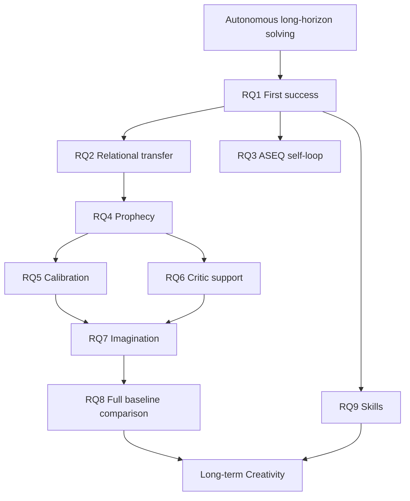

# 연구 질문 (Research Questions)

AASSR은 특정 모듈을 먼저 만들고 이유를 붙인 프로젝트가 아니라, 다음 질문에서 출발한다.

> **중간 보상이 거의 없고, 가능한 행동이 많으며, 환경을 완전히 관찰할 수 없는 상황에서 에이전트가 실제 경험의 구조를 학습하고 미래 결과를 예측하여, 사람이 정답 경로를 주입하지 않아도 최종 목표까지 가는 행동 과정을 스스로 만들 수 있는가?**

초기 연구 철학은 더 짧게 표현할 수 있다.

> **최종 목표만 존재하는 희소 보상 환경에서 에이전트가 인간이 미리 정해준 경로 없이 목표 수행 과정을 스스로 만들어낼 수 있는가?**

이 페이지는 이 큰 질문을 **실제로 틀릴 수 있는(testable) 연구 질문**으로 쪼갠다.

> [!TIP]
> 각 질문의 H1/H0, 독립변수, 종속변수, evidence 수준을 한눈에 보려면 **[Evidence Matrix](Evidence-Matrix)** 를 같이 본다.

---

## 목차

1. [문제의 구조](#1-문제의-구조)
2. [RQ1 — 최초 성공](#rq1--희소-보상만으로-최초-성공을-발견할-수-있는가)
3. [RQ2 — 관계 표현](#rq2--relational-representation이-unseen-transfer를-개선하는가)
4. [RQ3 — ASEQ](#rq3--aseq가-진전-없는-self-loop를-줄이는가)
5. [RQ4 — Prophecy](#rq4--prophecy는-planning에-쓸-수-있는-stochastic-world-model인가)
6. [RQ5 — Calibration](#rq5--prediction-reliability를-실제-decision-gate로-쓸-수-있는가)
7. [RQ6 — Critic support](#rq6--critic-value를-local-support-없이-믿어도-되는가)
8. [RQ7 — Imagination](#rq7--imagination은-같은-policy보다-더-좋은-첫-행동을-만드는가)
9. [RQ8 — Full system](#rq8--aassr-전체가-strong-baseline보다-나은가)
10. [RQ9 — Skill](#rq9--skill은-성공-구조를-unseen-scenario에-재사용하는가)
11. [Long-term — Creativity](#long-term--creativity)

---

# 1. 문제의 구조

AASSR이 겨냥하는 환경에서는 대부분의 [상태 전이(transition)](MDP-and-POMDP) [보상(reward)](Sparse-Reward-and-Credit-Assignment)가 `0`이다.

```text
정보 확인      0
경로 발견      0
인증 시도      0
대상 확인      0
workflow 진행  0
proof 획득     +1
true failure   -1
```

이때 여러 문제가 동시에 생긴다.

```text
[Sparse Reward / Credit Assignment]
               ↓
[성공 experience 자체가 희귀]
               ↓
[Exploration bottleneck]
               ↓
[같은 행동 self-loop]
               ↓
[Partial Observability / Memory]
               ↓
[ID memorization vs structural transfer]
               ↓
[World-model uncertainty]
               ↓
[Long-horizon planning]
               ↓
[OOD Critic extrapolation]
               ↓
[Fair evaluation / causal ablation]
```

관련 기초 개념:

- [Sparse Reward & Credit Assignment](Sparse-Reward-and-Credit-Assignment)
- [Exploration & Exploitation](Exploration-and-Exploitation)
- [MDP and POMDP](MDP-and-POMDP)
- [Relational Representation & Generalization](Relational-Representation-and-Generalization)
- [Model-Based RL & World Models](Model-Based-RL-and-World-Models)
- [Critic, Support & OOD](Critic-Support-and-OOD)
- [Ablation, Benchmarking & Reproducibility](Ablation-Benchmarking-and-Reproducibility)

---

# RQ1 — 희소 보상만으로 최초 성공을 발견할 수 있는가?

> **guided trajectory, oracle [행동(action)](Reinforcement-Learning) injection, intermediate 보상 shaping 없이도 [에이전트(agent)](Reinforcement-Learning)가 실제 성공 experience를 스스로 만들 수 있는가?**

이 질문은 나머지 모든 질문보다 앞선다.

성공 상태 전이을 한 번도 보지 못하면 [DQN/TD](Q-Learning-DQN-and-TD), [Critic](Critic), [Prophecy](Prophecy), [Skill](Skills) 모두 충분한 positive evidence를 얻기 어렵다.

AASSR은 정답 경로를 직접 주는 대신 다음을 사용한다.

- [exploration](Exploration-and-Exploitation)
- [Curriculum Learning](Curriculum-Learning)
- [Policy](Policy)
- [ASEQ](ASEQ)

## H1

> 제한된 real-상태 전이 budget 안에서 사람이 성공 행동 sequence를 입력하지 않아도 적어도 일부 [난이도 조절 학습(curriculum)](Curriculum-Learning) frontier에서 proof가 발생한다.

## 반증되는 경우

- 성공이 oracle/guided 행동이 있을 때만 발생
- hidden difficulty/target information이 learner input에 들어감
- shaping 보상를 제거하면 성공 experience가 완전히 사라짐

## 핵심 측정

- first proof 상태 전이
- training proof count
- 난이도 조절 학습 level reached
- stalled rate

상세 실험 정의: [Evidence Matrix — RQ1](Evidence-Matrix#rq1-희소-보상만으로-최초-성공을-발견할-수-있는가)

---

# RQ2 — Relational representation이 unseen transfer를 개선하는가?

> **구체적인 route/object/profile ID를 외우는 대신 역할과 관계를 표현하면 이름이 바뀐 [학습 중 보지 못한(unseen)](Relational-Representation-and-Generalization) scenario에 더 잘 [전이(transfer)](Relational-Representation-and-Generalization)하는가?**

예:

```text
Training
route-12 → catalog-like role
profile-4 → authenticated profile
object-7 → candidate object

Unseen
route-31 → catalog-like role
profile-9 → authenticated profile
object-2 → candidate object
```

Concrete ID는 전부 다르지만 구조는 같을 수 있다.

그래서 [State Representation](State-Representation)은 두 identity를 분리한다.

```text
Concrete semantic identity
→ 실제 실행 / 정확한 반복 판정

Relational identity
→ Policy / Prophecy / Critic / Skill transfer
```

## 핵심 causal comparison

```text
dqn_raw
   ↓ representation만 변경
dqn_relational
```

## H1

> 동일한 보상, budget, [DQN(딥 Q-네트워크)](Q-Learning-DQN-and-TD) 조건에서 [관계 기반 표현(relational representation)](Relational-Representation-and-Generalization)이 학습 중 보지 못한 success 또는 milestone reach를 개선한다.

## 중요한 반론

Relational abstr행동이 강할수록 무조건 좋은 것은 아니다.

```text
abstraction ↑
→ rename invariance ↑
→ 하지만 decision-critical distinction 소실 가능
→ state aliasing ↑
```

2026-08-11의 public HTTP status 소실은 이 trade-off를 보여준 historical 사례다.

관련: [Historical Imagination Diagnostic — 2026-08-11](Historical-Imagination-Diagnostic-2026-08-11)

---

# RQ3 — ASEQ가 진전 없는 self-loop를 줄이는가?

> **실제로 관측한 `(S,A,S')`에서 `S → A → S`인 반복만 억제하면 탐색 정체를 줄이면서 필요한 반복 행동은 보존할 수 있는가?**

[AASSR의 ASEQ](ASEQ)는 다음 실제 상태 전이이다.

```text
ASEQ = (S, A, S')
```

억제 대상:

```text
S → A → S
```

억제하면 안 되는 것:

```text
S1 → A → S2
S2 → A → S3
```

같은 행동 type이 반복되어도 state가 진행하면 허용한다.

## H1

> exact semantic [제자리 반복(self-loop)](ASEQ) guard가 stalled episode를 줄이고 false suppression은 낮게 유지한다.

## 현재 mechanism evidence

과거 diagnostic에서:

```text
raw greedy stalled       24 / 24
exact ASEQ stalled        0 / 24
```

가 관측됐다.

이 결과의 정확한 주장 범위는 [Evidence Matrix — RQ3](Evidence-Matrix#rq3-aseq가-진전-없는-self-loop를-줄이는가)에서 본다.

---

# RQ4 — Prophecy는 planning에 쓸 수 있는 stochastic world model인가?

> **현재 public state와 행동으로부터 가능한 다음 public outcome의 분포를 학습하여 multi-step planning에 사용할 수 있는가?**

현재 [Prophecy](Prophecy)는 deterministic `(S,A) → S'` 회귀가 아니다.

`main`의 current contract:

```text
relational-conditional-mixture-ensemble-v5-status-balanced
```

개념적으로:

```math
p(S_{t+1}|S_t,A_t,K_t)
=
\sum_m \pi_m(X_t)p_m(S_{t+1}|X_t)
```

예측 대상에는:

- relational next descriptor
- latest public HTTP status
- [가능 행동 마스크(legal-action mask)](Prophecy)
- [에피소드 종료(terminal)](Replay-Buffer-and-Episode-Boundaries) class
- [결과 확률(outcome probability)](Stochasticity-Uncertainty-and-Probability) mass

가 포함된다.

## H1

> [검증용 분리 데이터(holdout)](Calibration) real 상태 전이에서 [Prophecy(미래 예측 모델)](Prophecy)의 multimodal prediction이 decision-relevant future structure를 충분히 보존해 planner input으로 사용할 수 있다.

## 단순 accuracy만 보면 안 되는 이유

```text
평균 semantic similarity 높음
!=
403/404/429 같은 중요한 channel이 정확함
```

따라서 status accuracy, legal-mask accuracy, 에피소드 종료 accuracy, mixture coverage를 별도로 본다.

관련: [Mixture, Ensemble & Calibration](Mixture-Ensemble-and-Calibration), [Loss Functions & Class Imbalance](Loss-Functions-and-Class-Imbalance)

---

# RQ5 — Prediction reliability를 실제 decision gate로 쓸 수 있는가?

> **[Prophecy](Prophecy)가 내놓은 결과 확률와 model reliability를 분리하고, 검증용 분리 데이터 calibration으로 unreliable future를 실제 행동 override 전에 걸러낼 수 있는가?**

두 값은 다르다.

```text
Outcome probability
= 환경에서 그 outcome이 일어날 probability mass

Prediction reliability
= 그 prediction을 얼마나 믿을 수 있는가
```

[Calibration](Calibration)의 목적은 rare outcome을 없애는 것이 아니다.

예를 들어:

```text
403 probability = 0.05
```

라고 해서 그 branch가 “모델이 5%만 신뢰한다”는 뜻이 아니다.

## H1

> [상태 코드까지 고려하는(status-aware)](Calibration) 검증용 분리 데이터 calibration은 decision-critical prediction error가 큰 branch의 override 참여를 줄인다.

## 실패 가능성

너무 공격적인 gate:

```text
planner opportunity
→ 거의 전부 reject
→ intervention 0
```

너무 느슨한 gate:

```text
unreliable branch 통과
→ model exploitation
```

따라서 **안전함과 planner activity를 같이 측정**해야 한다.

---

# RQ6 — Critic value를 local support 없이 믿어도 되는가?

> **[Critic(미래 가치 평가기)](Critic)이 전체적으로 학습됐더라도 지금 imagined state/행동이 실제 training distribution 밖이라면 그 value를 믿어도 되는가?**

2026-08-11 historical diagnostic에서 이 질문의 필요성이 드러났다.

당시에는 낮은 난이도 조절 학습 level의 real success evidence가 주로 존재했는데 planner는 더 높은 학습 중 보지 못한 level에서 [Critic](Critic) value를 이용해 적극적으로 override했다.

이것은 다음 구분을 만들었다.

```text
Critic readiness
= model이 overall training을 받았는가?

Local Critic support
= 지금 이 state/action 주변에 real training evidence가 있는가?
```

## H1

> [local real-training support gate](Critic-Support-and-OOD)는 unsupported high-value extrapolation을 fail-closed하면서 supported planning은 유지한다.

## 중요한 경계

```text
support
!= reward
!= value
!= confidence bonus
```

Support는 **값이 좋다는 뜻이 아니라 값 추정의 데이터 근거가 있다는 뜻**이다.

---

# RQ7 — Imagination은 같은 Policy보다 더 좋은 첫 행동을 만드는가?

> **실제로 행동하기 전에 여러 counterfactual future를 전개하면, 동일하게 학습된 [Policy(정책 모델)](Policy)-only보다 더 좋은 root 행동을 선택할 수 있는가?**

[Imagination](Imagination)은 현재 protocol에서 persistent imagined learning이 아니라 planning 장치다.

가장 중요한 실험 계약:

```text
one AASSR training run
        ↓
frozen checkpoint
     /             \
OFF                   ON
Policy-only      Imagination
```

## 왜 same checkpoint인가?

OFF와 ON을 따로 학습하면:

```text
training randomness
+ replay 차이
+ exploration 차이
+ checkpoint 차이
```

가 섞여 [Imagination(가상 미래 탐색)](Imagination)의 marginal effect를 분리하기 어렵다.

## H1

> planner ON이 OFF보다 success/failure trade-off를 개선한다.

## planner가 지켜야 하는 수학

환경의 stochastic outcome:

```math
V_{chance}=\sum_i p_iV_i
```

에이전트의 다음 행동 선택:

```math
V_{decision}=\max_aV(S',a)
```

관련: [Chance Nodes & Decision Nodes](Chance-and-Decision-Nodes)

## Historical diagnostic과 current claim 분리

2026-08-11 `4/20 vs 4/20`, `86 interventions`는 **현재 v5/상태 코드까지 고려하는/support-gated architecture의 최종 성능 결과가 아니다.**

그 결과는 [Historical Imagination Diagnostic](Historical-Imagination-Diagnostic-2026-08-11)로 분리한다.

---

# RQ8 — AASSR 전체가 strong baseline보다 나은가?

> **같은 보상, [관측(observation)](MDP-and-POMDP) boundary, real sample budget, 학습 중 보지 못한 protocol에서 current AASSR이 strong model-free / model-based [비교 기준(baseline)](Ablation-Benchmarking-and-Reproducibility)보다 더 안정적으로 장기 task를 해결하는가?**

최종 비교 구조:

```text
dqn_raw
  ↓ representation effect
dqn_relational
  ↓ AASSR stack beyond representation
aassr_current_no_imagination
  ↓ Imagination marginal effect
aassr_current_full
```

그리고 외부 model-based family 비교:

```text
dreamerv3_relational
↔
aassr_current_full
```

## 이 질문은 마지막에 답한다

각 component가 individually reasonable하다고 해서 전체 시스템이 비교 기준보다 좋은 것은 아니다.

```text
good representation
+ good world model
+ good critic
+ good planner

≠ automatically better agent
```

최종적으로는 [Ablation](Ablation-Benchmarking-and-Reproducibility), multi-[난수 시드(seed)](Ablation-Benchmarking-and-Reproducibility) aggregate, [최종 비공개 평가(final blind)](Ablation-Benchmarking-and-Reproducibility)가 필요하다.

현재 claim 상태: **Pending.**

---

# RQ9 — Skill은 성공 구조를 unseen scenario에 재사용하는가?

> **반복 성공한 real ASeq를 concrete ID가 아닌 relational template로 저장하면 새로운 scenario에서도 high-level 행동 structure로 재사용할 수 있는가?**

[Skill](Skills)은 사람이 정답 macro를 넣는 장치가 아니다.

```text
real successful ASeq
      ↓
repeated relational pattern
      ↓
promotion
      ↓
relational Skill template
      ↓
new scenario의 concrete action에 rebind
```

## H1

> relational [Skill(성공 절차 재사용)](Skills)이 raw concrete macro보다 학습 중 보지 못한 rebinding에 강하고 primitive-only search cost를 줄인다.

## 별도로 봐야 할 것

- premature promotion
- unavailable primitive
- stochastic rollout collapse
- [Skill](Skills) domination

관련: [Hierarchical RL & Skills](Hierarchical-RL-and-Skills)

---

# Long-term — Creativity

초기 AASSR의 두 번째 큰 질문은 다음과 같다.

> **에이전트가 인간이 미리 정해준 정답 경로 또는 이미 학습한 [Skill](Skills)을 그대로 복제하지 않고도 새로운 유효한 목표 수행 경로를 만들 수 있는가?**

이 질문은 중요하지만 현재 primary performance claim과 분리한다.

먼저 다음이 필요하다.

```text
1. autonomous success
2. unseen transfer
3. reliable planning
4. stable baseline superiority 또는 최소한 충분한 competence
5. 그 뒤 path novelty 분석
```

## Creativity를 단순 action diversity로 정의하면 안 되는 이유

랜덤하게 여러 행동을 하는 것도 diversity는 높을 수 있다.

하지만 연구적으로 원하는 것은:

```text
새로운 경로
+
유효한 목표 달성
+
training trajectory 단순 복제 아님
+
우연한 한 번이 아니라 반복 가능
```

이다.

따라서 future creativity study에는 path equivalence, structural novelty, success-conditioned diversity 같은 별도 [평가지표(metric)](Ablation-Benchmarking-and-Reproducibility)이 필요하다.

---

# 전체 RQ 연결도



---

# 연구 원칙

모든 RQ에서 공통으로 지킨다.

- [external sparse reward](Sparse-Reward-and-Credit-Assignment)는 성공 `+1`, true failure `-1`, 그 외 `0`이라는 task contract를 유지한다.
- intermediate shaping 보상를 최종 목표의 대체물로 쓰지 않는다.
- oracle 행동 / guided success trajectory를 learner에게 주지 않는다.
- hidden simulator truth를 [observation](MDP-and-POMDP)에 넣지 않는다.
- [Knowledge](Knowledge)는 prediction 시점 이전에 real response로 획득한 사실만 사용한다.
- imagined 상태 전이을 real factual evidence로 자동 승격하지 않는다.
- evaluation 중 persistent learner state를 바꾸지 않는다.
- [Imagination](Imagination) OFF/ON은 same frozen [체크포인트(checkpoint)](Reproduction)다.
- 과거 세대 수치를 current-generation final claim에 섞지 않는다.

---

## 다음으로 읽기

- **[Evidence Matrix](Evidence-Matrix)** — 각 RQ를 실제 변수·지표·claim으로 연결
- **[Experiments](Experiments)** — 실험 protocol과 결과
- **[Current Status](Current-Status)** — 지금 무엇이 current인지
- **[Historical Imagination Diagnostic — 2026-08-11](Historical-Imagination-Diagnostic-2026-08-11)** — 대표 negative result
